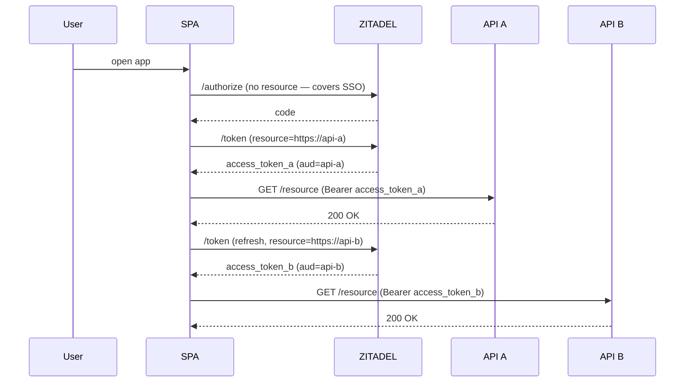

Resource Indicators ([RFC 8707](https://datatracker.ietf.org/doc/html/rfc8707))
let a client tell the authorization server **which protected resource** an
access token will be presented to. ZITADEL uses the `resource` parameter
to populate the `aud` (audience) claim on the issued access token, so a
single client can mint differently-scoped tokens for different APIs from
the same authorization grant.

## Why use resource indicators?

Without resource indicators, every access token a client mints carries
the same audience — typically the `client_id`. That works for the simple
case (one client → one API), but breaks down when:

- One client talks to **multiple APIs** and you want each API to refuse
  tokens minted for the other (token confusion / passing-the-token).
- A token gets **stolen from API A's logs** and replayed against API B
  — `aud` validation on B's side rejects it because the audience says
  "API A only".
- Per-grant **least-privilege scoping** matters — the user authorizes
  the client once, the client mints scoped tokens per downstream call.

The `resource` parameter is the standard, OAuth-native way to do this.
The pattern is widely deployed and is the foundation MCP servers use to
isolate tool surfaces.

## Quick start

Pass `resource=<absolute URI>` on `/authorize` (and/or on `/token`):

```bash
# Step 1: authorize, requesting a token for API "https://api.example.com".
GET /oauth/v2/authorize?
  response_type=code
  &client_id=<client_id>
  &redirect_uri=https%3A%2F%2Fapp.example.com%2Fcb
  &scope=openid+profile
  &resource=https%3A%2F%2Fapi.example.com
  &code_challenge=<sha256_b64url>
  &code_challenge_method=S256
  &state=<csrf>
```

```bash
# Step 2: exchange the code, optionally narrowing the resource further.
curl -X POST https://example.zitadel.cloud/oauth/v2/token \
  -d grant_type=authorization_code \
  -d code=<code> \
  -d redirect_uri=https://app.example.com/cb \
  -d client_id=<client_id> \
  -d code_verifier=<plaintext_verifier> \
  -d resource=https://api.example.com
```

The minted access token's `aud` claim now contains
`["https://api.example.com"]`. The downstream API verifies the audience
and accepts the token; any other API rejects it with HTTP 401.

## Where you can pass `resource`

The parameter is honored on every grant type that issues an access token:

| Grant                     | Endpoint                                                                         | Notes                                                                                                                                                            |
| ------------------------- | -------------------------------------------------------------------------------- | ---------------------------------------------------------------------------------------------------------------------------------------------------------------- |
| Authorization code        | `/oauth/v2/authorize` and `/oauth/v2/token`                                      | Most common path. `resource` on `/authorize` becomes the upper bound; `resource` on `/token` may equal or be a subset (RFC 8707 §2.2 narrowing).                 |
| Refresh token             | `/oauth/v2/token` (`grant_type=refresh_token`)                                   | The refresh request MAY narrow the audience to a subset of the original grant. Asking for a resource that wasn't authorized originally returns `invalid_target`. |
| Client credentials        | `/oauth/v2/token` (`grant_type=client_credentials`)                              | Resource(s) become the access token's `aud`.                                                                                                                     |
| Device code               | `/oauth/v2/device_authorization`                                                 | Resource is captured at the device-authorization request and propagated through `/token`.                                                                        |
| Token exchange (RFC 8693) | `/oauth/v2/token` (`grant_type=urn:ietf:params:oauth:grant-type:token-exchange`) | Resource is **additive-merged** with the audience computed from `subject_token` / `actor_token`.                                                                 |
| JWT bearer profile        | `/oauth/v2/token` (`grant_type=urn:ietf:params:oauth:grant-type:jwt-bearer`)     | Resource(s) become the access token's `aud`.                                                                                                                     |

The parameter MAY appear multiple times on the wire to request multiple
resources at once:

```http
POST /oauth/v2/token HTTP/1.1
Content-Type: application/x-www-form-urlencoded

grant_type=authorization_code
&code=<code>
&resource=https%3A%2F%2Fapi-a.example.com
&resource=https%3A%2F%2Fapi-b.example.com
```

The minted token's `aud` claim is then `["https://api-a.example.com",
"https://api-b.example.com"]` (subject to the `AllowedAudiences`
allow-list described below).

## Operator configuration: `AllowedAudiences`

The instance config has a `AllowedAudiences` allow-list under the DCR
config block. Set it when you want to restrict the set of resources
clients may target — for example, to lock the instance down to a known
set of internal APIs:

```yaml
OIDC:
  DCR:
    AllowedAudiences:
      - https://api.internal.corp
      - https://billing.internal.corp
      - https://reports.internal.corp
```

| `AllowedAudiences` value | Behavior                                                                                                                                       |
| ------------------------ | ---------------------------------------------------------------------------------------------------------------------------------------------- |
| `[]` (default, empty)    | **Unrestricted** — clients may pass any absolute-URI `resource`.                                                                               |
| `[<list of URIs>]`       | Allow-list. A `resource` value not on the list returns `invalid_target` 400. URI matching is exact (case-sensitive scheme + authority + path). |

The allow-list applies to every grant type. If a refresh request asks
for a resource that _was_ on the original grant but has since been
removed from the allow-list, the refresh fails with `invalid_target` —
operators can revoke audience access by editing config without rotating
clients.

## Error semantics: `invalid_target`

Per RFC 8707 §2.2, requests that violate the resource constraints return
HTTP 400 with the standard OAuth 2.0 error envelope:

```json
{
  "error": "invalid_target",
  "error_description": "resource <https://forbidden.example.com> is not in the AllowedAudiences allow-list"
}
```

ZITADEL emits `invalid_target` when:

- The `resource` parameter is not a syntactically valid absolute URI
  (RFC 3986 — must include scheme + authority).
- The `resource` URI is not on `OIDC.DCR.AllowedAudiences` (when the
  allow-list is non-empty).
- A refresh request asks for a resource that was not on the original
  grant.

The `Content-Type` is `application/json; charset=utf-8` and the
`Cache-Control: no-store` header is set.

## Verifying the `aud` claim on the resource server

Every Zitadel-issued access token (when `resource` was supplied) has the
RFC 8707 audience populated. Resource servers MUST validate `aud` to
get the security benefit:

```go
// Go — using github.com/zitadel/oidc/v3
import "github.com/zitadel/oidc/v3/pkg/oidc"

claims, err := verifier.Verify(ctx, accessToken)
if err != nil {
    return fmt.Errorf("token invalid: %w", err)
}
expectedAudience := "https://api.example.com"
if !claims.Audience.Contains(expectedAudience) {
    return fmt.Errorf("token audience mismatch: have %v, want %s",
        claims.Audience, expectedAudience)
}
```

```javascript
// Node — using jose
import { jwtVerify } from "jose";

const { payload } = await jwtVerify(accessToken, jwks, {
  issuer: "https://example.zitadel.cloud",
  audience: "https://api.example.com",
});
// jose throws if the aud claim doesn't include the expected value.
```

```python
# Python — using PyJWT
import jwt

claims = jwt.decode(
    access_token,
    public_key,
    algorithms=['RS256'],
    issuer='https://example.zitadel.cloud',
    audience='https://api.example.com',
)
# PyJWT raises InvalidAudienceError on mismatch.
```

## Refresh narrowing semantics

The `/token` endpoint with `grant_type=refresh_token` MAY:

- **Omit `resource`** — the refresh keeps the original grant's audience.
- **Pass a subset of resources** — the new access token has the smaller
  `aud`. (RFC 8707 §2.2 narrowing.)
- **Pass a superset / new resources** — `invalid_target` 400.

```bash
# Original grant covered both APIs.
# This refresh narrows to api-a only — minted token's aud is just api-a.
curl -X POST https://example.zitadel.cloud/oauth/v2/token \
  -d grant_type=refresh_token \
  -d refresh_token=<refresh_token> \
  -d client_id=<client_id> \
  -d resource=https://api-a.example.com
```

## Multi-API SSO example

A common deployment shape: a single SPA talks to multiple internal APIs.
The user authenticates once; the SPA mints per-API tokens at exchange
time. Each API validates its own `aud`:



Per-API tokens isolate the blast radius: a leaked `access_token_a` is
useless against `API-B`.

## Interaction with token exchange (RFC 8693)

If you're using `grant_type=urn:ietf:params:oauth:grant-type:token-exchange`,
both the legacy `audience` parameter and the RFC 8707 `resource` parameter
work. They merge additively:

| Subject token `aud` | Request `audience` | Request `resource`          | Issued token `aud`                   |
| ------------------- | ------------------ | --------------------------- | ------------------------------------ |
| `[api-a]`           | (omitted)          | (omitted)                   | `[api-a]`                            |
| `[api-a]`           | `api-a`            | (omitted)                   | `[api-a]`                            |
| `[api-a, api-b]`    | `api-a`            | (omitted)                   | `[api-a]` (narrowed)                 |
| `[api-a]`           | (omitted)          | `https://api-a.example.com` | `[api-a, https://api-a.example.com]` |
| `[api-a]`           | (omitted)          | `https://forbidden.com`     | `invalid_target`                     |

The narrowing rule from token exchange (the new `aud` MUST be a subset
of the subject_token's audience) still applies; `resource` cannot escape
the subject_token's authorization scope. See
[Token Exchange](../../guides/integrate/token-exchange) for details.

## Dynamic Client Registration interaction

When DCR is enabled, the audiences a dynamically-registered client may
target are still bound by the instance-level `AllowedAudiences`
allow-list. DCR clients have no per-client audience override in Phase 1
— a future per-client `allowed_audiences` field is tracked separately.

## Related

- [RFC 8707 — Resource Indicators for OAuth 2.0](https://datatracker.ietf.org/doc/html/rfc8707)
- [RFC 8693 — Token Exchange](https://datatracker.ietf.org/doc/html/rfc8693)
- [Token exchange guide](../../guides/integrate/token-exchange)
- [Dynamic Client Registration](./dynamic-client-registration)
- [OAuth/OIDC endpoints](./endpoints)
