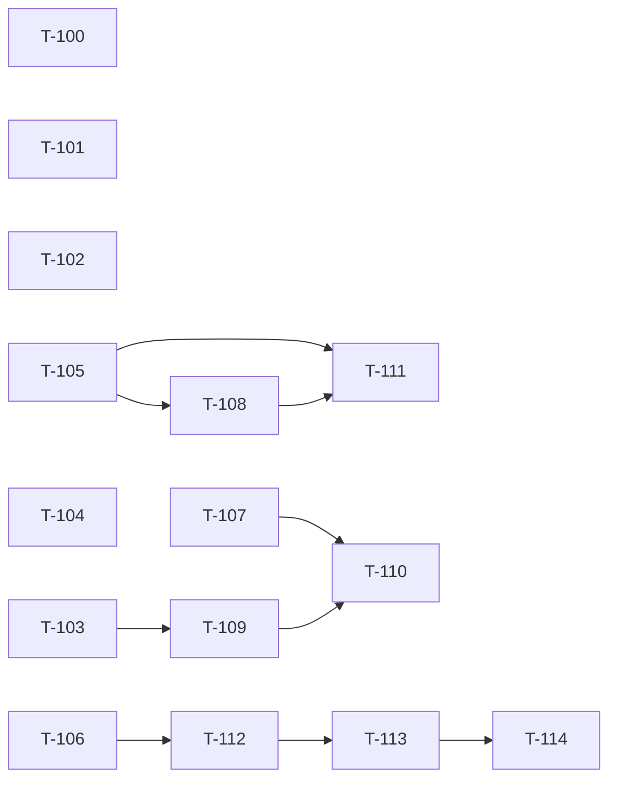

# Build Site — DCR Bootstrap Validation

15 tasks across 4 tiers from 1 kit (cavekit-dcr-bootstrap-validation.md).

## Tier 0 — No Dependencies (Start Here)

| Task ID | Title | Effort | Depth | Requirement | Description |
|---|---|---|---|---|---|
| T-100 | CI gate: flag projection `Init()` column adds without matching `cmd/setup/NN.sql` ALTER | M | thorough | R1 | Add a static-check script (e.g. `tools/checks/projection_init_alter_parity.go`) wired into CI that diffs `internal/query/projection/*.go` `Init()` table-suffix column declarations against `cmd/setup/*.sql` ALTER statements within the same commit range; fails the build when a column appears in `Init()` without a matching `ALTER TABLE … ADD COLUMN IF NOT EXISTS …` step. Document the rule in `CONTRIBUTING.md`. |
| T-101 | Regression-test convention: every new `RegisterHandlerOnPrefix` mount with gorilla internals ships a no-slash test | S | quick | R2 | Add doctrine note in `internal/api/oidc/dcr/wire.go` package doc plus `CONTRIBUTING.md` section. Each new handler mounted via `apis.RegisterHandlerOnPrefix` whose internal router is gorilla MUST include a sibling `*_no_slash_test.go` mirroring `no_slash_register_test.go::TestStripPrefixEmptyPath_NormalizationFix`. Reference the existing test as the canonical template. |
| T-102 | Doctrine note: well-known endpoints source issuer from `ContextToIssuer`, never from `op.IssuerFromContext` outside the OIDC mux | S | quick | R3 | Add a package-level doc comment in `internal/api/oidc/op.go` near `ContextToIssuer` plus a `CONTRIBUTING.md` paragraph stating the invariant. Add a grep-based CI check (or `go vet`-style analyzer) flagging new callsites of `op.IssuerFromContext` outside `internal/api/oidc/server.go` test fixtures. |
| T-103 | R8: detect duplicate `(project_id, app_name)` and auto-suffix or 400 | M | standard | R8 | In `internal/command/dynamic_client_registration.go::RegisterClient`, before the event push (line ~187), query the `apps` projection for an existing app with the same `(project_id, app_name)`. If collision, auto-append `-N` (smallest N≥2 yielding non-collision) and use the suffixed name in `ApplicationAddedEvent.Name`. Round-trip the final name into the response. Operator config knob `OIDC.DCR.OnNameCollision: "suffix" \| "reject"` (default `suffix`) chooses the policy; `reject` returns a `ClampError{Code: "invalid_client_metadata", Description: "client_name already in use under this project"}` mapped to 400. Unit + integration test asserts second registration is 201 (suffix) or 400 (reject) — never 500. |
| T-104 | R11: console Apps tab filters out dynamically-registered clients + info banner | M | standard | R11 | In `console/src/app/pages/projects/owned-projects/owned-project-detail/`, filter the Apps tab list by `oidcConfig?.dynamicallyRegistered !== true`. When the filter dropped rows, show an info banner "X dynamically-registered clients hidden — see Dynamic Clients" with a click-through to the existing Dynamic Clients sidenav route. The mgmt gRPC `ListApps` RPC must remain unfiltered (UI-only filter). Add a Cypress smoke test that registers a DCR client and asserts it does NOT appear under the General Apps tab but DOES appear under Dynamic Clients. |
| T-105 | R4 Part A: `ProjectExistsByID` + `OrgExistsByID` query helpers (incl. state + resource_owner) | M | standard | R4, R5 | Add `Queries.ProjectExistsAndActiveByID(ctx, projectID) (resourceOwner string, ok bool, err error)` to `internal/query/project.go` returning the project's `resource_owner` and a boolean for ACTIVE state (state==1). Add `Queries.OrgExistsAndActiveByID(ctx, orgID) (ok bool, err error)` to `internal/query/org.go`. Both helpers do a thin existence-only SELECT (no full row load) against `projections.projects4` and `projections.orgs1` respectively. Unit tests cover: missing row, present-and-active, present-but-deactivated. This is the shared helper R4 boot validation and R5 in-request validation will both call. |
| T-106 | R12 Part A: `apps7_last_seen` projection column + auth-flow update path | M | thorough | R12 | Add `last_seen_at TIMESTAMPTZ NULL` to `apps7` (or `apps7_oidc_configs`) via projection `Init()` declaration in `internal/query/projection/app.go` AND a numbered `cmd/setup/NN.sql` ALTER TABLE migration (per R1 doctrine — handled together). Update the auth flow (token issuance handlers in `internal/api/oidc/token_*.go` plus `/authorize` and `/userinfo` paths) to UPSERT this timestamp on each successful client use. Throttle writes to once per minute per client to avoid eventstore churn. Unit test: simulated token issuance updates the timestamp; rapid-fire requests within throttle window do not write. |
| T-107 | R10 Part A: `deriveDevMode` helper — http loopback / private-IP detection | S | quick | R10 | Add a pure helper `deriveDevMode(redirectURIs []string) bool` in `internal/api/oidc/dcr/dcr_defaults.go` that returns true if ANY entry has scheme `http` AND host is loopback (`localhost`, `127.0.0.1`, `::1`) OR a private-range IP (RFC 1918 / RFC 4193). All-https → false. Unit test pins each branch (all-https, mixed, all-loopback-http, public-http). This helper is independent of R9's profile helper but will be invoked from the same applyMCPProfileDefaults orchestration in T-110. |

## Tier 1 — Depends on Tier 0

| Task ID | Title | Effort | Depth | blockedBy | Requirement | Description |
|---|---|---|---|---|---|---|
| T-108 | R4 Part B: boot-time validation in `cmd/start/start.go` (existence + ACTIVE state + resource_owner consistency) | L | thorough | T-105 | R4 | In `cmd/start/start.go` near the existing `dcrDeps.Validate()` call (line ~882), when `OIDC.DCR.RequireInitialAccessToken=false` AND DCR is enabled (yaml + runtime feature flag), invoke the helpers from T-105: (1) `ProjectExistsAndActiveByID(DefaultProjectID)` — fatal with clear error `dcr: OIDC.DCR.DefaultProjectID="…" does not exist in projections.projects4 — anonymous DCR mode requires a real project ID. Create the project first or set a different ID.` (2) `OrgExistsAndActiveByID(DefaultOrgID)` — fatal with parallel message. (3) Assert returned `project.resource_owner == DefaultOrgID` — fatal mismatch error. (4) Assert both states ACTIVE (1). Integration test: start zitadel with phantom DefaultProjectID — expect startup failure with the expected error class; start with real project — expect success. |
| T-109 | R9 Part A: `applyMCPProfileDefaults` helper + config tree | M | standard | T-103 | R9 | Add `applyMCPProfileDefaults(*RFC7591Metadata)` in new file `internal/api/oidc/dcr/dcr_defaults.go`. Fills the eight fields when omitted: `application_type` derived from redirect URI schemes (https → WEB, http-loopback → NATIVE), `response_types=["code"]`, `token_endpoint_auth_method="none"`, `grant_types=["authorization_code","refresh_token"]`, `refresh_token=true`, `access_token_type=JWT`, `id_token_role_assertion=true`, `id_token_userinfo_assertion=true`, `clock_skew=2s`. Add `OIDC.DCR.MCPProfile.{AccessTokenType,IDTokenRoleAssertion,IDTokenUserinfoAssertion,ClockSkew}` to `cmd/defaults.yaml` with these values + env-var bindings `ZITADEL_OIDC_DCR_MCPPROFILE_*`. Wire helper into `ValidateAndClampMetadata` AFTER the operator-allow-list clamp but BEFORE OIDCApp synthesis. Unit test: minimal client → all eight defaults applied. Unit test: explicit `access_token_type=Bearer` → request value wins. (Sequenced after T-103 to avoid merge churn in `internal/command/dynamic_client_registration.go`.) |

## Tier 2 — Depends on Tier 1

| Task ID | Title | Effort | Depth | blockedBy | Requirement | Description |
|---|---|---|---|---|---|---|
| T-110 | R10 Part B: integrate `deriveDevMode` into `applyMCPProfileDefaults` + log determination | S | quick | T-107, T-109 | R10 | Inside the helper from T-109, after redirect URIs are clamped, call `deriveDevMode` from T-107 and assign `OIDCApp.DevMode = result`. Log at INFO with structured fields `{client_id, redirect_uris, devmode_enabled, reason}` so operators can see WHY DevMode is on for a given app. Add unit tests for: all-https → DevMode false, mixed http-localhost+https → DevMode true, all-loopback-http → DevMode true. |
| T-111 | R5: in-request defense — `RegisterClient` re-validates default project/org existence | M | standard | T-105, T-108 | R5 | In `internal/command/dynamic_client_registration.go::RegisterClient` (line ~187, before event push), call the same `ProjectExistsAndActiveByID` / `OrgExistsAndActiveByID` helpers from T-105 against the resolved DefaultProjectID/DefaultOrgID. On miss, emit NO events and return `ClampError{Code: "default_project_not_found"}` (add the constant to `internal/api/oidc/dcr/errors.go:46-51` alongside `ErrCodeServerError`). Dispatcher maps the new code to 503 with RFC 7591 envelope `{"error":"server_error","error_description":"default project not configured"}`. Unit test pins no-events-emitted invariant via the events-slice capture pattern from `dcr_audit_payload_test.go`. |
| T-112 | R12 Part B: `RunDCRClientJanitor` goroutine + reap query | L | thorough | T-106 | R12 | Implement `internal/query/dcr_janitor.go::RunDCRClientJanitor(ctx, interval, recorder)` mirroring the shape of `RunSoftwareStatementJTIJanitor` (see `cavekit-software-statement.md` R9). Per-tick deadline at `interval/2`. Reap query: SELECT DCR clients (`apps7_oidc_configs.registration_access_token_hash IS NOT NULL`) WHERE `apps7.last_seen_at < NOW() - MaxIdleDuration` (uses column added in T-106). For each match, call `commands.DeleteRegisteredClient` (Design Ref: this is the same path RFC 7592 DELETE uses — keeps event sourcing + session revocation + projection chain consistent). Emit OTel `zitadel.dcr.client_janitor_reaped_total{result=ok|error}` counter and `zitadel.dcr.client_janitor_duration_seconds` histogram. |

## Tier 3 — Depends on Tier 2

| Task ID | Title | Effort | Depth | blockedBy | Requirement | Description |
|---|---|---|---|---|---|---|
| T-113 | R12 Part C: config wiring + start.go integration + simulated-stale test | M | thorough | T-112 | R12 | Add `OIDC.DCR.ClientRetention.{Enabled,Interval,MaxIdleDuration}` to `cmd/defaults.yaml` (Enabled=false default, Interval=`6h`, MaxIdleDuration=`720h`/30 days). Env-var bindings `ZITADEL_OIDC_DCR_CLIENTRETENTION_*`. Start the goroutine in `cmd/start/start.go` next to the JTI janitor when `Enabled=true` with the same ctx-cancellation deadline contract. Test: simulated 30-day-stale DCR client → reaped + `ApplicationRemovedEvent` emitted; 29-day-stale → preserved. |
| T-114 | R12 Part D: operator runbook for the DCR client janitor | S | quick | T-113 | R12 | Add `docs/operate/dcr-client-janitor.md` (or extend the existing DCR operate doc) covering: enabling the janitor, retention-window tuning, the destructive nature of reaping (stale-but-still-functional clients lose identity and must re-register on next use), how to monitor the OTel metrics, how to inspect candidate rows before enabling. |

## Summary

| Tier | Tasks | Effort breakdown |
|------|-------|------------------|
| 0 | 8 | 2×S, 6×M |
| 1 | 2 | 1×M, 1×L |
| 2 | 3 | 1×S, 1×M, 1×L |
| 3 | 2 | 1×S, 1×M |
| **Total** | **15** | **4×S, 9×M, 2×L** |

Depth distribution: 5 quick, 6 standard, 4 thorough.

## Coverage Matrix

**Scope:** unchecked acceptance criteria from R1..R12. The 12 already-shipped `[x]` criteria are out-of-scope (DONE) and excluded from the denominator.

| Cavekit | Req | Criterion (abbreviated) | Task(s) | Status |
|---|---|---|---|---|
| cavekit-dcr-bootstrap-validation.md | R1 | Future kits: CI gate flagging Init() column adds w/o ALTER step | T-100 | COVERED |
| cavekit-dcr-bootstrap-validation.md | R2 | Future kits: no-slash regression test for new RegisterHandlerOnPrefix mounts | T-101 | COVERED |
| cavekit-dcr-bootstrap-validation.md | R3 | Future kits: well-known endpoints use ContextToIssuer first | T-102 | COVERED |
| cavekit-dcr-bootstrap-validation.md | R4 | Boot queries projects4 for DefaultProjectID; refuse start on miss | T-105, T-108 | COVERED |
| cavekit-dcr-bootstrap-validation.md | R4 | Same check for DefaultOrgID against orgs1 | T-105, T-108 | COVERED |
| cavekit-dcr-bootstrap-validation.md | R4 | Boot confirms project.resource_owner == DefaultOrgID | T-108 | COVERED |
| cavekit-dcr-bootstrap-validation.md | R4 | Boot confirms project + org states are ACTIVE (1) | T-105, T-108 | COVERED |
| cavekit-dcr-bootstrap-validation.md | R4 | Integration test: phantom DefaultProjectID → startup fails; real → success | T-108 | COVERED |
| cavekit-dcr-bootstrap-validation.md | R5 | RegisterClient re-queries project+org via shared helper; no events on miss | T-111 | COVERED |
| cavekit-dcr-bootstrap-validation.md | R5 | Dispatcher maps default_project_not_found code → 503 RFC 7591 envelope | T-111 | COVERED |
| cavekit-dcr-bootstrap-validation.md | R5 | Unit test pins no-events-emitted via events-slice capture pattern | T-111 | COVERED |
| cavekit-dcr-bootstrap-validation.md | R8 | RegisterClient detects (project_id, app_name) collision via projection query | T-103 | COVERED |
| cavekit-dcr-bootstrap-validation.md | R8 | Auto-append `-N` smallest non-colliding suffix; round-trips to response | T-103 | COVERED |
| cavekit-dcr-bootstrap-validation.md | R8 | Alternative AC: ClampError invalid_client_metadata mapped to 400 | T-103 | COVERED |
| cavekit-dcr-bootstrap-validation.md | R8 | Implementer chooses suffix vs reject (kit accepts either) | T-103 | COVERED |
| cavekit-dcr-bootstrap-validation.md | R8 | Unit + integration: register twice same name → 201 or 400, never 500 | T-103 | COVERED |
| cavekit-dcr-bootstrap-validation.md | R9 | applyMCPProfileDefaults helper fills eight fields when omitted | T-109 | COVERED |
| cavekit-dcr-bootstrap-validation.md | R9 | Helper called after operator-allow-list clamp, before OIDCApp synthesis | T-109 | COVERED |
| cavekit-dcr-bootstrap-validation.md | R9 | cmd/defaults.yaml gains OIDC.DCR.MCPProfile.* + env var bindings | T-109 | COVERED |
| cavekit-dcr-bootstrap-validation.md | R9 | Unit test: minimal client gets all eight defaults | T-109 | COVERED |
| cavekit-dcr-bootstrap-validation.md | R9 | Unit test: explicit access_token_type=Bearer wins over profile | T-109 | COVERED |
| cavekit-dcr-bootstrap-validation.md | R10 | applyMCPProfileDefaults sets DevMode=true for http loopback/private-IP | T-107, T-110 | COVERED |
| cavekit-dcr-bootstrap-validation.md | R10 | Mixed http-localhost + https → DevMode true | T-107, T-110 | COVERED |
| cavekit-dcr-bootstrap-validation.md | R10 | All-https → DevMode false | T-107, T-110 | COVERED |
| cavekit-dcr-bootstrap-validation.md | R10 | Unit test pins each branch | T-107, T-110 | COVERED |
| cavekit-dcr-bootstrap-validation.md | R10 | DevMode determination logged at registration time with reason | T-110 | COVERED |
| cavekit-dcr-bootstrap-validation.md | R11 | Console Apps tab filters dynamicallyRegistered !== true | T-104 | COVERED |
| cavekit-dcr-bootstrap-validation.md | R11 | Info banner "X hidden — see Dynamic Clients" with click-through | T-104 | COVERED |
| cavekit-dcr-bootstrap-validation.md | R11 | mgmt gRPC ListApps remains unfiltered (UI-only filter) | T-104 | COVERED |
| cavekit-dcr-bootstrap-validation.md | R12 | RunDCRClientJanitor goroutine; per-tick deadline; OTel metrics | T-112 | COVERED |
| cavekit-dcr-bootstrap-validation.md | R12 | Reap query identifies DCR clients with last_seen older than MaxIdleDuration | T-106, T-112 | COVERED |
| cavekit-dcr-bootstrap-validation.md | R12 | Reap deletes via commands.DeleteRegisteredClient (RFC 7592 DELETE path) | T-112 | COVERED |
| cavekit-dcr-bootstrap-validation.md | R12 | OIDC.DCR.ClientRetention.{Enabled,Interval,MaxIdleDuration} config + env bindings | T-113 | COVERED |
| cavekit-dcr-bootstrap-validation.md | R12 | Janitor goroutine started in cmd/start/start.go next to JTI janitor | T-113 | COVERED |
| cavekit-dcr-bootstrap-validation.md | R12 | Test: 30-day-stale reaped, 29-day-stale preserved, ApplicationRemovedEvent emitted | T-113 | COVERED |
| cavekit-dcr-bootstrap-validation.md | R12 | Operator runbook documents retention-window downside | T-114 | COVERED |

**Coverage: 36/36 criteria (100%)**

## Dependency Graph

