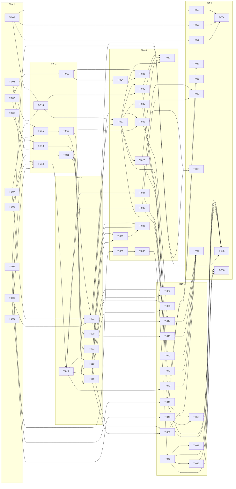

# Phase 2 Build Site — DCR Per-Org Policies, software_statement, Inline jwks, Console Phase 2

61 tasks across 6 tiers from 4 cavekits (219 acceptance criteria, 100% coverage).

This build site is **independent of `context/plans/build-site.md`** (Phase 1, fully drained as of `dcr-rfc8707-v1.0.0`). T-IDs do not collide because impl tracking scopes by `Build site:` line.

---

## Tier 1 — No Phase-2 dependencies (start here)

| Task | Title | Cavekit | Requirement | Effort |
|------|-------|---------|-------------|--------|
| T-001 | Define shared event file `internal/repository/policy/policy_dcr.go` with `DCRPolicyAddedEvent` / `DCRPolicyChangedEvent` / `DCRPolicyRemovedEvent`, payload `{allowed_audiences []string, registration_access_token_lifetime time.Duration}`, NULL-encodes-inherit semantics | cavekit-org-dcr-policy.md | R1 | M |
| T-002 | Add org-aggregate wrapper `internal/repository/org/policy_dcr.go` with `OrgDCRPolicyAdded/Changed/RemovedEvent` under `org.policy.dcr.{added,changed,removed}` wire-types | cavekit-org-dcr-policy.md | R1 | S |
| T-003 | Add instance-aggregate wrapper `internal/repository/instance/policy_dcr.go` with `InstanceDCRPolicyAdded/ChangedEvent` under `instance.policy.dcr.*` (no Reset/Remove — instance default always exists) | cavekit-org-dcr-policy.md | R1 | S |
| T-004 | Refine `OIDC.DCR.SoftwareStatement` config shape in `cmd/defaults.yaml`: convert `TrustedIssuers` from `[]string` to typed list `{Issuer, JWKSURI?, RequiredClaims?}`; add `JWKSCacheTTL=1h`, `AllowedAlgorithms=[RS256,ES256,ES384]`, `JTIRetentionBuffer=24h`; startup refusal for non-https issuer / non-https JWKSURI / `none`/`HS*` algorithms (loopback dev override gated on `JwksURI.AllowLoopbackInDev`) | cavekit-software-statement.md | R1 | M |
| T-005 | Implement structural JWT parse for `software_statement` in `internal/api/oidc/dcr/software_statement/parse.go`: 3-segment split, base64url decode, JSON decode, header `alg` required, body `iss` required, body size cap 64 KiB; all errors return 400 `invalid_software_statement` keyed `Errors.DCR.SoftwareStatement.InvalidStructure` | cavekit-software-statement.md | R2 | M |
| T-006 | Implement inline-`jwks` decode + mutual-exclusion enforcement in shared `internal/api/oidc/dcr/validate.go` extension: reject body with both `jwks` and `jwks_uri`, reject non-object `jwks`, reject empty `keys` array, reject non-array `keys`, run after Phase 1 R2 body-cap/Content-Type checks; error keys `Errors.DCR.Jwks.{MutuallyExclusive,InvalidStructure,EmptyKeySet}` | cavekit-inline-jwks.md | R1 | M |
| T-007 | Implement per-JWK validation in `internal/api/oidc/dcr/jwks_inline/validate.go`: required non-empty `kid`, unique-`kid` enforcement, `kty ∈ {RSA,EC,OKP}`, `alg ∈ {RS256/RS384/RS512/ES256/ES384/ES512/EdDSA}`, reject any of `d/p/q/dp/dq/qi`, max 10 entries, max 16 KiB serialized, silently drop `use=enc`; error keys `Errors.DCR.Jwks.{InvalidStructure,DuplicateKid,UnsupportedAlgorithm,PrivateKeyMaterial,TooManyKeys,TooLarge}` | cavekit-inline-jwks.md | R2 | L |
| T-008 | Register Phase 2 backend yaml i18n key stubs (English + key existence) in all 22 locale files under `internal/api/ui/login/static/i18n/`: `Errors.DCR.OrgPolicy.{InvalidAudienceSubset,InvalidLifetimeCap,NotAuthorized}` (3 keys) + `Errors.DCR.SoftwareStatement.{InvalidStructure,UntrustedIssuer,Expired,NotYetValid,InvalidSignature,Replay,MissingRequiredClaim,UnsupportedAlgorithm,JWKSFetchFailed}` (9 keys) + `Errors.DCR.Jwks.{MutuallyExclusive,InvalidStructure,PrivateKeyMaterial,TooManyKeys,TooLarge,UnsupportedAlgorithm,DuplicateKid,EmptyKeySet}` (8 keys); 20 keys × 22 locales | cavekit-org-dcr-policy.md, cavekit-software-statement.md, cavekit-inline-jwks.md, cavekit-console-phase2.md | R9 / R10 / R7 / R7 | M |
| T-009 | Add Phase 2 console JSON i18n key stubs in all 22 locale files under `console/src/assets/i18n/*.json`: `SETTINGS.LIST.ORG_INITIAL_ACCESS_TOKENS`, `SETTINGS.LIST.ORG_DCR_POLICY`, `SETTINGS.GROUPS.DCR`, `DESCRIPTIONS.DCR.MANAGED_BY_CLIENT` plus dialog title / button label keys for R1–R6 of console-phase2 | cavekit-console-phase2.md | R8 | M |

---

## Tier 2 — Depends on Tier 1

| Task | Title | Cavekit | Requirement | blockedBy | Effort |
|------|-------|---------|-------------|-----------|--------|
| T-010 | Build `dcr_policies1` projection at `internal/query/projection/dcr_policy.go` with schema `(id, creation_date, change_date, sequence, state, is_default, allowed_audiences TEXT[] NULL, registration_access_token_lifetime BIGINT NULL, resource_owner, instance_id, owner_removed)`; PK `(instance_id, id)`; index `(instance_id, resource_owner)`; reducers for OrgDCRPolicy{Added,Changed,Removed}, OrgRemoved (cascade owner_removed=TRUE), InstanceDCRPolicy{Added,Changed}, InstanceRemoved (DELETE); register in `projection.go` | cavekit-org-dcr-policy.md | R2 | T-001, T-002, T-003 | L |
| T-011 | Implement org-scope command surface in `internal/command/org_policy_dcr.go`: `SetOrgDCRPolicy`, `UpdateOrgDCRPolicy`, `ResetOrgDCRPolicy` (back to instance default), `RemoveOrgDCRPolicy` | cavekit-org-dcr-policy.md | R1 | T-002 | M |
| T-012 | Implement instance-scope command surface in `internal/command/instance_policy_dcr.go`: `SetInstanceDCRPolicy`, `UpdateInstanceDCRPolicy` (no Reset/Remove) | cavekit-org-dcr-policy.md | R1 | T-003 | S |
| T-013 | Implement trusted-issuer lookup in `internal/api/oidc/dcr/software_statement/lookup.go`: case-sensitive exact-string match against configured `TrustedIssuers`; mismatch → 400 `unapproved_software_statement` keyed `Errors.DCR.SoftwareStatement.UntrustedIssuer`; `error_description` must NOT echo offending `iss`; on match return descriptor (Issuer, JWKSURI, RequiredClaims) | cavekit-software-statement.md | R3 | T-004, T-005 | S |
| T-014 | Build JTI replay-dedupe Postgres table at `projections.dcr_software_statement_jtis1` with columns `(software_statement_iss, software_statement_jti, created_at, expires_at, instance_id)`, unique index `(instance_id, software_statement_iss, software_statement_jti)`; reuses Phase 1 IAT slot-dedupe pattern; register projection + janitor reaping rows past `expires_at` (reuses Phase 1 IAT exhausted-slot reap infra) | cavekit-software-statement.md | R9 | T-004, T-008 | M |
| T-015 | Add inline-`jwks` storage column on `apps7_oidc_configs` (JSONB, nullable, name matches existing `jwks_uri_*` neighbor convention); migration + projection scan-target update + projection materialization round-trip in `internal/query/app.go` (companion to existing `jwks_uri` column) | cavekit-inline-jwks.md | R3 | T-006, T-007 | M |
| T-016 | Add three new OIDC-config events `project.application.oidc_config.jwks.inline.{set,changed,removed}` in `internal/repository/project/oidc_config.go`; reducer writes/clears the new column atomically; mutual-exclusion at storage — setting inline `jwks` clears stored `jwks_uri` in same transaction, and vice versa (PUT-side path) | cavekit-inline-jwks.md | R3 | T-015 | M |

---

## Tier 3 — Depends on Tier 2

| Task | Title | Cavekit | Requirement | blockedBy | Effort |
|------|-------|---------|-------------|-----------|--------|
| T-017 | Implement `internal/query/dcr_policy.go` `DCRPolicyByOrg(ctx, instanceID, orgID) (*DCRPolicy, error)` with `//go:embed dcr_policy_by_org.sql` (single COALESCE-by-`is_default` SQL); merges org row → instance row → static `OIDC.DCR.*` config; returns `Scope` reporting `org`/`instance`/`static-config` per merged field; cross-instance lookups isolated; synthesizes static-config-default when neither row exists | cavekit-org-dcr-policy.md | R3 | T-010 | L |
| T-018 | Wire R4 set-narrowing validation into `Set/UpdateOrgDCRPolicy`: subset check against effective instance allow-list (uses Phase 1 RFC 8707 URI parser — no divergence); empty-list-as-unrestricted only at instance/static-config tier; first-violating-URI named in `error_description` (only the first); empty/unset stored NULL = "inherit"; INVALID_ARGUMENT keyed `Errors.DCR.OrgPolicy.InvalidAudienceSubset`; tightened-instance leaves historical events unmodified, refuses subsequent updates until brought back into bounds | cavekit-org-dcr-policy.md | R4 | T-011, T-017 | M |
| T-019 | Wire R5 cap-narrowing validation into `Set/UpdateOrgDCRPolicy`: positive-and-≤-instance-default cap check (effective at command time, no caching); negative durations refused; `0s` org permitted iff instance default also `0s`; empty/unset stored NULL = "inherit"; tightened-instance leaves history unmodified, refuses subsequent updates; INVALID_ARGUMENT keyed `Errors.DCR.OrgPolicy.InvalidLifetimeCap` | cavekit-org-dcr-policy.md | R5 | T-011, T-017 | M |
| T-020 | Build per-issuer JWKS fetcher with cache in `internal/api/oidc/dcr/software_statement/jwks_cache.go`: reuses Phase 1 `internal/api/oidc/dcr/jwks_fetcher.go` SSRF guard for both discovery (`${Issuer}/.well-known/openid-configuration`) and JWKS fetch; cache keyed by `iss` (NOT URL); TTL `OIDC.DCR.SoftwareStatement.JWKSCacheTTL`; refetch failure on cached miss returns 400 keyed `Errors.DCR.SoftwareStatement.JWKSFetchFailed`; MUST NOT serve stale on key-rotation refetch failure | cavekit-software-statement.md | R4 | T-013 | M |
| T-021 | Implement RFC 7592 PUT inline-`jwks` update path in `internal/api/oidc/dcr/manage.go`: PUT body validated per R1+R2; transitions both directions (`jwks_uri ↔ jwks`) clear+persist atomically and emit paired events; PUT with neither clears stored value (full-replacement contract); both fields → 400 (R1 envelope); R5 PUT clamps still run | cavekit-inline-jwks.md | R4 | T-006, T-007, T-016 | M |
| T-022 | Implement RFC 7592 GET read-back response shape in `internal/api/oidc/dcr/manage.go` Get handler: when row stores inline `jwks` echo verbatim (modulo key-order normalization); when row stores `jwks_uri` omit `jwks` field (key absent, never `null`); when row stores neither omit both; integration test asserts the three storage states | cavekit-inline-jwks.md | R5 | T-016 | S |

---

## Tier 4 — Depends on Tier 3

| Task | Title | Cavekit | Requirement | blockedBy | Effort |
|------|-------|---------|-------------|-----------|--------|
| T-023 | Add `ManagementService.{GetOrgDCRPolicy,UpdateOrgDCRPolicy,ResetOrgDCRPolicy}` RPCs in `proto/zitadel/management.proto` with HTTP / OpenAPI annotations and `auth_option` permissions `policy.read` / `policy.write`; matches existing `GetDomainPolicy` / `UpdateCustomDomainPolicy` / `ResetDomainPolicyToDefault` pattern; run `buf generate` + `pnpm generate` | cavekit-org-dcr-policy.md | R6 | T-018, T-019 | M |
| T-024 | Add `AdminService.{GetDCRPolicyDefault,UpdateDCRPolicyDefault}` RPCs in `proto/zitadel/admin.proto` with `iam.policy.read` / `iam.policy.write` perms; run `buf generate` + `pnpm generate` | cavekit-org-dcr-policy.md | R6 | T-012 | S |
| T-025 | Implement gRPC handlers wiring `ManagementService` org-policy RPCs to `command/org_policy_dcr.go` + `query/dcr_policy.go`; Phase 1 dual-gating: FAILED_PRECONDITION + `Errors.DCR.FeatureDisabled` when runtime flag off; conditional registration → UNIMPLEMENTED when `OIDC.DCR.Enabled=false` (mirrors Phase 1 IAT R6 / config R3) | cavekit-org-dcr-policy.md | R6 | T-023, T-018, T-019 | M |
| T-026 | Implement gRPC handlers wiring `AdminService` instance-policy-default RPCs; same dual-gate semantics as T-025 | cavekit-org-dcr-policy.md | R6 | T-024, T-012 | S |
| T-027 | Implement signature + claim verification in `internal/api/oidc/dcr/software_statement/verify.go`: `kid` exact-string match → JWK; `alg` ∈ `AllowedAlgorithms`; `none`/`HS*` always rejected even if config tolerates them (defense-in-depth); `exp` required + `exp ≥ now` (no skew); `iat` required + `iat ≤ now+5m`; optional `nbf` ≤ now; `jti` required; rejection keys `Errors.DCR.SoftwareStatement.{InvalidSignature,UnsupportedAlgorithm,Expired,InvalidStructure,NotYetValid,Replay}` | cavekit-software-statement.md | R5 | T-020, T-014 | L |
| T-028 | Implement claim-to-metadata override mapping in `MergedMetadata` per RFC 7591 §2.3: JWT body claims `redirect_uris,grant_types,response_types,scope,client_name,client_uri,logo_uri,tos_uri,policy_uri,software_id,software_version` override caller body; envelope claims (`iss,iat,exp,jti,nbf`, custom) NOT mapped; merged result still flows through Phase 1 R4 clamps (cannot bypass scheme allow-list); single comment lists every mapped claim, unit test asserts comment ↔ table agree | cavekit-software-statement.md | R6 | T-027 | M |
| T-029 | Implement `RequiredClaims` enforcement: each claim in trusted-issuer descriptor's `RequiredClaims` must be present AND non-empty (`null`, `""`, `[]`, `{}` treated as absent); empty `RequiredClaims` enforces only standard JWT claims of R5; `error_description` names missing claim by name (operator-supplied, safe to reflect); error key `Errors.DCR.SoftwareStatement.MissingRequiredClaim` | cavekit-software-statement.md | R7 | T-027 | S |
| T-030 | Wire JTI replay-dedupe storage into verify path: structural unique-violation on duplicate INSERT against `dcr_software_statement_jtis1` (NOT a SELECT-then-INSERT race); retention `software_statement.exp + JTIRetentionBuffer` (24h default); fail-closed when DB unreachable (any `software_statement` rejected with `Errors.DCR.SoftwareStatement.InvalidSignature`) | cavekit-software-statement.md | R9 | T-014, T-027 | M |
| T-031 | Wire `MergedMetadata` and `SoftwareStatementJTI` audit population in register handler (`internal/api/oidc/dcr/register.go`): on success populate `ApplicationDynamicallyRegisteredEvent.SoftwareStatementJTI = jwt.jti`; on no-`software_statement` registration field is empty string (Phase 1 sentinel preserved); on rejection (R2/R3/R5/R7) no event emitted (registration fails pre-event-push); replay rejection logged via R11 metric path with no event | cavekit-software-statement.md | R8 | T-027, T-028, T-029, T-030 | S |
| T-032 | Implement token-endpoint `private_key_jwt` authoritativeness for inline `jwks` in `internal/api/oidc/op_client.go` (or callsite where `private_key_jwt` verification occurs): when stored row has non-NULL inline `jwks` column, select verification key from inline `keys[].kid` exact-match; on `kid` mismatch reuse the same envelope today's `jwks_uri` path returns; `jwks_uri`-only rows take Phase 1 fetch path unchanged; neither field configured → today's "no signing material" path; key-rotation via PUT invalidates previous key on next token request | cavekit-inline-jwks.md | R6 | T-016, T-021 | M |
| T-033 | Wire request-time effective-policy resolution into DCR register handler: handler resolves `(instance_id, org_id)` from IAT-mode IAT claims (Phase 1 register-handler R3) or anonymous-mode `DefaultOrgID` (Phase 1 config R1); applies merged `AllowedAudiences` to register-time clamping; RAT issuance path consumes effective `RegistrationAccessTokenLifetime` (overrides static `OIDC.DCR.RegistrationAccessToken.Lifetime`) | cavekit-org-dcr-policy.md | R8 | T-017 | M |
| T-034 | Wire request-time effective-policy resolution into RFC 8707 sidecar audience-allow-list check (`cavekit-rfc8707-resource.md` R3 callsite): sidecar reads merged `AllowedAudiences` from R3 per request rather than static instance slice; preserves Phase 1 invariant byte-identical when no org override; org-override-out-of-instance request → `invalid_target` per Phase 1 R6 envelope; PUT-time RAT rotation in `cavekit-manage-handler.md` R5 also honors effective lifetime | cavekit-org-dcr-policy.md | R8 | T-017 | M |
| T-035 | Add `RotateRegistrationAccessToken(RotateRegistrationAccessTokenRequest) returns (RotateRegistrationAccessTokenResponse)` RPC to `proto/zitadel/management.proto` `ManagementService` with `auth_option` `project.app.write`, HTTP / OpenAPI annotations matching existing app-action pattern; run `buf generate` + `pnpm generate` | cavekit-console-phase2.md | R3 | T-006 | S |
| T-036 | Implement `RotateRegistrationAccessToken` command + gRPC handler reusing `project.application.registration_access_token.rotated` event from Phase 1 (operator vs client disambiguated by eventstore actor field — no payload extension, no split event); response carries new RAT plaintext once | cavekit-console-phase2.md | R3 | T-035 | M |

---

## Tier 5 — UI surfaces and remaining observability

| Task | Title | Cavekit | Requirement | blockedBy | Effort |
|------|-------|---------|-------------|-----------|--------|
| T-037 | Emit redacted audit-log payload from successful `OrgDCRPolicy*` / `InstanceDCRPolicy*` events: `{instance_id, resource_owner, allowed_audiences_count (int), registration_access_token_lifetime, scope}` — count NOT the URI list (privacy: org allow-lists may name internal-only URIs) | cavekit-org-dcr-policy.md | R7 | T-018, T-019 | S |
| T-038 | Emit WARN log on R4/R5 failure paths: `{instance_id, resource_owner, error_key, first_violating_value}` — never the full submitted list | cavekit-org-dcr-policy.md | R7 | T-018, T-019 | S |
| T-039 | Emit counter `zitadel.dcr.org_policy_changes_total{org_id, scope ∈ org|instance, result ∈ accepted|rejected}` | cavekit-org-dcr-policy.md | R7 | T-018, T-019 | S |
| T-040 | Extend Phase 1 OTel spans `oidc.dcr.register` and the RFC 8707 sidecar evaluation span with attribute `dcr.policy.scope = org|instance|static-config` (sourced from the merged `Scope` field of T-017); assert no span/log/metric attribute carries the org `AllowedAudiences` list verbatim | cavekit-org-dcr-policy.md | R7 | T-017, T-033, T-034 | S |
| T-041 | Emit span `oidc.dcr.software_statement.verify` parented by Phase 1 `oidc.dcr.register`; attributes `iss`, `jti` (RFC 7519 §4.1.7 explicitly identifier-only — non-secret), `result ∈ accepted|untrusted|expired|replay|invalid_signature|invalid_structure|fetch_failed|unsupported_algorithm|missing_required_claim|not_yet_valid`; NEVER the raw JWT, raw timestamps, or JWKS payload | cavekit-software-statement.md | R11 | T-027, T-028, T-029, T-030 | S |
| T-042 | Emit counter `zitadel.dcr.software_statement_verifications_total{iss,result}` on every verifier exit (success and failure) | cavekit-software-statement.md | R11 | T-027 | S |
| T-043 | Emit counter `zitadel.dcr.software_statement_jwks_cache_hits_total{iss, outcome ∈ hit|miss|refetch_failed}` from per-issuer cache lookups (T-020) | cavekit-software-statement.md | R11, R4 | T-020 | S |
| T-044 | Extend OTel spans `oidc.dcr.register`, `oidc.dcr.update`, and the existing token-endpoint span with attribute `dcr.jwks.source ∈ inline|uri|none`; `inline` set when verified-against material was stored inline JWK Set; `uri` when `jwks_uri` fetch result; `none` when no signing material; NEVER carry JWK Set content | cavekit-inline-jwks.md | R7 | T-021, T-032 | S |
| T-045 | Build `<dcr-operator-panel>` Angular component under `console/src/app/modules/dcr-operator-panel/` rendered conditionally above the OIDC-config block in `AppDetailComponent` when `app.oidcConfig?.dynamicallyRegistered === true` (NOT CSS-hidden — fully unrendered when false); shows `registration_client_uri` (read-only string + clipboard button), "RAT last rotated" timestamp sourced from latest `registration_access_token.rotated` event (or empty), Rotate RAT button (gated by R3), Deactivate toggle (calls existing `DeactivateApp`), Delete button (calls existing `RemoveApp`); panel actions gated by `project.app.write$` / `project.app.write:{projectId}` (no new perm strings); no-write users see panel read-only with disabled buttons + tooltip explaining missing role | cavekit-console-phase2.md | R1 | T-036 | L |
| T-046 | Implement editable-scope guardrails in App Detail for DCR-registered apps: form controls bound to `redirect_uris`, `grant_types`, `response_types`, `scope`, `token_endpoint_auth_method`, `application_type` rendered disabled with `DESCRIPTIONS.DCR.MANAGED_BY_CLIENT` label and link to `/apis/openidoauth/dynamic-client-registration#management-rfc-7592`; "Move app to another project" remains enabled (operator-owned); description remains editable; gRPC `UpdateApp` request body OMITS client-owned fields on submit (operator edits never silently overwrite client-managed metadata) | cavekit-console-phase2.md | R2 | T-045 | M |
| T-047 | Build `<rat-plaintext-dialog>` modal at `console/src/app/modules/rat-plaintext-dialog/` mirroring Phase 1 IAT plaintext-dialog hardening: `disableClose: true` (ESC / outside-click cannot drop token), 60s auto-mask client-side constant + re-mask button, in-memory plaintext zeroed on close + NOT passed back through `MatDialogRef.afterClosed()`, "I have saved it" required confirm; new RAT delivered ONLY via this dialog flow — never in App Detail view, never in subsequent GET responses | cavekit-console-phase2.md | R3 | T-045 | M |
| T-048 | Build per-org IAT admin module at `console/src/app/modules/org-iat-admin/` mirroring `iat-admin/` structure; Issue dialog accepts `project_id` (limited to projects owned by calling org), `lifetime`, `max_uses`, `allowed_grant_types`, `allowed_redirect_uri_patterns`, `description`; reuses Phase 1 plaintext-once dialog hardening (structural plaintext-retention bound, `Validators.max(8760)` lifetime upper validator, projectId-required validator) — no divergence from instance-scope; List view paginates via `ListInitialAccessTokensRequest.query: ListQuery` default page size 100 (matches Phase 1 R2 amendment); server-side filter restricts to IATs whose resource_owner equals calling org; Revoke calls existing `RevokeInitialAccessToken` (no new RPC); permissions inherit from parent org-settings route | cavekit-console-phase2.md | R4 | T-009 | L |
| T-049 | Build per-org DCR policy editor at `console/src/app/modules/org-dcr-policy/`: textarea `AllowedAudiences` (one URI per line, trim + skip empty lines on submit), duration input `RegistrationAccessTokenLifetime`; Submit calls `UpdateOrgDCRPolicy`; "Reset to instance default" calls `ResetOrgDCRPolicy` and clears local form state on success; server-side error keys `Errors.DCR.OrgPolicy.{InvalidAudienceSubset,InvalidLifetimeCap}` displayed inline against offending field (rendered localized translation, never raw key); read-only mode for users without `policy.write`; initial state hydrated from `GetOrgDCRPolicy`, no-override case displays merged effective values with visual "inherited from instance default" indicator | cavekit-console-phase2.md | R5 | T-025, T-009 | L |
| T-050 | Add Org Settings sidenav entries in `console/src/app/modules/settings-list/settings.ts`: `ORG_INITIAL_ACCESS_TOKENS` (`SETTINGS.LIST.ORG_INITIAL_ACCESS_TOKENS`, `requiredRoles: { mgmt: ['policy.read'] }`) + `ORG_DCR_POLICY` (`SETTINGS.LIST.ORG_DCR_POLICY`, `requiredRoles: { mgmt: { read: 'policy.read', write: 'policy.write' } }`); add both to `defaultSettingsList` in `console/src/app/pages/orgs/org-settings/org-settings.component.ts`; introduce `SETTINGS.GROUPS.DCR` group label (English "Dynamic Client Registration", German "Dynamische Clientregistrierung"); both new entries belong to that group; entries hidden (filtered out, not greyed) for users without `policy.read` | cavekit-console-phase2.md | R6 | T-048, T-049 | M |

---

## Tier 6 — Full localization, E2E, and docs

| Task | Title | Cavekit | Requirement | blockedBy | Effort |
|------|-------|---------|-------------|-----------|--------|
| T-051 | Hand-translate the 3 `Errors.DCR.OrgPolicy.*` keys in all 22 backend yaml locale files under `internal/api/ui/login/static/i18n/` (no machine-passthrough English in non-English locales); extend `internal/i18n/dcr_keys_test.go` to fail when any of the 3 keys absent in any locale; preserve Phase 1 fallback contract — missing key falls through to rendered English, never raw key | cavekit-org-dcr-policy.md | R9 | T-008 | M |
| T-052 | Hand-translate the 9 `Errors.DCR.SoftwareStatement.*` keys in all 22 backend yaml locale files; extend `internal/i18n/dcr_keys_test.go`; preserve Phase 1 fallback contract | cavekit-software-statement.md | R10 | T-008 | M |
| T-053 | Hand-translate the 8 `Errors.DCR.Jwks.*` keys in all 22 backend yaml locale files; extend `internal/i18n/dcr_keys_test.go`; preserve Phase 1 fallback contract | cavekit-inline-jwks.md | R7 | T-008 | M |
| T-054 | Verify R7 console-phase2 backend rollout passes `internal/i18n/dcr_keys_test.go` for the union of T-051 + T-052 + T-053 keys; non-empty + locale-appropriate phrasing review pass; re-confirm Phase 1 fallback unchanged | cavekit-console-phase2.md | R7 | T-051, T-052, T-053 | S |
| T-055 | Hand-translate the full Phase 1 + Phase 2 `DESCRIPTIONS.DCR.*` set plus `SETTINGS.LIST.ORG_INITIAL_ACCESS_TOKENS`, `SETTINGS.LIST.ORG_DCR_POLICY`, `SETTINGS.GROUPS.DCR`, `DESCRIPTIONS.DCR.MANAGED_BY_CLIENT`, and every dialog title / button label introduced by R1–R6 — across all 22 console JSON locale files; console TypeScript build is the test gate (unknown i18n key referenced in template = TS compile error); review fails on literal English duplicates in non-English locales | cavekit-console-phase2.md | R8 | T-009, T-045, T-046, T-047, T-048, T-049, T-050 | L |
| T-056 | Cypress `tests/functional-ui/cypress/e2e/dcr/app-edit.cy.ts`: (a) operator panel renders for DCR-registered app fixture; (b) panel does NOT render for non-DCR-registered app; (c) Deactivate works (UI reflects new state); (d) Delete works (app no longer appears in project app list); RAT-rotation flow: new RAT issued, plaintext-once dialog renders with `disableClose: true`, displayed plaintext masked after 60s auto-mask via `cy.clock`/`cy.tick`, dialog cannot close without explicit confirm button; all `.should()`/`.contains()` regexes are `RegExp` literals (not `RegExp.toString()`) per Phase 1 R4 hardening | cavekit-console-phase2.md | R9 | T-045, T-046, T-047 | M |
| T-057 | Cypress `tests/functional-ui/cypress/e2e/dcr/org-iat.cy.ts`: org-scope IAT issue + list shows issued IAT, revoke removes it from active list; convention follows `applications.cy.ts` + Phase 1 `iat.cy.ts` (login + throwaway project + cleanup hook); regex literals only | cavekit-console-phase2.md | R9 | T-048 | M |
| T-058 | Cypress `tests/functional-ui/cypress/e2e/dcr/org-policy.cy.ts`: setting `AllowedAudiences` subset + valid `RegistrationAccessTokenLifetime` succeeds; out-of-bounds value renders localized error inline; "Reset to instance default" clears override; regex literals only | cavekit-console-phase2.md | R9 | T-049 | M |
| T-059 | Implement R8 integration test exercising three resolutions: (a) no org override → instance allow-list applied; (b) org override narrows list → narrowed list applied; (c) org override out-of-bounds rejected at command time per R4 (never reaches request path) | cavekit-org-dcr-policy.md | R8 | T-033, T-034 | M |
| T-060 | Implement R6 inline-jwks integration test: client with inline `jwks` authenticates at `/oauth/v2/token` via `private_key_jwt`; key rotation via RFC 7592 PUT (replacing inline `jwks`) invalidates previous key on next token request | cavekit-inline-jwks.md | R6 | T-032, T-021 | M |
| T-061 | Update `apps/docs/content/apis/openidoauth/dynamic-client-registration.mdx` observability section: enumerate `zitadel.dcr.org_policy_changes_total` (`cavekit-org-dcr-policy.md` R7), `zitadel.dcr.software_statement_verifications_total`, `zitadel.dcr.software_statement_jwks_cache_hits_total` (`cavekit-software-statement.md` R11), and `project.application.registration_access_token.rotated` event with note that operator-initiated rotation (`cavekit-console-phase2.md` R3) and client-initiated rotation (`cavekit-manage-handler.md` R5) emit the SAME event so audit consumers cannot distinguish by event type alone (must use eventstore actor field); cross-reference `dcr.policy.scope` (T-040) and `dcr.jwks.source` (T-044) attribute additions; explicitly note no new console-side OTel spans / metrics introduced | cavekit-console-phase2.md | R10 | T-039, T-040, T-041, T-042, T-043, T-044 | M |

---

## Summary

| Tier | Tasks | Effort |
|------|-------|--------|
| 1 | 9 | mixed S/M/L (event scaffolds, config refinement, validators, i18n key stubs) |
| 2 | 7 | mixed S/M/L (projection, commands, lookup, JTI dedupe, inline-jwks storage) |
| 3 | 6 | mixed S/M/L (effective-policy query, R4/R5 cap-narrowing, JWKS cache, PUT/GET) |
| 4 | 14 | mixed S/M/L (gRPC + handlers, sig+claim verify, override mapping, request-time resolution, RotateRAT proto+command) |
| 5 | 14 | mixed S/M/L (audit/OTel emission, operator panel, scope guardrails, RAT dialog, org-iat-admin, org-dcr-policy, sidenav) |
| 6 | 11 | mixed S/M/L (full 22-locale i18n × 3 backend yaml + console JSON, Cypress × 3, integration tests × 2, MDX docs) |

**Total: 61 tasks, 6 tiers**

T-ID ranges by tier: T-001..T-009 (9) / T-010..T-016 (7) / T-017..T-022 (6) / T-023..T-036 (14) / T-037..T-050 (14) / T-051..T-061 (11) = 61.

## Coverage Matrix

| Cavekit | Req | Criterion (abbreviated) | Task(s) | Status |
|---------|-----|-------------------------|---------|--------|
| cavekit-org-dcr-policy.md | R1 | Shared event file `policy_dcr.go` defines DCRPolicy{Added,Changed,Removed}Event | T-001 | COVERED |
| cavekit-org-dcr-policy.md | R1 | Org-aggregate wrapper `org/policy_dcr.go` carrying `org.policy.dcr.*` wire-types | T-002 | COVERED |
| cavekit-org-dcr-policy.md | R1 | Instance-aggregate wrapper `instance/policy_dcr.go` carrying `instance.policy.dcr.*` | T-003 | COVERED |
| cavekit-org-dcr-policy.md | R1 | Org-scope commands Set / Update / Reset / Remove | T-011 | COVERED |
| cavekit-org-dcr-policy.md | R1 | Instance-scope commands Set / Update (no Reset/Remove) | T-012 | COVERED |
| cavekit-org-dcr-policy.md | R1 | Event payload `{allowed_audiences []string, registration_access_token_lifetime}`; absent/null = inherit | T-001 | COVERED |
| cavekit-org-dcr-policy.md | R2 | Projection registered, name `projections.dcr_policies1` | T-010 | COVERED |
| cavekit-org-dcr-policy.md | R2 | Schema columns exact match | T-010 | COVERED |
| cavekit-org-dcr-policy.md | R2 | PK `(instance_id, id)` | T-010 | COVERED |
| cavekit-org-dcr-policy.md | R2 | Reducers Org{Added/Changed/Removed}, OrgRemoved cascade, Instance{Added/Changed}, InstanceRemoved DELETE | T-010 | COVERED |
| cavekit-org-dcr-policy.md | R2 | Index `(instance_id, resource_owner)` | T-010 | COVERED |
| cavekit-org-dcr-policy.md | R2 | `is_default=TRUE → resource_owner=instance_id`; FALSE → org_id | T-010 | COVERED |
| cavekit-org-dcr-policy.md | R3 | `dcr_policy.go` exposes `DCRPolicyByOrg` | T-017 | COVERED |
| cavekit-org-dcr-policy.md | R3 | Org → instance → static-config merge precedence | T-017 | COVERED |
| cavekit-org-dcr-policy.md | R3 | Single SQL via `//go:embed dcr_policy_by_org.sql` | T-017 | COVERED |
| cavekit-org-dcr-policy.md | R3 | Returned struct exposes Scope per merged field | T-017 | COVERED |
| cavekit-org-dcr-policy.md | R3 | Cross-instance lookups isolated, no leak | T-017 | COVERED |
| cavekit-org-dcr-policy.md | R3 | No org+no instance → static-config-default synthesized without error | T-017 | COVERED |
| cavekit-org-dcr-policy.md | R4 | Subset check rejects out-of-bounds with INVALID_ARGUMENT keyed `InvalidAudienceSubset` | T-018 | COVERED |
| cavekit-org-dcr-policy.md | R4 | `error_description` names FIRST violating URI only | T-018 | COVERED |
| cavekit-org-dcr-policy.md | R4 | Empty instance allow-list → org allow-list any valid URI list (subset vacuously satisfied) | T-018 | COVERED |
| cavekit-org-dcr-policy.md | R4 | Empty/unset org `AllowedAudiences` stored NULL = inherit | T-018 | COVERED |
| cavekit-org-dcr-policy.md | R4 | Tightened-instance leaves history unmodified, refuses subsequent updates until brought into bounds | T-018 | COVERED |
| cavekit-org-dcr-policy.md | R4 | URI syntax validated by Phase 1 RFC 8707 parser (no divergence) | T-018 | COVERED |
| cavekit-org-dcr-policy.md | R5 | Lifetime > effective instance default → INVALID_ARGUMENT keyed `InvalidLifetimeCap` | T-019 | COVERED |
| cavekit-org-dcr-policy.md | R5 | Negative durations refused | T-019 | COVERED |
| cavekit-org-dcr-policy.md | R5 | `0s` org permitted iff instance default also `0s` | T-019 | COVERED |
| cavekit-org-dcr-policy.md | R5 | Empty/unset org lifetime stored NULL = inherit | T-019 | COVERED |
| cavekit-org-dcr-policy.md | R5 | Cap check uses EFFECTIVE instance default at command time (no caching) | T-019 | COVERED |
| cavekit-org-dcr-policy.md | R5 | Tightened-instance leaves history unmodified | T-019 | COVERED |
| cavekit-org-dcr-policy.md | R6 | `ManagementService.{GetOrgDCRPolicy,UpdateOrgDCRPolicy,ResetOrgDCRPolicy}` RPCs added | T-023 | COVERED |
| cavekit-org-dcr-policy.md | R6 | `AdminService.{GetDCRPolicyDefault,UpdateDCRPolicyDefault}` RPCs added | T-024 | COVERED |
| cavekit-org-dcr-policy.md | R6 | mgmt auth_options `policy.read` / `policy.write` | T-023 | COVERED |
| cavekit-org-dcr-policy.md | R6 | admin auth_options `iam.policy.read` / `iam.policy.write` | T-024 | COVERED |
| cavekit-org-dcr-policy.md | R6 | Runtime feature-flag off → FAILED_PRECONDITION + `Errors.DCR.FeatureDisabled` | T-025, T-026 | COVERED |
| cavekit-org-dcr-policy.md | R6 | `Enabled=false` → not registered → UNIMPLEMENTED | T-025, T-026 | COVERED |
| cavekit-org-dcr-policy.md | R6 | `buf generate` + `pnpm generate` clean diff | T-023, T-024 | COVERED |
| cavekit-org-dcr-policy.md | R7 | Audit payload includes count not URI list | T-037 | COVERED |
| cavekit-org-dcr-policy.md | R7 | Failure WARN log `{instance_id, resource_owner, error_key, first_violating_value}` | T-038 | COVERED |
| cavekit-org-dcr-policy.md | R7 | Counter `zitadel.dcr.org_policy_changes_total{org_id,scope,result}` | T-039 | COVERED |
| cavekit-org-dcr-policy.md | R7 | OTel attribute `dcr.policy.scope` added on register / RFC 8707 sidecar spans | T-040 | COVERED |
| cavekit-org-dcr-policy.md | R7 | No span/log/metric attribute carries org allow-list verbatim | T-040 | COVERED |
| cavekit-org-dcr-policy.md | R8 | Register handler resolves effective policy via R3 from IAT claims or anonymous defaults; clamps audience/resource | T-033 | COVERED |
| cavekit-org-dcr-policy.md | R8 | RFC 8707 sidecar audience-allow-list reads merged value per request | T-034 | COVERED |
| cavekit-org-dcr-policy.md | R8 | No org override → byte-identical to Phase 1 instance allow-list | T-034 | COVERED |
| cavekit-org-dcr-policy.md | R8 | Narrowing override rejects non-overlapping `resource` with `invalid_target` (Phase 1 R6 envelope) | T-034 | COVERED |
| cavekit-org-dcr-policy.md | R8 | Integration test exercises (a) no override (b) narrow (c) out-of-bounds rejected at command time | T-059 | COVERED |
| cavekit-org-dcr-policy.md | R8 | Effective `RegistrationAccessTokenLifetime` supersedes static config in RAT issuance (POST register + PUT rotation) | T-033, T-034 | COVERED |
| cavekit-org-dcr-policy.md | R9 | 3 `Errors.DCR.OrgPolicy.*` keys present in all 22 yaml locales | T-008, T-051 | COVERED |
| cavekit-org-dcr-policy.md | R9 | `dcr_keys_test.go` extended for the 3 new keys | T-051 | COVERED |
| cavekit-org-dcr-policy.md | R9 | Each locale value non-empty, non-raw-key, locale-appropriate | T-051 | COVERED |
| cavekit-org-dcr-policy.md | R9 | Phase 1 fallback contract preserved (missing key → rendered English) | T-051 | COVERED |
| cavekit-software-statement.md | R1 | `TrustedIssuers` typed list `{Issuer, JWKSURI?, RequiredClaims?}` | T-004 | COVERED |
| cavekit-software-statement.md | R1 | `Issuer` non-empty absolute https URI; startup refuses non-https (loopback dev override only) | T-004 | COVERED |
| cavekit-software-statement.md | R1 | Empty `JWKSURI` triggers OIDC discovery against `${Issuer}/.well-known/openid-configuration` | T-020 | COVERED |
| cavekit-software-statement.md | R1 | Non-empty `JWKSURI` overrides discovery, must be https (loopback dev override only) | T-004, T-020 | COVERED |
| cavekit-software-statement.md | R1 | `RequiredClaims` is list of zero or more claim names | T-004 | COVERED |
| cavekit-software-statement.md | R1 | Empty `TrustedIssuers` preserves Phase 1 `unapproved_software_statement` | T-004, T-013 | COVERED |
| cavekit-software-statement.md | R1 | `JWKSCacheTTL` defaults `1h` | T-004 | COVERED |
| cavekit-software-statement.md | R1 | `AllowedAlgorithms` defaults `[RS256,ES256,ES384]`; startup refuses `none`/`HS*` | T-004 | COVERED |
| cavekit-software-statement.md | R2 | Non 3-segment input → `InvalidStructure` | T-005 | COVERED |
| cavekit-software-statement.md | R2 | Base64url decode failure → `InvalidStructure` | T-005 | COVERED |
| cavekit-software-statement.md | R2 | JSON decode failure → `InvalidStructure` | T-005 | COVERED |
| cavekit-software-statement.md | R2 | Header missing `alg` → `InvalidStructure` | T-005 | COVERED |
| cavekit-software-statement.md | R2 | Body missing `iss` → `InvalidStructure` | T-005 | COVERED |
| cavekit-software-statement.md | R2 | Body size cap < 64 KiB → `InvalidStructure` | T-005 | COVERED |
| cavekit-software-statement.md | R3 | Untrusted `iss` → 400 `unapproved_software_statement` keyed `UntrustedIssuer` | T-013 | COVERED |
| cavekit-software-statement.md | R3 | Error envelope is RFC 7591 §3.2.2 | T-013 | COVERED |
| cavekit-software-statement.md | R3 | `error_description` MUST NOT echo offending `iss` | T-013 | COVERED |
| cavekit-software-statement.md | R3 | Exact match returns descriptor (Issuer, JWKSURI, RequiredClaims) | T-013 | COVERED |
| cavekit-software-statement.md | R4 | Reuses Phase 1 `jwks_fetcher.go` SSRF guard for both discovery + JWKS fetch | T-020 | COVERED |
| cavekit-software-statement.md | R4 | Per-issuer JWKS cache keyed by `iss` (NOT URL) | T-020 | COVERED |
| cavekit-software-statement.md | R4 | Cache TTL `JWKSCacheTTL` (default 1h) | T-020 | COVERED |
| cavekit-software-statement.md | R4 | Refetch failure → 400 keyed `JWKSFetchFailed` | T-020 | COVERED |
| cavekit-software-statement.md | R4 | MUST NOT serve stale on key-rotation refetch failure | T-020 | COVERED |
| cavekit-software-statement.md | R4 | `software_statement_jwks_cache_hits_total{iss,outcome}` counter emitted | T-043 | COVERED |
| cavekit-software-statement.md | R5 | `kid` exact-string match → JWK; mismatch → `InvalidSignature` | T-027 | COVERED |
| cavekit-software-statement.md | R5 | `alg` ∈ `AllowedAlgorithms`; reject key `UnsupportedAlgorithm` | T-027 | COVERED |
| cavekit-software-statement.md | R5 | `none`/`HS*` always rejected at runtime even if config tolerates | T-027 | COVERED |
| cavekit-software-statement.md | R5 | `exp` required → `InvalidStructure` if missing | T-027 | COVERED |
| cavekit-software-statement.md | R5 | `exp ≥ now` (no skew) → `Expired` | T-027 | COVERED |
| cavekit-software-statement.md | R5 | `iat` required + `iat ≤ now+5m` skew → `InvalidStructure` | T-027 | COVERED |
| cavekit-software-statement.md | R5 | `nbf` if present ≤ now → `NotYetValid` | T-027 | COVERED |
| cavekit-software-statement.md | R5 | `jti` required → `InvalidStructure` if missing | T-027 | COVERED |
| cavekit-software-statement.md | R5 | `(iss, jti)` previously seen within retention → `Replay` | T-030 | COVERED |
| cavekit-software-statement.md | R6 | `MergedMetadata` returned for `redirect_uris,grant_types,response_types,scope,client_name,client_uri,logo_uri,tos_uri,policy_uri,software_id,software_version` | T-028 | COVERED |
| cavekit-software-statement.md | R6 | Envelope claims (`iss,iat,exp,jti,nbf`, custom) NOT mapped | T-028 | COVERED |
| cavekit-software-statement.md | R6 | JWT-present + body-absent → JWT value used | T-028 | COVERED |
| cavekit-software-statement.md | R6 | JWT-present + body-present → JWT supersedes | T-028 | COVERED |
| cavekit-software-statement.md | R6 | JWT-absent → request-body or RFC 7591 default applies | T-028 | COVERED |
| cavekit-software-statement.md | R6 | Mapping documented in single comment; unit test asserts comment ↔ table agree | T-028 | COVERED |
| cavekit-software-statement.md | R6 | After merge, Phase 1 R4 clamps still run (cannot bypass scheme allow-list) | T-028 | COVERED |
| cavekit-software-statement.md | R7 | Missing `RequiredClaims` claim → 400 `invalid_software_statement` keyed `MissingRequiredClaim` | T-029 | COVERED |
| cavekit-software-statement.md | R7 | Empty value (`null`/`""`/`[]`/`{}`) treated as absent | T-029 | COVERED |
| cavekit-software-statement.md | R7 | Present + non-empty (string/array/object) passes | T-029 | COVERED |
| cavekit-software-statement.md | R7 | `error_description` names missing claim by name (operator-supplied, safe) | T-029 | COVERED |
| cavekit-software-statement.md | R7 | Empty/unset `RequiredClaims` enforces only standard JWT claims of R5 | T-029 | COVERED |
| cavekit-software-statement.md | R8 | Successful registration populates `ApplicationDynamicallyRegisteredEvent.SoftwareStatementJTI = jwt.jti` | T-031 | COVERED |
| cavekit-software-statement.md | R8 | No `software_statement` registration → field is empty string (Phase 1 sentinel) | T-031 | COVERED |
| cavekit-software-statement.md | R8 | Rejection (R2/R3/R5/R7) → no event emitted | T-031 | COVERED |
| cavekit-software-statement.md | R8 | Replay-rejected → R11 metric path; no event | T-031 | COVERED |
| cavekit-software-statement.md | R9 | Postgres table `dcr_software_statement_jtis1` records `(iss, jti, created_at, expires_at, instance_id)` | T-014 | COVERED |
| cavekit-software-statement.md | R9 | Unique index `(instance_id, iss, jti)`; structural unique-violation enforces dedupe (no SELECT-then-INSERT race) | T-014, T-030 | COVERED |
| cavekit-software-statement.md | R9 | Retention `exp + JTIRetentionBuffer` (24h default); `expires_at` absolute timestamp | T-014, T-030 | COVERED |
| cavekit-software-statement.md | R9 | Janitor reaps rows past `expires_at` (reuses Phase 1 IAT exhausted-slot reaper) | T-014 | COVERED |
| cavekit-software-statement.md | R9 | Duplicate `(iss, jti)` → 400 keyed `Replay` | T-030 | COVERED |
| cavekit-software-statement.md | R9 | DB unreachable → fail-closed (any `software_statement` rejected with `InvalidSignature`) | T-030 | COVERED |
| cavekit-software-statement.md | R10 | 9 keys present in all 22 yaml locales | T-008, T-052 | COVERED |
| cavekit-software-statement.md | R10 | `dcr_keys_test.go` extended | T-052 | COVERED |
| cavekit-software-statement.md | R10 | Each locale value non-empty, non-raw-key, locale-appropriate | T-052 | COVERED |
| cavekit-software-statement.md | R10 | Phase 1 fallback contract preserved | T-052 | COVERED |
| cavekit-software-statement.md | R11 | Span `oidc.dcr.software_statement.verify` parented by `oidc.dcr.register` | T-041 | COVERED |
| cavekit-software-statement.md | R11 | Span attributes `iss, jti, result ∈ {accepted,untrusted,expired,replay,invalid_signature,invalid_structure,fetch_failed,unsupported_algorithm,missing_required_claim,not_yet_valid}` | T-041 | COVERED |
| cavekit-software-statement.md | R11 | Span never carries raw JWT, raw timestamps, JWKS payload | T-041 | COVERED |
| cavekit-software-statement.md | R11 | Counter `software_statement_verifications_total{iss,result}` | T-042 | COVERED |
| cavekit-software-statement.md | R11 | Counter `software_statement_jwks_cache_hits_total{iss,outcome}` | T-043 | COVERED |
| cavekit-inline-jwks.md | R1 | Both `jwks` and `jwks_uri` → 400 keyed `MutuallyExclusive` | T-006 | COVERED |
| cavekit-inline-jwks.md | R1 | `jwks` not object-with-keys-array → 400 keyed `InvalidStructure` | T-006 | COVERED |
| cavekit-inline-jwks.md | R1 | Empty `keys: []` → 400 keyed `EmptyKeySet` | T-006 | COVERED |
| cavekit-inline-jwks.md | R1 | `keys` non-array → 400 keyed `InvalidStructure` | T-006 | COVERED |
| cavekit-inline-jwks.md | R1 | Neither `jwks` nor `jwks_uri` → unchanged from Phase 1 | T-006 | COVERED |
| cavekit-inline-jwks.md | R1 | Decode runs after Phase 1 R2 body-cap / Content-Type checks | T-006 | COVERED |
| cavekit-inline-jwks.md | R2 | Each JWK requires non-empty `kid` → `InvalidStructure` if missing | T-007 | COVERED |
| cavekit-inline-jwks.md | R2 | `kid` unique within set → `DuplicateKid` on dup | T-007 | COVERED |
| cavekit-inline-jwks.md | R2 | `kty ∈ {RSA, EC, OKP}` → `InvalidStructure` otherwise | T-007 | COVERED |
| cavekit-inline-jwks.md | R2 | `alg` if present ∈ {RS256/RS384/RS512/ES256/ES384/ES512/EdDSA} → `UnsupportedAlgorithm` otherwise | T-007 | COVERED |
| cavekit-inline-jwks.md | R2 | Any of `d/p/q/dp/dq/qi` present → `PrivateKeyMaterial` (each field independent) | T-007 | COVERED |
| cavekit-inline-jwks.md | R2 | Max 10 keys → `TooManyKeys` on 11th | T-007 | COVERED |
| cavekit-inline-jwks.md | R2 | Serialized ≤ 16 KiB (sorted-key normalized) → `TooLarge` if larger | T-007 | COVERED |
| cavekit-inline-jwks.md | R2 | `use` if present must be `sig` or absent; `use=enc` silently dropped | T-007 | COVERED |
| cavekit-inline-jwks.md | R3 | New JSONB column added to `apps7_oidc_configs` (name matches `jwks_uri_*` neighbor convention) | T-015 | COVERED |
| cavekit-inline-jwks.md | R3 | Column type JSONB | T-015 | COVERED |
| cavekit-inline-jwks.md | R3 | Column nullable | T-015 | COVERED |
| cavekit-inline-jwks.md | R3 | Reducer writes/clears column atomically with rest of OIDC config | T-016 | COVERED |
| cavekit-inline-jwks.md | R3 | Event `oidc_config.jwks.inline.set` on initial set | T-016 | COVERED |
| cavekit-inline-jwks.md | R3 | Event `oidc_config.jwks.inline.changed` on update | T-016 | COVERED |
| cavekit-inline-jwks.md | R3 | Event `oidc_config.jwks.inline.removed` on transition away | T-016 | COVERED |
| cavekit-inline-jwks.md | R3 | Setting `jwks` clears stored `jwks_uri` in single transaction | T-016 | COVERED |
| cavekit-inline-jwks.md | R3 | Setting `jwks_uri` clears stored inline `jwks` in single transaction | T-016, T-021 | COVERED |
| cavekit-inline-jwks.md | R4 | PUT body decoded + validated per R1+R2 | T-021 | COVERED |
| cavekit-inline-jwks.md | R4 | PUT `jwks_uri → jwks` clears stored, persists new, emits paired events | T-021 | COVERED |
| cavekit-inline-jwks.md | R4 | PUT `jwks → jwks_uri` clears stored, persists new, emits inverse paired events | T-021 | COVERED |
| cavekit-inline-jwks.md | R4 | PUT with neither → clears stored value (full-replacement) | T-021 | COVERED |
| cavekit-inline-jwks.md | R4 | Phase 1 R5 clamps still run | T-021 | COVERED |
| cavekit-inline-jwks.md | R4 | PUT with both → 400 (R1 envelope) | T-021 | COVERED |
| cavekit-inline-jwks.md | R5 | GET response includes `jwks` field byte-equal (modulo key order) when stored | T-022 | COVERED |
| cavekit-inline-jwks.md | R5 | Stored `jwks_uri` → response includes `jwks_uri`, omits `jwks` (key absent, never null) | T-022 | COVERED |
| cavekit-inline-jwks.md | R5 | Neither stored → response omits both | T-022 | COVERED |
| cavekit-inline-jwks.md | R5 | Never both `jwks` and `jwks_uri` in single GET response | T-022 | COVERED |
| cavekit-inline-jwks.md | R5 | Integration test asserts the three storage states | T-022, T-060 | COVERED |
| cavekit-inline-jwks.md | R6 | Token endpoint selects key from inline `jwks` when column non-NULL | T-032 | COVERED |
| cavekit-inline-jwks.md | R6 | `kid`-match contract reused from software_statement R5 | T-032 | COVERED |
| cavekit-inline-jwks.md | R6 | `kid` mismatch returns same envelope today's `jwks_uri` path returns | T-032 | COVERED |
| cavekit-inline-jwks.md | R6 | `jwks_uri`-only rows take Phase 1 fetch path unchanged | T-032 | COVERED |
| cavekit-inline-jwks.md | R6 | Neither configured + `private_key_jwt` → today's no-signing-material path | T-032 | COVERED |
| cavekit-inline-jwks.md | R6 | Integration test: inline `jwks` authn at `/oauth/v2/token`; PUT key rotation invalidates previous on next request | T-060 | COVERED |
| cavekit-inline-jwks.md | R7 | 8 `Errors.DCR.Jwks.*` keys present in all 22 yaml locales | T-008, T-053 | COVERED |
| cavekit-inline-jwks.md | R7 | `dcr_keys_test.go` extended | T-053 | COVERED |
| cavekit-inline-jwks.md | R7 | OTel attribute `dcr.jwks.source ∈ inline|uri|none` on register/update/token-endpoint spans | T-044 | COVERED |
| cavekit-inline-jwks.md | R7 | Attribute set per per-request material source | T-044 | COVERED |
| cavekit-inline-jwks.md | R7 | Span attributes never carry JWK Set content | T-044 | COVERED |
| cavekit-console-phase2.md | R1 | `<dcr-operator-panel>` rendered conditionally above OIDC-config section when `oidcConfig?.dynamicallyRegistered === true` (NOT CSS-hidden) | T-045 | COVERED |
| cavekit-console-phase2.md | R1 | Panel shows `registration_client_uri` read-only with copy button | T-045 | COVERED |
| cavekit-console-phase2.md | R1 | Panel shows "RAT last rotated" timestamp from latest `rotated` event (or empty) | T-045 | COVERED |
| cavekit-console-phase2.md | R1 | Panel shows Rotate Registration Access Token button (gated by R3) | T-045 | COVERED |
| cavekit-console-phase2.md | R1 | Panel shows Deactivate toggle (calls existing `DeactivateApp`) | T-045 | COVERED |
| cavekit-console-phase2.md | R1 | Panel shows Delete (calls existing `RemoveApp`) | T-045 | COVERED |
| cavekit-console-phase2.md | R1 | Actions gated by existing `project.app.write*` perms (no new strings) | T-045 | COVERED |
| cavekit-console-phase2.md | R1 | No-write users see panel read-only with disabled buttons + tooltip | T-045 | COVERED |
| cavekit-console-phase2.md | R2 | Client-owned controls (`redirect_uris`, `grant_types`, etc.) render disabled | T-046 | COVERED |
| cavekit-console-phase2.md | R2 | Disabled controls show `DESCRIPTIONS.DCR.MANAGED_BY_CLIENT` label + RFC 7592 link | T-046 | COVERED |
| cavekit-console-phase2.md | R2 | "Move app to another project" remains enabled | T-046 | COVERED |
| cavekit-console-phase2.md | R2 | Description remains editable | T-046 | COVERED |
| cavekit-console-phase2.md | R2 | gRPC `UpdateApp` request body OMITS client-owned fields on submit | T-046 | COVERED |
| cavekit-console-phase2.md | R3 | `ManagementService.RotateRegistrationAccessToken` RPC added with `project.app.write` | T-035 | COVERED |
| cavekit-console-phase2.md | R3 | Reuses existing `registration_access_token.rotated` event (operator vs client distinguished by actor field — no payload extension) | T-036 | COVERED |
| cavekit-console-phase2.md | R3 | Console panel button calls RPC and surfaces plaintext via `<rat-plaintext-dialog>` | T-045, T-047 | COVERED |
| cavekit-console-phase2.md | R3 | Modal `disableClose: true` (mirrors IAT-plaintext hardening) | T-047 | COVERED |
| cavekit-console-phase2.md | R3 | Auto-mask after 60s (configurable client-side constant) | T-047 | COVERED |
| cavekit-console-phase2.md | R3 | Modal zeroes in-memory plaintext on close, NOT passed back through `MatDialogRef.afterClosed()` | T-047 | COVERED |
| cavekit-console-phase2.md | R3 | "I have saved it" confirm required to close | T-047 | COVERED |
| cavekit-console-phase2.md | R3 | New RAT delivered ONLY through dialog; never in App Detail / GET | T-047 | COVERED |
| cavekit-console-phase2.md | R4 | Module `console/src/app/modules/org-iat-admin/` mirrors `iat-admin/` | T-048 | COVERED |
| cavekit-console-phase2.md | R4 | Issue dialog accepts `project_id` (org-scoped), `lifetime`, `max_uses`, `allowed_grant_types`, `allowed_redirect_uri_patterns`, `description` | T-048 | COVERED |
| cavekit-console-phase2.md | R4 | Reuses Phase 1 plaintext-once dialog hardening (no divergence) | T-048 | COVERED |
| cavekit-console-phase2.md | R4 | List view paginates via `ListInitialAccessTokensRequest.query: ListQuery` default page 100 | T-048 | COVERED |
| cavekit-console-phase2.md | R4 | Server-side filter restricts to IATs whose resource_owner equals calling org | T-048 | COVERED |
| cavekit-console-phase2.md | R4 | Revoke calls existing `RevokeInitialAccessToken` (no new RPC) | T-048 | COVERED |
| cavekit-console-phase2.md | R4 | Permissions inherit from parent org-settings route | T-048 | COVERED |
| cavekit-console-phase2.md | R5 | Module `console/src/app/modules/org-dcr-policy/` exists | T-049 | COVERED |
| cavekit-console-phase2.md | R5 | Form: textarea `AllowedAudiences` + duration `RegistrationAccessTokenLifetime` | T-049 | COVERED |
| cavekit-console-phase2.md | R5 | Submit calls `UpdateOrgDCRPolicy` | T-049 | COVERED |
| cavekit-console-phase2.md | R5 | "Reset to instance default" calls `ResetOrgDCRPolicy` and clears local form state | T-049 | COVERED |
| cavekit-console-phase2.md | R5 | Server-side error keys mapped inline as localized strings (never raw key) | T-049 | COVERED |
| cavekit-console-phase2.md | R5 | Read-only mode for users without `policy.write` | T-049 | COVERED |
| cavekit-console-phase2.md | R5 | Initial state hydrated from `GetOrgDCRPolicy`; no-override displays merged effective values + "inherited" indicator | T-049 | COVERED |
| cavekit-console-phase2.md | R6 | `ORG_INITIAL_ACCESS_TOKENS` SidenavSetting added with `policy.read` | T-050 | COVERED |
| cavekit-console-phase2.md | R6 | `ORG_DCR_POLICY` SidenavSetting added with `policy.read`/`policy.write` | T-050 | COVERED |
| cavekit-console-phase2.md | R6 | Both added to `defaultSettingsList` in `org-settings.component.ts` | T-050 | COVERED |
| cavekit-console-phase2.md | R6 | `SETTINGS.GROUPS.DCR` group label in EN + DE; both entries belong to it | T-050 | COVERED |
| cavekit-console-phase2.md | R6 | Entries hidden (filtered) for users without `policy.read` | T-050 | COVERED |
| cavekit-console-phase2.md | R7 | Every Phase 2 yaml `Errors.DCR.*` key (org-policy R9 + software-statement R10 + inline-jwks R7) present in all 22 locales | T-051, T-052, T-053, T-054 | COVERED |
| cavekit-console-phase2.md | R7 | `dcr_keys_test.go` covers every new key | T-051, T-052, T-053, T-054 | COVERED |
| cavekit-console-phase2.md | R7 | Each locale value non-empty, non-raw-key, locale-appropriate | T-054 | COVERED |
| cavekit-console-phase2.md | R7 | Phase 1 fallback contract preserved | T-054 | COVERED |
| cavekit-console-phase2.md | R8 | Every `DESCRIPTIONS.DCR.*` key present in all 22 console JSON locale files | T-055 | COVERED |
| cavekit-console-phase2.md | R8 | New SETTINGS / `MANAGED_BY_CLIENT` / dialog-title-button-label keys present in all 22 locales | T-055 | COVERED |
| cavekit-console-phase2.md | R8 | TS build is the test gate (unknown key → compile error) | T-055 | COVERED |
| cavekit-console-phase2.md | R8 | No literal English duplicates in non-English locales (review-fail) | T-055 | COVERED |
| cavekit-console-phase2.md | R9 | `app-edit.cy.ts` exists and asserts (a)-(d) | T-056 | COVERED |
| cavekit-console-phase2.md | R9 | `app-edit.cy.ts` further asserts RAT rotation, `disableClose: true`, 60s auto-mask via `cy.clock`/`cy.tick`, no-confirm cannot close | T-056 | COVERED |
| cavekit-console-phase2.md | R9 | `org-iat.cy.ts` issue+list+revoke | T-057 | COVERED |
| cavekit-console-phase2.md | R9 | `org-policy.cy.ts` set-subset / out-of-bounds / reset | T-058 | COVERED |
| cavekit-console-phase2.md | R9 | All specs follow Phase 1 convention (login + project + cleanup) | T-056, T-057, T-058 | COVERED |
| cavekit-console-phase2.md | R9 | All `.should()` / `.contains()` regexes use `RegExp` literals (no `RegExp.toString()`) | T-056, T-057, T-058 | COVERED |
| cavekit-console-phase2.md | R10 | DCR MDX observability section enumerates `org_policy_changes_total` + `registration_access_token.rotated` event with operator vs client note | T-061 | COVERED |
| cavekit-console-phase2.md | R10 | No new console-side OTel spans (server-mediated; inherits server spans) | T-061 | COVERED |
| cavekit-console-phase2.md | R10 | No new console-side metrics | T-061 | COVERED |
| cavekit-console-phase2.md | R10 | MDX cross-references `dcr.policy.scope` + `dcr.jwks.source` attribute additions | T-061 | COVERED |

**Coverage: 219/219 (100%)**

## Dependency Graph

<!-- META
- Coverage matrix totals 219 criteria across 37 requirements (4 kits × ~9 reqs each). Per-kit AC counts as parsed from each kit body: org-dcr-policy=52, software-statement=64, inline-jwks=45, console-phase2=58 = 219 (matches kit totals exactly).
- Phase 1 cross-references reused (not rebuilt): `internal/api/oidc/dcr/jwks_fetcher.go` SSRF guard (Phase 1 security-hardening R2) → reused by software-statement R4 (T-020); IAT slot-dedupe pattern (Phase 1 iat R3) → reused by software-statement R9 JTI dedupe (T-014, T-030); IAT exhausted-slot reaper → reused by JTI janitor (T-014); IAT plaintext-once dialog hardening (Phase 1 console-ui R2) → reused by RAT plaintext dialog (T-047) and per-org IAT admin (T-048); Phase 1 RFC 8707 URI parser → reused by org-policy R4 audience validator (T-018); `ApplicationDynamicallyRegisteredEvent.SoftwareStatementJTI` field (Phase 1 register-handler R6) → populated by T-031.
- Architectural decisions encoded in tasks (per prompt — not flagged as gaps): JTI dedupe is Postgres unique-index-backed (T-014, T-030 — no Redis); RAT-rotation event is shared between operator + client paths with disambiguation via eventstore actor field (T-036 — no payload extension or split event).
- T-008 + T-009 land i18n keys in all 22 locales early as English stubs so feature work can wire-up assertions; T-051, T-052, T-053 deliver hand-translated values (Phase 1 T-075 review bar — no machine-passthrough); T-054 cross-checks the union; T-055 delivers full 22-locale console JSON.
- T-040 + T-044 extend Phase 1 spans (`oidc.dcr.register`, `oidc.dcr.update`, RFC 8707 sidecar span, token-endpoint span) with new attributes — Phase 1 spans exist; this is attribute extension, not new spans (R7 software-statement R11 is the only new span).
- Tier 4 is the widest tier (14 tasks) because it integrates four backends (org-policy gRPC, software-statement verifier, inline-jwks token-endpoint, console-phase2 RotateRAT proto+command) into the existing surfaces.
- T-024 (Admin gRPC) depends only on T-012 (instance command surface) — Admin and Management gRPC tasks are independent of each other.
- No contradictions detected between kits during decomposition.
-->
