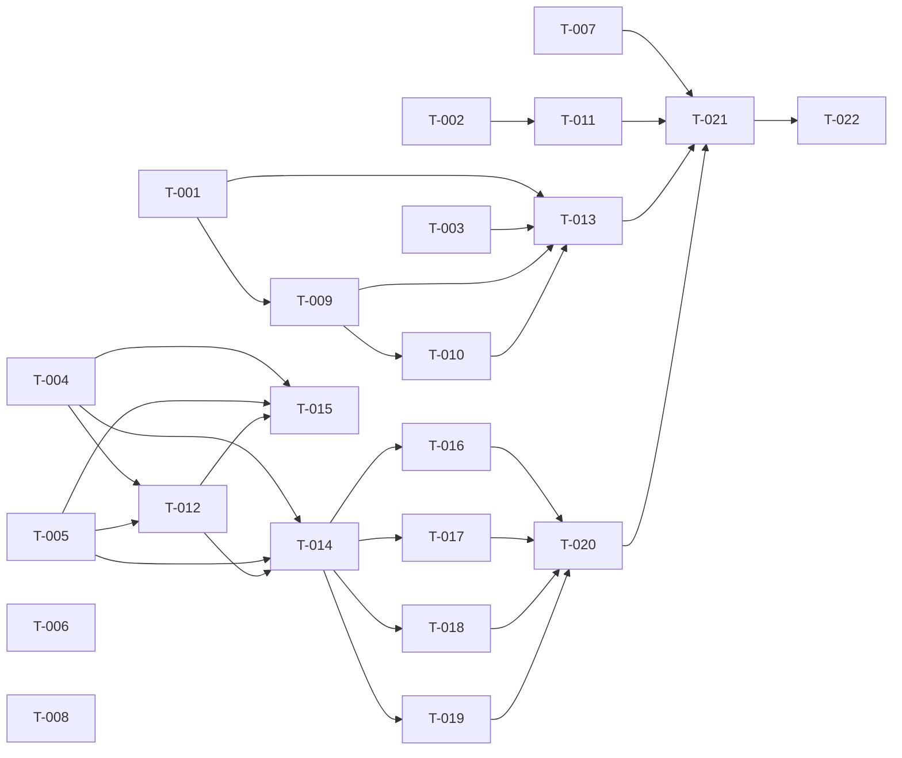

# Build Site — v3 Audit Cleanup

22 tasks across 5 tiers from 6 cavekits (74 in-scope acceptance criteria, 100% coverage).

This build site is independent of `context/plans/build-site.md` (Phase 1) and `context/plans/build-site-phase2.md` (Phase 2). T-IDs restart at T-001 — impl tracking scopes by `Build site:` line. Only the strengthening / new requirements introduced by the v5.0.0-dcr.3 audit-cleanup amendments are decomposed here; existing implemented R bodies of the revised kits are not re-emitted.

---

## Tier 0 — No dependencies (start here, fully parallel)

| Task | Title | Cavekit | Requirement | Effort |
|------|-------|---------|-------------|--------|
| T-001 | Delete the offending `internal/query/projection/dcr_software_statement_jtis.go` projection file and remove its `DCRSoftwareStatementJTIProjection` entry from `newProjectionsList()` in `internal/query/projection/projection.go` (the v3 BLOCKER root cause) | cavekit-software-statement.md | R9 / R12 | S |
| T-002 | Add a numbered setup step `cmd/setup/NN.go` (next free index after `cmd/setup/14.go`) plus its embedded `cmd/setup/NN.sql` that `CREATE TABLE projections.dcr_software_statement_jtis1 (software_statement_iss TEXT, software_statement_jti TEXT, instance_id TEXT, created_at TIMESTAMPTZ, expires_at TIMESTAMPTZ)` with `UNIQUE (instance_id, software_statement_iss, software_statement_jti)` and an index on `expires_at`; register the step in `cmd/setup/setup.go`'s migration slice | cavekit-software-statement.md | R9 / R12 | M |
| T-003 | grep-scan invariant test: add a `_test.go` (e.g. `internal/query/projection/no_empty_reducers_test.go`) that walks `internal/query/projection/`, `internal/admin/repository/eventsourcing/handler/`, `internal/auth/repository/eventsourcing/handler/`, and `internal/notification/handlers/` and asserts no projection's `Reducers()` returns nil or `[]handler.AggregateReducer{}` (the same predicate the framework guard from cavekit-eventstore-framework-guard.md R1 enforces at runtime, surfaced as a callsite-resolution test) | cavekit-software-statement.md | R12 | S |
| T-004 | Implement i18n pipeline script at `console/scripts/translate-i18n.mjs` (Node ESM module): reads source `console/src/assets/i18n/en.json`, walks `console/src/assets/i18n/*.json` targets, env-var config (`ANTHROPIC_API_KEY` required exit-non-zero on missing, `ANTHROPIC_MODEL` default `claude-haiku-4-5-20251001`, `I18N_SOURCE`, `I18N_TARGET_DIR`, `I18N_LOCALES`, `I18N_DRY_RUN`); register pnpm script `"translate-i18n": "node scripts/translate-i18n.mjs"` in `console/package.json`; per-locale progress lines to stderr; clean exit codes | cavekit-i18n-pipeline.md | R1 | M |
| T-005 | Implement idempotent merge logic + unit tests inside the same script (or a colocated `console/scripts/translate-i18n.merge.mjs` with `*.test.mjs`): pre-API diff phase computes `source-keys MINUS target-keys` recursively; empty diff → skip locale entirely (no API call); merge writes only newly-translated keys at correct nested paths leaving every existing key bit-identical; final output preserves source key order at each nesting level; unit tests cover the flat case `{a:1,b:2,c:3}` + `{a:'X'}` + translations `{b:'Y',c:'Z'}` → `{a:'X',b:'Y',c:'Z'}` and the nested case `{x:{y:1,z:2}}` + `{x:{y:'A'}}` + translations `{x:{z:'B'}}` → `{x:{y:'A',z:'B'}}` | cavekit-i18n-pipeline.md | R4 | M |
| T-006 | Add R13 `aud`-validation to `internal/api/oidc/dcr/software_statement/verify.go`: when JWT body contains `aud`, check it equals (string) or contains (array) the configured token-endpoint URL; new config `OIDC.DCR.SoftwareStatement.SkipAudValidation: false` default in `cmd/defaults.yaml` with env binding `ZITADEL_OIDC_DCR_SOFTWARESTATEMENT_SKIPAUDVALIDATION`; absent `aud` → behavior unchanged; mismatch → fail with new result-enum `invalid_audience` mapped to RFC 7591 `invalid_software_statement`; `SkipAudValidation: true` → no aud check; extend the `result` enum on `zitadel.dcr.software_statement_verifications_total` (Phase 2 R11 metric) with the new `invalid_audience` label-value; unit tests in `internal/api/oidc/dcr/software_statement/verify_test.go` cover all six branches (absent, string-match, array-match, string-mismatch, array-mismatch, skip-flag-on) | cavekit-software-statement.md | R13 | M |
| T-007 | Flip `ManageFromContext` contract in `internal/api/oidc/dcr/manage.go`: change return signature so a missing `manageContextKey{}` value `panic`s with a clear programmer-error message (e.g. `"dcr.ManageFromContext called without manageVerifyDispatch in the chain — programmer error"`); delete every `if mctx == nil { … WriteError(invalid_token) … }` guard from `internal/api/oidc/dcr/manage_get.go`, `manage_put.go`, `manage_delete.go`; add a unit test in `internal/api/oidc/dcr/manage_from_context_test.go` (or extend `manage_test.go`) that asserts the panic when called with raw `context.Background()`; verify recover middleware at `internal/api/oidc/op.go:300` still catches it (no server crash on misconfigured request); grep-scan acceptance: `grep -rn 'mctx == nil\|mc == nil' internal/api/oidc/dcr/` returns only the panic-site (or zero matches if structured as `if v, ok := …; !ok { panic(…) }`) | cavekit-manage-handler.md | R8 | M |
| T-008 | Doctrine-only: add the contrasting-pattern note + Out-of-Scope bullet to `cavekit-iat.md` R8 already exists in the kit body (this is a documentation-only AC) — verify the Out-of-Scope line "TTL/janitor cleanup of consumed IAT rows — explicitly NOT needed; slot uniqueness via eventstore `UniqueConstraint` (R2) covers replay protection structurally. See R8." is present; verify the cross-reference to `cavekit-software-statement.md` R9 is present in the Cross-References section; run grep-scan acceptance test `grep -rn "func.*Reap.*InitialAccessToken\|func.*[Ii]at[A-Z].*[Jj]anitor" --include='*.go'` and assert zero matches (positive negative — confirms no accidental janitor was added) | cavekit-iat.md | R8 | S |

---

## Tier 1 — Depends on Tier 0

| Task | Title | Cavekit | Requirement | blockedBy | Effort |
|------|-------|---------|-------------|-----------|--------|
| T-009 | Implement framework guard at `internal/eventstore/handler/v2/handler.go::NewHandler` (around line 174, immediately after `aggregates` is built and before `metrics := NewProjectionMetrics(ctx)` and the `handler := &Handler{…}` literal): if `len(aggregates) == 0 && config.TriggerWithoutEvents == nil && !projection.implements(GlobalProjection)` then panic with the actionable message `eventstore/handler/v2: projection %q has empty Reducers, no TriggerWithoutEvents, and does not implement GlobalProjection — refusing to construct because the prefill loop would scan the entire eventstore as no-op statements. Use a numbered setup step (cmd/setup/NN.go) for application-managed tables, a TriggerWithoutEvents callback for scheduled-wakeup projections, or a FieldHandler for field projections.` (substitute `%q` with `projection.Name()`); FieldHandler at `field_handler.go:43-58` is unaffected because it constructs `Handler{}` via struct literal, not `NewHandler` | cavekit-eventstore-framework-guard.md | R1 | T-001 | M |
| T-010 | Truth-table tests at `internal/eventstore/handler/v2/nil_reducers_guard_test.go` (or extend `handler_test.go`): Case 1 panic — empty Reducers + nil TriggerWithoutEvents + non-Global → assert panic message substring `refusing to construct`; Case 2 pass — non-empty Reducers slice → no panic, constructed handler has non-empty `eventTypes`; Case 3 pass — empty Reducers but `Config.TriggerWithoutEvents` set to a non-nil `Reduce` function → no panic, callback stored; Case 4 pass — empty Reducers + nil TriggerWithoutEvents + projection implements `GlobalProjection` → no panic, `queryGlobal == true` | cavekit-eventstore-framework-guard.md | R2 | T-009 | S |
| T-011 | Wire JTI replay-dedupe janitor into `cmd/start/start.go`: implement `ReapExpiredSoftwareStatementJTIs(ctx, now) (int64, error)` on `*query.Queries` that deletes every row from `projections.dcr_software_statement_jtis1` with `expires_at < now`; start a janitor goroutine alongside `serviceping.Start` driven by a `time.Ticker` at `OIDC.DCR.Janitor.Interval` (default `1h`, gated by `OIDC.DCR.Janitor.Enabled` true-by-default) sourced from `cmd/defaults.yaml` with env-var bindings `ZITADEL_OIDC_DCR_JANITOR_ENABLED` and `ZITADEL_OIDC_DCR_JANITOR_INTERVAL`; goroutine exits cleanly on context cancellation (test asserts return within 100ms of `ctx.Done()`); grep-scan callsite test: `grep -rn "ReapExpiredSoftwareStatementJTIs" --include='*.go'` shows the janitor `tick()` callsite in addition to the function definition (zero callers = regression) | cavekit-software-statement.md | R9 | T-002 | M |
| T-012 | Translation-correctness contract in `console/scripts/translate-i18n.mjs`: system prompt to Claude Haiku enumerates the protected glossary (`Zitadel`, `OAuth`, `OIDC`, `JWT`, `JWKS`, `DCR`, `IAT`, `RAT`, `RFC 7591`, `RFC 7592`, `RFC 8707`, `PKCE`, `MCP`, `URL`, `URI`, `HTTP`, `HTTPS`, `JSON`, plus any all-uppercase initialism of length 2-6 detected in source values); explicit instructions for ICU/printf placeholder preservation (`{0}`, `{count}`, `{userName}`, `%s`, `%d` verbatim, no reordering, no localization); JSON-only response constraint; API call uses `temperature: 0`, `max_tokens: 8192`; on JSON parse failure log raw response truncated to 500 chars and exit non-zero per locale (do not write malformed output); per-key placeholder-set diff vs source — any divergence logs source/translated pair and exits non-zero (do not partially write); per-key glossary check — any protected-term divergence same fail-and-exit | cavekit-i18n-pipeline.md | R2 | T-004, T-005 | M |

---

## Tier 2 — Depends on Tier 1

| Task | Title | Cavekit | Requirement | blockedBy | Effort |
|------|-------|---------|-------------|-----------|--------|
| T-013 | Boot-smoke verification of framework-guard back-stop: extend the existing `cmd/setup` integration test (or add `cmd/start/no_panic_smoke_test.go`) with two cases — (a) fresh empty Postgres: `setup` + `start` complete without the guard panicking; (b) existing-data Postgres (upgrade simulation): boot completes without panic, no log line containing `refusing to construct` is emitted; explicit assertion that the grep-scan from `cavekit-eventstore-framework-guard.md` R3 (`grep -rn 'func.*Reducers().*\[\]handler.AggregateReducer' internal/admin/repository/eventsourcing/handler/ internal/auth/repository/eventsourcing/handler/ internal/notification/handlers/ internal/query/projection/ \| xargs grep -l 'return nil$\|return \[\]handler.AggregateReducer{}$'`) returns empty after T-001 has been applied | cavekit-eventstore-framework-guard.md | R3 | T-001, T-009, T-010 | M |
| T-014 | Run the i18n pipeline (Tier 1 product) against all 22 console locale files to populate the missing `DESCRIPTIONS.DCR.CLIENTS.*` and `DESCRIPTIONS.DCR.IAT.*` subtrees plus the new ARIA-label keys `DESCRIPTIONS.DCR.IAT.{REFRESH,REVOKE_BUTTON,COPY,REVEAL_TOGGLE,DISMISS}`; commit the regenerated locale files; verifiable via a shell loop that JSON-parses each locale and asserts both subtrees exist; translated values preserve all `{placeholder}` / `{count}` ICU tokens verbatim from English; no translated value is a literal English duplicate (modulo locale-neutral terms) | cavekit-console-ui-docs-and-observability.md | R3 | T-004, T-005, T-012 | M |
| T-015 | CI reproducibility verification target: add `console/scripts/translate-i18n.test.mjs` (or Nx target `nx run @zitadel/console:translate-i18n-verify`) that runs the pipeline twice with identical inputs and asserts the second run produces zero new writes; when `ANTHROPIC_API_KEY` is unset log `skipped — ANTHROPIC_API_KEY not configured` and exit zero; on main-branch CI where the key IS available a regression (any new diff) fails the build with a message instructing the operator to commit the regenerated locale files; supports `--dry-run` flag passed to underlying pipeline so the working tree is never modified — diff inspection is via dry-run output only | cavekit-i18n-pipeline.md | R3 | T-004, T-005, T-012 | S |

---

## Tier 3 — Depends on Tier 2 (frontend hygiene + Cypress teardown)

| Task | Title | Cavekit | Requirement | blockedBy | Effort |
|------|-------|---------|-------------|-----------|--------|
| T-016 | Subscription-cleanup hygiene in `console/src/app/modules/iat-admin/iat-admin.component.ts`: implement `OnDestroy`, declare `private destroy$ = new Subject<void>()`, complete it in `ngOnDestroy()`; pipe both existing `afterClosed().subscribe(...)` calls (lines 76, 127) through `takeUntil(this.destroy$)`; mirror the same pattern in any sibling subscription in `console/src/app/modules/dynamic-clients/` if present | cavekit-console-ui-docs-and-observability.md | R9 | T-014 | S |
| T-017 | trackBy hygiene: add `trackById = (_: number, row: { id: string }) => row.id` to `iat-admin.component.ts` and bind via `trackBy: trackById` on `iat-admin.component.html` `<table mat-table>` row definition; mirror the same trackBy pattern on `dynamic-clients.component.html` row definition | cavekit-console-ui-docs-and-observability.md | R9 | T-014 | S |
| T-018 | ARIA-label hygiene on icon-only buttons: every `<button mat-icon-button>` in `iat-admin.component.html`, `iat-plaintext-dialog.component.html`, `iat-revoke-dialog.component.html`, `iat-issue-dialog.component.html`, and `dynamic-clients.component.html` gets `[attr.aria-label]="'KEY' | translate"` matching its tooltip — required keys `DESCRIPTIONS.DCR.IAT.{REFRESH,REVOKE_BUTTON,COPY,REVEAL_TOGGLE,DISMISS}` (the keys T-014 already populated across all 22 locales); add presence test in `console/src/app/modules/iat-admin/iat-admin.component.spec.ts` for `aria-label` on the per-row revoke button | cavekit-console-ui-docs-and-observability.md | R9 | T-014 | M |
| T-019 | Status-text-accompanies-color hygiene: status badges in `iat-admin.component.html` (active / revoked) render a translated text label in the same DOM node as the colored span; SCSS MUST NOT use `text-indent: -9999px`, `font-size: 0`, or `display: none` to hide the text from sighted users; verifiable by visual smoke and by `getComputedStyle()` assertion in a unit test | cavekit-console-ui-docs-and-observability.md | R9 | T-014 | S |
| T-020 | Cypress teardown helpers + per-spec `afterEach()`: create `tests/functional-ui/cypress/support/dcr-helpers.ts` exposing `teardownIATs(projectId)` (revokes every IAT issued during the test, idempotent — tolerates already-revoked) and `teardownDCRClients(projectId)` (deletes every client registered during the test via the management gRPC client, tolerates already-deleted); add `afterEach()` blocks to `tests/functional-ui/cypress/e2e/dcr/iat.cy.ts` and `tests/functional-ui/cypress/e2e/dcr/dcr-clients.cy.ts` that call the helpers; teardown failures (e.g. RPC unavailable) are logged but do NOT fail the test (preserve diagnostic signal from the actual assertions); re-running each spec twice in immediate sequence shows zero state accumulation (count of IAT rows / DCR clients in the instance after the second run equals the count before the first run, modulo unrelated test fixtures) | cavekit-console-ui-docs-and-observability.md | R10 | T-016, T-017, T-018, T-019 | M |

---

## Tier 4 — Verification + ship

| Task | Title | Cavekit | Requirement | blockedBy | Effort |
|------|-------|---------|-------------|-----------|--------|
| T-021 | End-to-end smoke (fresh DB + existing-data DB): boot Zitadel against a fresh empty Postgres and against an upgrade-simulation Postgres with prior v5.0.0-dcr.2 data; for each: register a confidential web client via `POST /oidc/v1/register` with a verified `software_statement` carrying `aud` (R13 happy path); assert audit event populated with `SoftwareStatementJTI`; second registration with same `(iss, jti)` is rejected as replay; janitor reaper runs once on tick (R9 wiring); RFC 7592 PUT against the registered client succeeds and the dispatcher-monopoly assertion holds (no panic from R7); console renders the IAT admin module with all ARIA labels translated, trackBy honored, subscriptions disposed on navigation away; Cypress specs run twice consecutively with zero state accumulation (R10 invariant); no `refusing to construct` log line | cavekit-software-statement.md, cavekit-eventstore-framework-guard.md, cavekit-console-ui-docs-and-observability.md, cavekit-manage-handler.md | R9 / R3 / R9, R10 / R8 | T-011, T-013, T-020, T-007 | L |
| T-022 | Operator-driven (NOT a builder task): build and push image `jpgeek/zitadel:v5.0.0-dcr.3` (and any `jpgeek/zitadel-*` companion images per the existing release procedure); tag the git ref; update the deployment manifest. Listed here for completeness — the image build is dispatched by the operator after T-021 passes; no acceptance criterion is mapped to this task | (operational) | n/a | S |

---

## Summary

| Tier | Tasks | Effort |
|------|-------|--------|
| 0 | 8 | mixed S/M (projection deletion, setup step, i18n pipeline scaffold, R13 aud-validate, R8 panic-flip, doctrine-only iat R8) |
| 1 | 4 | mixed S/M (framework guard at NewHandler, truth-table tests, janitor wiring, translation-correctness contract) |
| 2 | 3 | mixed S/M (boot-smoke back-stop, run pipeline against 22 locales, CI reproducibility verification) |
| 3 | 5 | mixed S/M (subscription cleanup, trackBy, ARIA labels, status text, Cypress teardown) |
| 4 | 2 | L + S (end-to-end smoke, operator image build) |

**Total: 22 tasks, 5 tiers (T-001..T-022).**

T-ID ranges by tier: T-001..T-008 (8) / T-009..T-012 (4) / T-013..T-015 (3) / T-016..T-020 (5) / T-021..T-022 (2) = 22.

---

## Coverage Matrix

Lists every in-scope acceptance criterion (the v3 strengthening / additions only) and the task(s) that cover it.

### cavekit-software-statement.md R9 strengthening (numbered setup step + janitor wiring + grep-scan callsite test)

| Cavekit | Req | Criterion (abbreviated) | Task(s) | Status |
|---------|-----|-------------------------|---------|--------|
| cavekit-software-statement.md | R9 | Table `projections.dcr_software_statement_jtis1` is created by a numbered setup step under `cmd/setup/`, registered in `cmd/setup/setup.go`'s migration slice | T-002 | COVERED |
| cavekit-software-statement.md | R9 | No file under `internal/query/projection/` registers a projection for this table; `newProjectionsList()` does NOT contain a `DCRSoftwareStatementJTIProjection` entry | T-001 | COVERED |
| cavekit-software-statement.md | R9 | Reaper function `ReapExpiredSoftwareStatementJTIs(ctx, now) (int64, error)` on `*query.Queries` deletes every row with `expires_at < now` | T-011 | COVERED |
| cavekit-software-statement.md | R9 | Janitor goroutine started during `cmd/start/start.go` (alongside `serviceping.Start`) calls reaper on configurable `time.Ticker` (default 1h, configured via `OIDC.DCR.Janitor.{Enabled,Interval}` in `cmd/defaults.yaml` with `ZITADEL_OIDC_DCR_JANITOR_*` env-var bindings) | T-011 | COVERED |
| cavekit-software-statement.md | R9 | Janitor exits cleanly on context cancellation (test asserts return within 100ms of `ctx.Done()`) | T-011 | COVERED |
| cavekit-software-statement.md | R9 | grep-scan: `grep -rn "ReapExpiredSoftwareStatementJTIs" --include='*.go'` shows the janitor `tick()` callsite in addition to the function definition | T-011 | COVERED |

### cavekit-software-statement.md R12 (application-managed tables avoid projection framework)

| Cavekit | Req | Criterion (abbreviated) | Task(s) | Status |
|---------|-----|-------------------------|---------|--------|
| cavekit-software-statement.md | R12 | No file under `internal/query/projection/` declares a projection whose `Reducers()` returns nil or `[]handler.AggregateReducer{}` | T-001, T-003 | COVERED |
| cavekit-software-statement.md | R12 | Framework guard in `internal/eventstore/handler/v2/handler.go::NewHandler` panics on the degenerate combination (authoritative definition lives in cavekit-eventstore-framework-guard.md R1) | T-009 | COVERED |
| cavekit-software-statement.md | R12 | The kit + framework-guard kit together prevent the JTI-projection mistake from recurring | T-001, T-002, T-003, T-009 | COVERED |

### cavekit-software-statement.md R13 (auto-validate `aud` claim when present)

| Cavekit | Req | Criterion (abbreviated) | Task(s) | Status |
|---------|-----|-------------------------|---------|--------|
| cavekit-software-statement.md | R13 | `OIDC.DCR.SoftwareStatement.SkipAudValidation: false` default in `cmd/defaults.yaml` with env binding `ZITADEL_OIDC_DCR_SOFTWARESTATEMENT_SKIPAUDVALIDATION` | T-006 | COVERED |
| cavekit-software-statement.md | R13 | `aud` absent → behavior unchanged (no new failure mode) | T-006 | COVERED |
| cavekit-software-statement.md | R13 | `aud` is string and matches token-endpoint URL exactly → verification proceeds | T-006 | COVERED |
| cavekit-software-statement.md | R13 | `aud` is array containing token-endpoint URL → verification proceeds | T-006 | COVERED |
| cavekit-software-statement.md | R13 | `aud` present but mismatch → verification fails with new result enum `invalid_audience` mapped to `invalid_software_statement` per RFC 7591 §3.2.2 | T-006 | COVERED |
| cavekit-software-statement.md | R13 | `SkipAudValidation: true` → behavior reverts to no aud check (Phase 2 status quo) | T-006 | COVERED |
| cavekit-software-statement.md | R13 | Verifier metric `zitadel.dcr.software_statement_verifications_total` adds new label-value `result=invalid_audience` | T-006 | COVERED |
| cavekit-software-statement.md | R13 | Unit tests in `internal/api/oidc/dcr/software_statement/verify_test.go` cover all six cases | T-006 | COVERED |

### cavekit-iat.md R8 (defensive doctrine note)

| Cavekit | Req | Criterion (abbreviated) | Task(s) | Status |
|---------|-----|-------------------------|---------|--------|
| cavekit-iat.md | R8 | No janitor goroutine, no `Reap*InitialAccessToken*` query, no scheduled cleanup wired for `projections.initial_access_tokens` (slot exhaustion enforced via R2 UniqueConstraint pattern) | T-008 | COVERED |
| cavekit-iat.md | R8 | Out of Scope explicitly lists "TTL/janitor cleanup of consumed IAT rows — not needed; slot uniqueness via eventstore UniqueConstraint covers replay protection structurally" | T-008 | COVERED |
| cavekit-iat.md | R8 | Future kits cite `cavekit-iat.md` R8 (eventstore-derivable identity) OR `cavekit-software-statement.md` R9 (externally-issued identity) as chosen replay-protection pattern | T-008 | COVERED |
| cavekit-iat.md | R8 | grep-scan: `grep -rn "func.*Reap.*InitialAccessToken\|func.*[Ii]at[A-Z].*[Jj]anitor" --include='*.go'` returns zero matches | T-008 | COVERED |

### cavekit-console-ui-docs-and-observability.md R3 strengthening (full-locale coverage of DCR keys)

| Cavekit | Req | Criterion (abbreviated) | Task(s) | Status |
|---------|-----|-------------------------|---------|--------|
| cavekit-console-ui-docs-and-observability.md | R3 | For every supported locale each `Errors.DCR.*` key resolves to a non-empty, non-raw-key string (or absent + fallback test guarantees English emission); partial-empty / partial-English-copied is NOT acceptable | T-014 | COVERED |
| cavekit-console-ui-docs-and-observability.md | R3 | Every key in `DESCRIPTIONS.DCR.CLIENTS.*` and `DESCRIPTIONS.DCR.IAT.*` (and any other DCR-namespaced subtrees) exists in all 22 locale files under `console/src/assets/i18n/` (verifiable via shell loop that JSON-parses each locale) | T-014 | COVERED |
| cavekit-console-ui-docs-and-observability.md | R3 | Translated values preserve all `{placeholder}` / `{count}` ICU tokens verbatim from English source | T-012, T-014 | COVERED |
| cavekit-console-ui-docs-and-observability.md | R3 | No translated value is identical to the English source (excluding locale-neutral brand names / HTTP methods / status codes — reviewer judgment) | T-012, T-014 | COVERED |
| cavekit-console-ui-docs-and-observability.md | R3 | Translation bootstrap is reproducible: re-running pipeline against same source produces same outputs (deterministic prompt + `temperature=0`); CI dry-run diffs two consecutive outputs | T-015 | COVERED |
| cavekit-console-ui-docs-and-observability.md | R3 | `ngx-translate` retains English-fallback runtime safety net but R3 acceptance does NOT consider a fallback resolution as a passing locale — every locale must have explicit values for the enumerated DCR keys | T-014 | COVERED |

### cavekit-console-ui-docs-and-observability.md R9 (frontend hygiene)

| Cavekit | Req | Criterion (abbreviated) | Task(s) | Status |
|---------|-----|-------------------------|---------|--------|
| cavekit-console-ui-docs-and-observability.md | R9 | `iat-admin.component.ts` implements `OnDestroy`, declares `private destroy$ = new Subject<void>()`, completes it in `ngOnDestroy()`; both `afterClosed().subscribe(...)` calls piped through `takeUntil(this.destroy$)` | T-016 | COVERED |
| cavekit-console-ui-docs-and-observability.md | R9 | `iat-admin.component.html` `<table mat-table>` row definition includes `trackBy: trackById` bound to component method `trackById = (_: number, row: { id: string }) => row.id` | T-017 | COVERED |
| cavekit-console-ui-docs-and-observability.md | R9 | `dynamic-clients.component.html` row definition includes the same trackBy pattern | T-017 | COVERED |
| cavekit-console-ui-docs-and-observability.md | R9 | Every `<button mat-icon-button>` in `iat-admin.component.html`, `iat-plaintext-dialog.component.html`, `iat-revoke-dialog.component.html`, `iat-issue-dialog.component.html`, `dynamic-clients.component.html` has `[attr.aria-label]="'KEY' | translate"` (required keys `DESCRIPTIONS.DCR.IAT.{REFRESH,REVOKE_BUTTON,COPY,REVEAL_TOGGLE,DISMISS}`, machine-translated to all 22 locales by T-014) | T-018 | COVERED |
| cavekit-console-ui-docs-and-observability.md | R9 | Status badges in `iat-admin.component.html` (active / revoked) render a translated text label in the same DOM node as the colored span; SCSS MUST NOT use `text-indent: -9999px`, `font-size: 0`, or `display: none`; verifiable by visual smoke and `getComputedStyle()` assertion | T-019 | COVERED |
| cavekit-console-ui-docs-and-observability.md | R9 | `iat-admin.component.spec.ts` adds an `aria-label` presence test on the per-row revoke button | T-018 | COVERED |
| cavekit-console-ui-docs-and-observability.md | R9 | No regression in existing R1/R2 functionality (existing Cypress smokes from R4 still pass, plus new R10 teardown additions) | T-021 | COVERED |

### cavekit-console-ui-docs-and-observability.md R10 (Cypress teardown leaves zero artifacts)

| Cavekit | Req | Criterion (abbreviated) | Task(s) | Status |
|---------|-----|-------------------------|---------|--------|
| cavekit-console-ui-docs-and-observability.md | R10 | `iat.cy.ts` has `afterEach()` revoking every IAT issued during the test (idempotent — tolerates already-revoked) | T-020 | COVERED |
| cavekit-console-ui-docs-and-observability.md | R10 | `dcr-clients.cy.ts` has `afterEach()` deleting every client registered during the test (via management gRPC client; tolerates already-deleted) | T-020 | COVERED |
| cavekit-console-ui-docs-and-observability.md | R10 | Re-running each spec twice in immediate sequence shows zero state accumulation | T-020, T-021 | COVERED |
| cavekit-console-ui-docs-and-observability.md | R10 | Teardown failures (e.g. RPC unavailable) logged but do NOT fail the test (preserve diagnostic signal) | T-020 | COVERED |
| cavekit-console-ui-docs-and-observability.md | R10 | Helper functions (e.g. `teardownIATs(projectId)`) live in shared `tests/functional-ui/cypress/support/dcr-helpers.ts` so both specs reuse | T-020 | COVERED |

### cavekit-manage-handler.md R8 (`ManageFromContext` panic on missing)

| Cavekit | Req | Criterion (abbreviated) | Task(s) | Status |
|---------|-----|-------------------------|---------|--------|
| cavekit-manage-handler.md | R8 | `ManageFromContext(ctx)` returns `*ManageContext` and `panic`s with a clear message when no value is found via `manageContextKey{}` | T-007 | COVERED |
| cavekit-manage-handler.md | R8 | Every consumer in `manage_get.go`, `manage_put.go`, `manage_delete.go` deletes its `if mctx == nil { … }` guard | T-007 | COVERED |
| cavekit-manage-handler.md | R8 | Unit test asserts the panic when called with raw `context.Background()` | T-007 | COVERED |
| cavekit-manage-handler.md | R8 | All existing manage-handler integration tests pass unchanged (dispatcher monopoly means production paths never trigger panic) | T-007, T-021 | COVERED |
| cavekit-manage-handler.md | R8 | grep-scan: `grep -rn 'mctx == nil\|mc == nil' internal/api/oidc/dcr/` returns only the panic site (or zero hits) | T-007 | COVERED |

### cavekit-eventstore-framework-guard.md R1 (NewHandler degenerate-construction guard)

| Cavekit | Req | Criterion (abbreviated) | Task(s) | Status |
|---------|-----|-------------------------|---------|--------|
| cavekit-eventstore-framework-guard.md | R1 | `NewHandler` evaluates the three conditions immediately after `aggregates` is built (around line 174, before any side-effecting setup) and panics with the actionable message containing `refusing to construct because the prefill loop would scan the entire eventstore as no-op statements` | T-009 | COVERED |
| cavekit-eventstore-framework-guard.md | R1 | Guard runs BEFORE `metrics := NewProjectionMetrics(ctx)` and BEFORE the `handler := &Handler{…}` literal — failure mode is "panic before any side effect" | T-009 | COVERED |
| cavekit-eventstore-framework-guard.md | R1 | `FieldHandler` (`field_handler.go:43-58`) is unaffected — constructs `Handler{}` directly via struct literal, not via `NewHandler` | T-009 | COVERED |
| cavekit-eventstore-framework-guard.md | R1 | Projections that implement `GlobalProjection` pass regardless of Reducers content | T-009, T-010 | COVERED |
| cavekit-eventstore-framework-guard.md | R1 | Projections with `Reducers()` returning non-empty slice pass | T-009, T-010 | COVERED |
| cavekit-eventstore-framework-guard.md | R1 | Projections with empty Reducers but `Config.TriggerWithoutEvents != nil` pass | T-009, T-010 | COVERED |

### cavekit-eventstore-framework-guard.md R2 (truth-table test coverage)

| Cavekit | Req | Criterion (abbreviated) | Task(s) | Status |
|---------|-----|-------------------------|---------|--------|
| cavekit-eventstore-framework-guard.md | R2 | Case 1 (panic): empty Reducers + nil TriggerWithoutEvents + non-Global → asserts panic with substring `refusing to construct` | T-010 | COVERED |
| cavekit-eventstore-framework-guard.md | R2 | Case 2 (pass — non-empty Reducers): one-element `[]AggregateReducer` → no panic, non-empty `eventTypes` | T-010 | COVERED |
| cavekit-eventstore-framework-guard.md | R2 | Case 3 (pass — TriggerWithoutEvents set): empty Reducers + non-nil callback → no panic, callback stored | T-010 | COVERED |
| cavekit-eventstore-framework-guard.md | R2 | Case 4 (pass — GlobalProjection): empty Reducers + projection implements `GlobalProjection` → no panic, `queryGlobal == true` | T-010 | COVERED |
| cavekit-eventstore-framework-guard.md | R2 | All four tests run as part of `go test ./internal/eventstore/handler/v2/...` and pass | T-010 | COVERED |

### cavekit-eventstore-framework-guard.md R3 (back-stop verification — guard does not affect existing projections)

| Cavekit | Req | Criterion (abbreviated) | Task(s) | Status |
|---------|-----|-------------------------|---------|--------|
| cavekit-eventstore-framework-guard.md | R3 | `cmd/setup` integration (or boot-smoke) starts fresh Zitadel against empty Postgres and completes setup + start without guard panicking | T-013 | COVERED |
| cavekit-eventstore-framework-guard.md | R3 | Same against existing-data Postgres (upgrade simulation): boot completes without panic, no `refusing to construct` log line | T-013, T-021 | COVERED |
| cavekit-eventstore-framework-guard.md | R3 | grep-scan acceptance: `grep -rn 'func.*Reducers().*\[\]handler.AggregateReducer' …` xargs grep -l 'return nil$\|return \[\]…{}$' returns empty after Step 1 (T-001) | T-003, T-013 | COVERED |

### cavekit-i18n-pipeline.md R1 (script structure, invocation, env-var config)

| Cavekit | Req | Criterion (abbreviated) | Task(s) | Status |
|---------|-----|-------------------------|---------|--------|
| cavekit-i18n-pipeline.md | R1 | Script lives at `console/scripts/translate-i18n.mjs` and is a valid Node ESM module | T-004 | COVERED |
| cavekit-i18n-pipeline.md | R1 | Registered as pnpm script `"translate-i18n": "node scripts/translate-i18n.mjs"` in `console/package.json` | T-004 | COVERED |
| cavekit-i18n-pipeline.md | R1 | Env vars: `ANTHROPIC_API_KEY` (required, exit non-zero if missing), `ANTHROPIC_MODEL` (default `claude-haiku-4-5-20251001`), `I18N_SOURCE` default `console/src/assets/i18n/en.json`, `I18N_TARGET_DIR` default `console/src/assets/i18n/`, `I18N_LOCALES` (comma-separated default = all `*.json` minus `en.json`), `I18N_DRY_RUN` (boolean default false) | T-004 | COVERED |
| cavekit-i18n-pipeline.md | R1 | Script exits zero on success, non-zero on any error; stderr carries diagnostic detail | T-004 | COVERED |
| cavekit-i18n-pipeline.md | R1 | Per-locale progress lines: `translating <locale> (<N missing keys>)` → `wrote <locale> (<N keys added>)` or `skipped <locale> (no missing keys)` | T-004 | COVERED |
| cavekit-i18n-pipeline.md | R1 | Script produces no stdout output other than progress lines | T-004 | COVERED |

### cavekit-i18n-pipeline.md R2 (translation correctness — placeholders, glossary, determinism)

| Cavekit | Req | Criterion (abbreviated) | Task(s) | Status |
|---------|-----|-------------------------|---------|--------|
| cavekit-i18n-pipeline.md | R2 | System prompt enumerates protected glossary (`Zitadel`, `OAuth`, `OIDC`, `JWT`, `JWKS`, `DCR`, `IAT`, `RAT`, `RFC 7591`, `RFC 7592`, `RFC 8707`, `PKCE`, `MCP`, `URL`, `URI`, `HTTP`, `HTTPS`, `JSON`, plus all-uppercase initialism length 2-6); placeholder preservation; JSON-only output; structure preservation | T-012 | COVERED |
| cavekit-i18n-pipeline.md | R2 | API call uses `temperature: 0`, `max_tokens` ≥ 8192 | T-012 | COVERED |
| cavekit-i18n-pipeline.md | R2 | Output validation: parsed as JSON; on parse failure exit non-zero with raw response truncated to 500 chars (do not write malformed file) | T-012 | COVERED |
| cavekit-i18n-pipeline.md | R2 | Placeholder check: per-key set of `{...}` and `%s`/`%d` tokens MUST equal source set; divergence logs source/translated pair and exits non-zero | T-012 | COVERED |
| cavekit-i18n-pipeline.md | R2 | Glossary check: per-key every protected term appearing in source MUST appear verbatim in translation; violations follow the same fail-and-exit pattern | T-012 | COVERED |
| cavekit-i18n-pipeline.md | R2 | Determinism smoke test (run as part of R3): two consecutive runs same source produce identical "would-write" payloads | T-015 | COVERED |

### cavekit-i18n-pipeline.md R3 (CI reproducibility verification)

| Cavekit | Req | Criterion (abbreviated) | Task(s) | Status |
|---------|-----|-------------------------|---------|--------|
| cavekit-i18n-pipeline.md | R3 | Test target (e.g. `console/scripts/translate-i18n.test.mjs` or Nx target `nx run @zitadel/console:translate-i18n-verify`) runs pipeline twice with identical inputs and asserts second run produces zero new writes | T-015 | COVERED |
| cavekit-i18n-pipeline.md | R3 | When `ANTHROPIC_API_KEY` unset, test logs `skipped — ANTHROPIC_API_KEY not configured` and exits zero | T-015 | COVERED |
| cavekit-i18n-pipeline.md | R3 | On main-branch CI where key IS available, regression (any new diff) fails the build with operator-instruction message | T-015 | COVERED |
| cavekit-i18n-pipeline.md | R3 | Test accepts `--dry-run` flag passed to underlying pipeline so working tree is never modified — diff inspection via dry-run output only | T-015 | COVERED |

### cavekit-i18n-pipeline.md R4 (idempotent merge — never overwrite existing target values)

| Cavekit | Req | Criterion (abbreviated) | Task(s) | Status |
|---------|-----|-------------------------|---------|--------|
| cavekit-i18n-pipeline.md | R4 | Pre-API-call diff phase: per target locale compute set of keys present in source but missing in target (recursively, by JSON path) | T-005 | COVERED |
| cavekit-i18n-pipeline.md | R4 | If diff is empty, locale is skipped entirely (no API call, no file write) | T-005 | COVERED |
| cavekit-i18n-pipeline.md | R4 | If diff non-empty, only missing keys sent to API; existing target keys NOT included in request payload | T-005 | COVERED |
| cavekit-i18n-pipeline.md | R4 | Merge writes translated keys back at correct nested paths leaving every other key bit-identical to its prior value | T-005 | COVERED |
| cavekit-i18n-pipeline.md | R4 | Final file output preserves source's key order at each nesting level | T-005 | COVERED |
| cavekit-i18n-pipeline.md | R4 | Unit test: source `{a:1,b:2,c:3}` + target `{a:'X'}` + translations `{b:'Y',c:'Z'}` → `{a:'X',b:'Y',c:'Z'}` | T-005 | COVERED |
| cavekit-i18n-pipeline.md | R4 | Unit test nested case: source `{x:{y:1,z:2}}` + target `{x:{y:'A'}}` + translations `{x:{z:'B'}}` → `{x:{y:'A',z:'B'}}` | T-005 | COVERED |

**Coverage Status: 100% — every in-scope acceptance criterion has at least one task assigned.** No GAPs.

---

## Dependency Graph

Tier 0 nodes (T-001..T-008) have no incoming edges and may run in parallel. T-006 (R13 aud-validation) and T-008 (iat R8 doctrine) are leaves until the Tier 4 smoke (T-021) folds R13 in via the happy-path test; T-008 is a documentation-only verification with no downstream dependency.

---

## Notes

- **DESIGN.md absent** at project root (verified). UI tasks (T-016..T-019) reference the existing console patterns under `console/src/app/modules/iat-admin/` and `console/src/app/modules/dynamic-clients/` directly per the kit's "Reference style guide" preamble — no `Design Ref` annotation emitted.
- **Setup-step number for T-002**: chose `NN` placeholder rather than hardcoding `15`; existing `cmd/setup/` directory listing shows numbered files up through `14.go` plus a few without numbers — builder picks the next free index at implementation time and reflects it in the task PR.
- **R9 hygiene split into four tasks** (T-016 takeUntil, T-017 trackBy, T-018 ARIA, T-019 status text): the four hygiene patterns are independent except that T-018 ARIA depends on Tier 2 i18n key population (T-014) for the `aria-label` translations to resolve. T-016/T-017/T-019 also list T-014 as `blockedBy` only via the parent-tier convention (the hygiene work is internally independent but the tier ordering is preserved so the build site reads as a single front).
- **T-008 (iat R8) is doctrine-only** — kit body changes already exist; the task verifies the kit text is in place and runs the grep-scan invariant. No code is written. Effort = S.
- **T-022 (operator image build) is operator-driven**, not a builder task. It is listed for completeness so the release sequence is visible in one diagram, but it carries no kit acceptance criterion mapping and the builder agent should skip it.
- **Janitor wiring (T-011)** is in Tier 1 (depends on T-002 setup step, not on framework-guard work) — chose this ordering because the janitor's reaper code path requires the table to exist; T-009 (framework guard) and T-011 (janitor) are independently dispatchable within Tier 1.
- **Boot-smoke (T-013)** depends on both T-001 (projection deletion) and T-009/T-010 (framework guard) so that the back-stop test confirms (a) the deletion landed and (b) the guard does not trip on any other current projection. The grep-scan from R3 is folded into T-013 alongside the boot-smoke.
- **End-to-end smoke (T-021)** intentionally folds in T-007 (`ManageFromContext` panic) verification as well as the R13/R9/R10 end-to-end checks — keeps the verification surface minimal while exercising every Tier 0..3 deliverable.

---

## Tier 5 — Post-loop revision (added 2026-05-05 by /ck:check)

Tasks added after the v3 build loop closed; addresses /ck:check findings F-001..F-014 + surveyor gaps. T-IDs continue from T-022.

| Task | Title | Cavekit | Requirement | blockedBy | Effort |
|------|-------|---------|-------------|-----------|--------|
| T-023 | Wire `SoftwareStatementPipeline` in `cmd/start/start.go`: construct `*software_statement.PipelineDeps` (TrustedIssuers, AllowedAlgorithms, JWKSCache, ReplayRecorder closure → `query.RecordSoftwareStatementJTI`, JTIRetentionBuffer, Now, VerificationRecorder, TokenEndpoint sourced from OIDC discovery, SkipAudValidation from config) and assign to `dcrDeps.SoftwareStatementPipeline` when `OIDC.DCR.SoftwareStatement.Enabled=true`; add `RegistrationDeps.Validate()` boot-time check that fails when Enabled && Pipeline==nil; integration test asserts `software_statement_verifications_total{result="accepted"}` increments on a verified statement | cavekit-software-statement.md | R14 | — | M |
| T-024 | `VerifyAudience` rejects when `tokenEndpoint == ""` regardless of skip flag (defense in depth); `software_statement.PipelineDeps.Validate()` returns error when `!SkipAudValidation && TokenEndpoint == ""`; `cmd/start/start.go` calls `Validate()` and surfaces error blocking startup; new unit test for `aud == "" && tokenEndpoint == ""` → `invalid_audience` | cavekit-software-statement.md | R15 | T-023 | S |
| T-025 | Wrap dcr router chain in `middleware.RecoverHandler(dcrWriteRecoverError)` at `cmd/start/start.go:868` BEFORE the instance interceptor; `dcrWriteRecoverError` emits `application/json` RFC 7591 §3.2.2 envelope; new invariant test (sibling of `dcr_mount_test.go`) injects panic into stub handler and asserts JSON envelope shape; correct misleading comments at `manage.go:410`, `manage_get_test.go:193`, `manage_from_context_test.go:11` | cavekit-manage-handler.md | R9 | — | M |
| T-026 | Re-fill `DESCRIPTIONS.DCR.OPERATOR_PANEL.*` (~7 keys), `DESCRIPTIONS.DCR.RAT_DIALOG.*` (~6 keys), `DESCRIPTIONS.DCR.ORG_IAT.*` (~13 keys), `DESCRIPTIONS.DCR.MANAGED_BY_CLIENT` across all 21 non-en locales; either via live `pnpm translate-i18n` (preferred) or by extending `dcr-i18n-fill.mjs`; verify with shell loop that no EN-leaf path under `DESCRIPTIONS.DCR.*` is missing in any locale; CI reproducibility verifier extended to fail on missing-key (not just diff) | cavekit-i18n-pipeline.md, cavekit-console-ui-docs-and-observability.md | R5 / R3 | — | M |
| T-027 | Fix `teardownIATs` in `tests/functional-ui/cypress/support/dcr-helpers.ts`: switch to `POST /admin/v1/initial_access_tokens/{iat_id}/_revoke` with body `{project_id}`; add positive-control assertion that distinguishes 404 (true idempotent) from URL-misconfiguration; verify by running `iat.cy.ts` twice and asserting list-after-second-run is empty | cavekit-console-ui-docs-and-observability.md | R10.1 | — | S |
| T-028 | Strengthen framework guard at `internal/eventstore/handler/v2/handler.go::NewHandler`: compute `totalEventTypes := sum(len(reducer.EventReducers))` over `projection.Reducers()`; guard fires when `totalEventTypes == 0 && config.TriggerWithoutEvents == nil && !isGlobalProjection`; add 5th truth-table case `[]AggregateReducer{{Aggregate: "x", EventReducers: nil}}`; extend AST-walk tests to recognize var-build-then-return shapes | cavekit-eventstore-framework-guard.md | R1.1 | — | M |
| T-029 | Janitor per-tick deadline + observability: wrap `q.ReapExpiredSoftwareStatementJTIs(ctx, time.Now())` in `context.WithTimeout(ctx, interval/2)`; emit `zitadel.dcr.software_statement_jti_janitor_reaped_total{result=ok|error}` counter and `..._duration_seconds` histogram per tick; test that simulated long DELETE does not block next scheduled tick | cavekit-software-statement.md | R9.1 | — | S |
| T-030 | DISMISS aria-label resolution: pick path A (add icon-only dismiss button to `iat-plaintext-dialog.component.html` with `[attr.aria-label]="'DESCRIPTIONS.DCR.IAT.DISMISS' \| translate"`) OR path B (drop DISMISS from R9 required list and remove from en.json + 22 locales); document choice and update R9 accordingly | cavekit-console-ui-docs-and-observability.md | R9.1 | — | S |
| T-031 | `getComputedStyle()` assertion in `iat-admin.component.spec.ts`: push a `revoked: true` row into `tokens$`, `detectChanges()`, query the rendered status badge, assert no `text-indent: -9999px` / `font-size: 0` / `display: none` would hide the translated text from sighted users | cavekit-console-ui-docs-and-observability.md | R9.2 | — | S |
| T-032 | iat-admin Promise-chain hygiene: route `loadPage` (`admin.listInitialAccessTokens(...).then(...)`) through `from(promise).pipe(takeUntil(this.destroy$)).subscribe(...)` so navigate-away mid-fetch stops emitting into the disposed component; audit `revoke()` and `openIssueDialog()` inner Promises for the same pattern | cavekit-console-ui-docs-and-observability.md | R9 (existing) | — | S |
| T-033 | `trackById` defensive nullish-coalesce: `(_: number, row?: { id?: string }) => row?.id ?? ''` in both `iat-admin.component.ts:41` and `dynamic-clients.component.ts:27-28` | cavekit-console-ui-docs-and-observability.md | R9 (existing) | — | S |
| T-034 | Embedded-Postgres test retry-on-bind-fail: wrap `embedded.Start()` in a 3-attempt loop in `cmd/setup/setup_step_70_smoke_test.go`, picking a fresh port each iteration; eliminates the documented close-then-bind race window flake risk on busy CI | (test hardening) | — | — | XS |
| T-035 | One-shot script cleanup: either move `console/scripts/dcr-i18n-fill.mjs` to `console/scripts/_archive/` with a top-of-file "DO NOT RUN — superseded by translate-i18n.mjs" banner, or delete it after T-026 completes (operator preference); leaves `translate-i18n.mjs` as the single canonical translation entry-point | (cleanup) | — | — | XS |

**Tier 5 total: 13 tasks (T-023..T-035), all unblocked except T-024 (depends on T-023). Recommended dispatch order: T-023 + T-025 + T-026 + T-027 + T-028 in parallel (top P1s), then T-024 + T-029 + T-030 + T-031 + T-032 + T-033 + T-034 + T-035 in a second wave.**

**Total Phase 3 + Tier 5: 35 tasks. Tier 0..4 status (per registry): 22/22 complete. Tier 5: 0/13 pending.**
