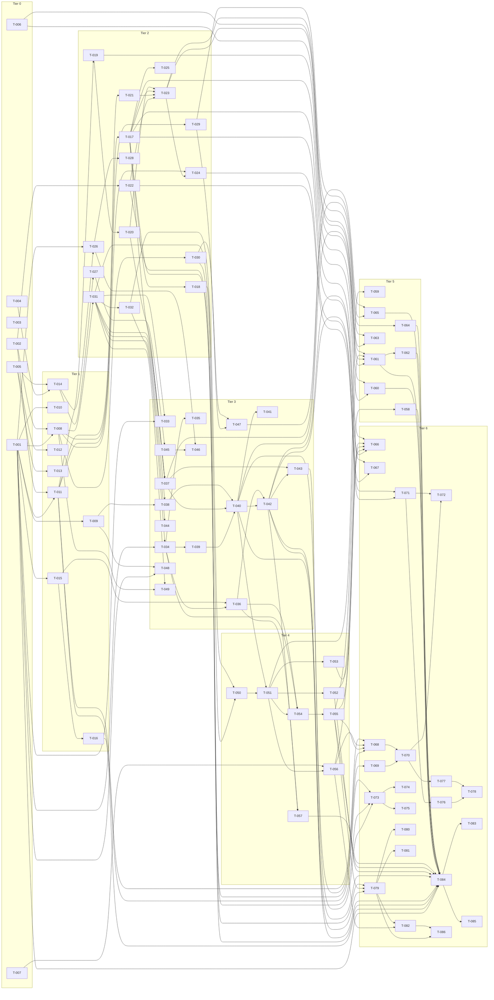

# Build Site

98 tasks across 7 tiers from 8 kits.

---

## Tier 0 — No Dependencies (Start Here)

| Task | Title | Cavekit | Requirement | Effort |
|------|-------|---------|-------------|--------|
| T-001 | Add `OIDC.DCR` block to `cmd/defaults.yaml` with all default knobs | cavekit-config.md | R1 | M |
| T-002 | Add `KeyDynamicClientRegistration=17` + `Features.DynamicClientRegistration` field | cavekit-config.md | R2 | S |
| T-003 | Inspect `cors_interceptor.go` and confirm DCR-handler CORS reuse contract (no new config) | cavekit-security-hardening.md | R1 | S |
| T-004 | Remove `resource` rejection at `internal/api/oidc/token_exchange.go:44-46` and update existing rejection test | cavekit-rfc8707-resource.md | R1 | S |
| T-005 | M5 decision-gate: grep `zitadel/oidc v3 AuthRequest` for `Resource` field; emit decision artifact (direct vs sidecar) | cavekit-rfc8707-resource.md | R7 | S |
| T-006 | M0 inspection: log-redaction posture survey across HTTP + gRPC + audit-log middleware | cavekit-security-hardening.md | R3 | S |
| T-007 | M4 decision-gate: survey existing token-revocation primitives at `internal/command/oidc_session.go:266`; pick path-(a) `RevokeApplicationTokens` vs path-(b) docs-only fallback | cavekit-manage-handler.md | R6 | S |

---

## Tier 1 — Depends on Tier 0

| Task | Title | Cavekit | Requirement | blockedBy | Effort |
|------|-------|---------|-------------|-----------|--------|
| T-008 | Implement dual-gate precedence: handler-mount on yaml `Enabled`, runtime feature-flag check, 404/403/2xx semantics | cavekit-config.md | R3 | T-001, T-002 | M |
| T-009 | Implement startup validation: refuse start when `Enabled=true` + `RequireInitialAccessToken=false` + empty `DefaultProjectID`/`DefaultOrgID` | cavekit-config.md | R4 | T-001 | M |
| T-010 | Implement issuer-path startup WARN naming probed `.well-known/oauth-authorization-server` URL | cavekit-config.md | R5 | T-001 | S |
| T-011 | Add IAT events on `project` aggregate: Added/Consumed/Revoked with wire-types, factories, and per-slot UniqueConstraint payloads | cavekit-iat.md | R1 | T-001, T-002 | M |
| T-012 | Implement RFC 8707 sidecar wrapper: `authRequestWithResource` + context-scoped resource map (per decision T-005) | cavekit-rfc8707-resource.md | R7 | T-005 | M |
| T-013 | Open upstream `github.com/zitadel/oidc` PR adding `Resource` field to `AuthRequest` (parallel to T-012) | cavekit-rfc8707-resource.md | R7 | T-005 | M |
| T-014 | Parse `resource` on `/authorize` and `/token`; add `Resources []string` field to `domain.AuthRequest`; wire into `auth_request_converter.go` | cavekit-rfc8707-resource.md | R2 | T-004, T-005 | M |
| T-014b | Extend V2 login path: add `Resources []string` to `command.AuthRequest`, extend `authrequest.AddedEvent` payload (additive — old events unmarshal with empty `Resources`), update authrequest write model + projection, populate from sidecar context in `createAuthRequestLoginClient` | cavekit-rfc8707-resource.md | R2 | T-012, T-014 | S |
| T-015 | Build SSRF-guarded `internal/api/oidc/dcr/jwks_fetcher.go` with deny-list + DNS-rebind + 3-hop redirect cap + 1MiB body cap + timeout + AllowLoopbackInDev | cavekit-security-hardening.md | R2 | T-001 | L |
| T-016 | jwks_fetcher table-driven unit tests + `dcr_ssrf_test.go` integration test (RFC1918, link-local, IPv6 ULA, loopback, oversized, redirect traps, 169.254.169.254) | cavekit-security-hardening.md | R2 | T-015 | M |

---

## Tier 2 — Depends on Tier 1

| Task | Title | Cavekit | Requirement | blockedBy | Effort |
|------|-------|---------|-------------|-----------|--------|
| T-017 | Implement IAT race-safe consume command with 3-retry on `ThrowAlreadyExists`; re-fetch projection on each retry; revocation/expiry observed | cavekit-iat.md | R2 | T-011 | L |
| T-018 | Implement `dcr_iat_concurrency_test.go` (3 scenarios: 10/3, 4/4, 5/5) + `go test -race -count=1000` | cavekit-iat.md | R2 | T-017 | M |
| T-019 | Build `initial_access_tokens` projection table + reducers + indices; register in projection.go | cavekit-iat.md | R3 | T-011 | M |
| T-020 | Add `InitialAccessTokenByID` and `InitialAccessTokenByHash` query helpers with `//go:embed` SQL | cavekit-iat.md | R4 | T-019 | M |
| T-021 | Implement IAT plaintext format (`zdiat_` + 48-byte b64url) + Passwap hashed storage; ensure ListIAT never returns plaintext; M1 prefix-collision grep | cavekit-iat.md | R5 | T-011 | M |
| T-022 | Add IAT admin gRPC RPCs to `proto/zitadel/admin.proto` (Create/List/Revoke) with annotations + auth_options + tag | cavekit-iat.md | R6 | T-002 | M |
| T-023 | Run `buf generate` + `pnpm generate` for IAT proto; implement gRPC handlers wiring through commands/queries | cavekit-iat.md | R6 | T-022, T-021, T-017, T-020 | M |
| T-024 | Implement gRPC dual-gating for IAT RPCs: FAILED_PRECONDITION on runtime-flag-off; conditional registration (UNIMPLEMENTED) when `Enabled=false` | cavekit-iat.md | R6 | T-023, T-008 | M |
| T-025 | Document project-aggregate serialization characteristic in handler godoc (per-aggregate sequence-lock note) | cavekit-iat.md | R7 | T-017 | S |
| T-026 | Implement `AllowedAudiences` allow-list (empty=unrestricted); URI syntax validation; multi-resource validation | cavekit-rfc8707-resource.md | R3 | T-014, T-001 | M |
| T-027 | Merge resources into `createAuthRequestScopeAndAudience()`; thread through `CreateAuthRequestToBusiness` → `OIDCSession.Audience` → access-token `aud` | cavekit-rfc8707-resource.md | R4 | T-014 | M |
| T-028 | `invalid_target` 400 error envelope on both `/authorize` and `/token` with proper Content-Type | cavekit-rfc8707-resource.md | R6 | T-026 | S |
| T-029 | Implement OIDC discovery `registration_endpoint` advertisement (`omitempty`, never null) in `createDiscoveryConfig` | cavekit-discovery-and-as-metadata.md | R1 | T-008 | S |
| T-030 | Build RFC 8414 AS metadata handler at `internal/api/oidc/as_metadata/handler.go`; register `/.well-known/oauth-authorization-server` in `oidcPrefixes` | cavekit-discovery-and-as-metadata.md | R2 | T-008 | M |
| T-031 | Mount DCR mux router at `/oidc/v1/register{/*}` with shared POST/GET/PUT/DELETE multiplexing; route precedence vs `/oidc/v1` | cavekit-register-handler.md | R1 | T-008 | M |
| T-032 | Build shared `internal/api/oidc/dcr/errors.go` (RFC 7591 envelope, `DCR-<5alphanumeric>` zerrors prefix) and `validate.go` skeleton | cavekit-manage-handler.md | R7 | T-031 | M |

---

## Tier 3 — Depends on Tier 2

| Task | Title | Cavekit | Requirement | blockedBy | Effort |
|------|-------|---------|-------------|-----------|--------|
| T-033 | Request decoding + Content-Type/415, MaxRequestBodyBytes/413, malformed-JSON/400, RFC 7591 §2 + OIDC Reg 1.0 §2 default application; synthesize empty client_name; drop unknown fields | cavekit-register-handler.md | R2 | T-031, T-001 | L |
| T-034 | Implement metadata validate+clamp (grant_types/response_types/auth_method/application_type/redirect_uris/subject_type/id_token_alg/request_object_*/software_statement/MaxRedirectURIs/`client_name#<lang>` drop) | cavekit-register-handler.md | R4 | T-032, T-001 | L |
| T-035 | Loopback HTTP redirect URI acceptance for native + `domain.GetOIDCV1Compliance` integration | cavekit-register-handler.md | R4 | T-034 | S |
| T-036 | Implement client-secret behavior matrix per auth method (none/basic/post/private_key_jwt/client_secret_jwt-rejected) using `newHashedSecretWithDefault` | cavekit-register-handler.md | R5 | T-034, T-015 | M |
| T-037 | Implement IAT-mode auth routing (`authVerifyIAT`): Bearer parse, IAT verify+consume; cross-instance/org/project rejection; resolve {instance,org,project} from claims | cavekit-register-handler.md | R3 | T-031, T-017, T-020 | M |
| T-038 | Implement anonymous-mode auth routing: derive instance from host; project/org from defaults; iat_id="" sentinel | cavekit-register-handler.md | R3 | T-031, T-009 | M |
| T-039 | Build `OIDCAppFromRFC7591Metadata` mapping in `internal/domain/application_oidc.go`; `dcr_meta` JSONB pass-through fields | cavekit-register-handler.md | R6 | T-034 | M |
| T-040 | Implement `RegisterClient` command + `ApplicationDynamicallyRegisteredEvent` + `ApplicationRegistrationAccessTokenSetEvent`; reuse `OIDCApplicationWriteModel`; SHA256(remote_addr) | cavekit-register-handler.md | R6 | T-039, T-037, T-038 | L |
| T-041 | Extend `appProjection.Reducers()` for the three new application events | cavekit-register-handler.md | R6 | T-040 | S |
| T-042 | Implement 201 response shape (Cache-Control, Pragma, Content-Type, echo clamps, client_id, optional client_secret, expires_at sentinel, RAT plaintext, registration_client_uri via `op.IssuerFromContext`) | cavekit-register-handler.md | R7 | T-040, T-036 | M |
| T-043 | Implement complete status-code matrix endpoint tests (201/400 invalid_client_metadata, invalid_redirect_uri, invalid_software_statement, unapproved_software_statement / 401 / 413 / 415 / 429 / 404 / 403) | cavekit-register-handler.md | R8 | T-042, T-037 | M |
| T-044 | TLS posture confirmation: same hostname/port/TLS as `/oidc/v1/userinfo`; no DCR-specific knobs; deployment-guide reference | cavekit-register-handler.md | R10 | T-031 | S |
| T-045 | Propagate `resource` through all 6 token grant handlers (token_code, refresh, client_credentials, device, exchange, jwt_profile) | cavekit-rfc8707-resource.md | R5 | T-027 | L |
| T-046 | Build `rfc8707_resource_test.go` integration test asserting `aud` in issued tokens for each grant | cavekit-rfc8707-resource.md | R5 | T-045, T-026 | M |
| T-047 | Build `dcr_discovery_test.go` + `dcr_as_metadata_test.go` asserting byte-identical shared fields when DCR enabled; both omit `registration_endpoint` when disabled | cavekit-discovery-and-as-metadata.md | R3 | T-029, T-030 | M |
| T-048 | Add fixture defaults to `internal/integration/config/client.yaml` (DCR.Enabled true + DefaultProjectID/OrgID); pass `TestInstance_BasicLoadsConfig` | cavekit-config.md | R7 | T-001, T-009 | S |
| T-049 | Validate rollback/disable: existing apps still authorize; RAT unmounted; admin-delete still works; flip back restores; nullable schema columns | cavekit-config.md | R6 | T-008, T-031 | M |

---

## Tier 4 — Depends on Tier 3

| Task | Title | Cavekit | Requirement | blockedBy | Effort |
|------|-------|---------|-------------|-----------|--------|
| T-050 | Mount RFC 7592 GET/PUT/DELETE on shared mux; 401 on missing Bearer; 404 when DCR disabled; 403 when feature off | cavekit-manage-handler.md | R1 | T-031, T-032 | M |
| T-051 | Implement RAT verification with Passwap two-return + silent rehash event `project.application.registration_access_token.rehashed`; expiry check; 401 on failure | cavekit-manage-handler.md | R2 | T-050, T-040 | M |
| T-052 | Implement anti-enumeration on unknown client_id: dummy-hash Verify; 401 not 404; WWW-Authenticate header on every 401 | cavekit-manage-handler.md | R3 | T-051 | M |
| T-053 | Implement GET handler returning current metadata; omit client_secret + RAT; re-emit registration_client_uri; cache headers | cavekit-manage-handler.md | R4 | T-051 | M |
| T-054 | Implement PUT handler full re-clamp using shared validate.go; auth-method transition matrix (none↔secret_*, *→private_key_jwt, reject client_secret_jwt) | cavekit-manage-handler.md | R5 | T-051, T-034, T-036 | L |
| T-055 | Implement RAT rotation on every successful PUT: emit `project.application.registration_access_token.rotated`; 200 response with new RAT in body; old RAT immediately invalid | cavekit-manage-handler.md | R5 | T-054 | M |
| T-056 | Implement DELETE path-(a) `RevokeApplicationTokens` command + revocation events for outstanding access/refresh tokens; integration test `dcr_delete_revokes_tokens_test.go` | cavekit-manage-handler.md | R6 | T-051, T-007 | L |
| T-057 | Implement Claude Code compat integration test `dcr_claude_code_compat_test.go` (literal payload + PKCE S256 follow-up) | cavekit-register-handler.md | R9 | T-042, T-036 | M |

---

## Tier 5 — Depends on Tier 4

| Task | Title | Cavekit | Requirement | blockedBy | Effort |
|------|-------|---------|-------------|-----------|--------|
| T-058 | Build timing-side-channel `dcr_timing_side_channel_test.go` (1000 GETs known-vs-unknown, mean+p95 < 5ms) | cavekit-security-hardening.md | R4 | T-052 | M |
| T-059 | Hash-rotation cross-cut: ensure RFC 7592 verify path uses two-return form; document M4 decision if silent-rehash deferred | cavekit-security-hardening.md | R5 | T-051 | S |
| T-060 | Build `dcr_iat_projection_lag_test.go` validating ≥95% retry success under simulated lag | cavekit-security-hardening.md | R5 | T-017, T-019 | M |
| T-061 | Add log-redaction wrappers (HTTP + gRPC) stripping client_secret, RAT, software_statement, Authorization header, IAT token field | cavekit-security-hardening.md | R3 | T-006, T-040, T-055, T-023 | M |
| T-062 | Build `dcr_log_redaction_test.go` + `dcr_grpc_iat_logging_redaction_test.go` integration tests | cavekit-security-hardening.md | R3 | T-061 | M |
| T-063 | Verify `internal/logstore/` does NOT leak IATs (audit) | cavekit-security-hardening.md | R3 | T-006, T-023 | S |
| T-064 | Cross-tenant abuse tests `dcr_iat_test.go` (cross-instance / cross-org IAT abuse) — T11 evidence | cavekit-security-hardening.md | R6 | T-037 | M |
| T-065 | T17 unit test in `dcr/handler_test.go`: discovery key absent when DCR disabled, non-null absolute URL when enabled | cavekit-security-hardening.md | R6 | T-029, T-047 | S |

---

## Tier 6 — Depends on Tier 5 (Observability, UI, Docs)

| Task | Title | Cavekit | Requirement | blockedBy | Effort |
|------|-------|---------|-------------|-----------|--------|
| T-066 | Emit OTel spans `oidc.dcr.register`, `.read`, `.update`, `.delete`, `.iat.consume`; assert no secret attributes | cavekit-console-ui-docs-and-observability.md | R7 | T-042, T-053, T-055, T-056, T-017 | M |
| T-067 | Emit OTel metrics under `zitadel.dcr.*` (registrations_total, request_duration_seconds, errors_total, iat.consumed_total, iat.exhausted_total) | cavekit-console-ui-docs-and-observability.md | R8 | T-042, T-017 | M |
| T-068 | Verify audit-event payload completeness across handlers: instance/org/project/client/iat/jti/remote_addr_sha256/user_agent/registration_method | cavekit-console-ui-docs-and-observability.md | R6 | T-040, T-055, T-056, T-011 | M |
| T-069 | Confirm Dynamic Clients UI placement decision (sub-route vs mat-tab) with console owner; record in M5.5 worker report | cavekit-console-ui-docs-and-observability.md | R1 | T-022 | S |
| T-070 | Implement Dynamic Clients read-only Angular module + view (list client_id, client_name, registration method, timestamp, audit link, empty-state) | cavekit-console-ui-docs-and-observability.md | R1 | T-069, T-068 | L |
| T-071 | Implement IAT admin Angular surface (Issue dialog with one-time plaintext + clipboard + warning; List; Revoke with confirmation) | cavekit-console-ui-docs-and-observability.md | R2 | T-022, T-024 | L |
| T-072 | Add frontend i18n keys to `console/src/assets/i18n/en.json` and `de.json` (DESCRIPTIONS.DCR.*); column-label keys | cavekit-console-ui-docs-and-observability.md | R3 | T-070, T-071 | M |
| T-073 | Add backend `Errors.DCR.*` i18n keys (11 keys: FeatureDisabled, InvalidClientMetadata, InvalidRedirectURI, InvalidSoftwareStatement, UnapprovedSoftwareStatement, InvalidToken, IAT.Exhausted, IAT.SlotAlreadyConsumed, IAT.NotFound, IAT.Expired, IAT.Revoked) to `internal/api/ui/login/static/i18n/*.yaml` (en + de) | cavekit-console-ui-docs-and-observability.md | R3 | T-043, T-017, T-011 | M |
| T-074 | Build `dcr_i18n_fallback_test.go` asserting English fallback (no raw key leak) | cavekit-console-ui-docs-and-observability.md | R3 | T-073 | S |
| T-075 | Open 19 GitHub locale-translation tickets via repo translation issue template (`@zitadel/i18n` team) | cavekit-console-ui-docs-and-observability.md | R3 | T-073 | S |
| T-076 | Cypress `iat.cy.ts` (admin login, create/list/revoke IAT) | cavekit-console-ui-docs-and-observability.md | R4 | T-071 | M |
| T-077 | Cypress `dcr-clients.cy.ts` (admin login, project fixture, listing, audit-event link) | cavekit-console-ui-docs-and-observability.md | R4 | T-070 | M |
| T-078 | Run `pnpm nx affected --targets lint test build` (clean baseline for Cypress additions) | cavekit-console-ui-docs-and-observability.md | R4 | T-076, T-077 | S |
| T-079 | MDX `dynamic-client-registration.mdx` (RFC refs, endpoint table, metadata table, error table, IAT mode, SSRF/rate-limit guarantees, security considerations, two curl examples, discovery + RFC 8414 samples, config reference, upgrade note, hostname-root note, Claude Code MCP walkthrough, PUT idempotency caveat) | cavekit-console-ui-docs-and-observability.md | R5 | T-042, T-055, T-030 | L |
| T-080 | MDX `claude-code-mcp.mdx` integrate guide linking back to DCR API reference | cavekit-console-ui-docs-and-observability.md | R5 | T-079 | M |
| T-081 | Update existing MDX `endpoints.mdx` (DCR subsection + RFC 8414 note) and `authn-methods.mdx` (`none` Phase-1 supported) | cavekit-console-ui-docs-and-observability.md | R5 | T-079 | S |
| T-082 | `CHANGELOG.md` feature entry leading with "Works with Claude Code out-of-the-box" + hostname-root requirement; DELETE token-revocation note (or fallback note if path-b) | cavekit-console-ui-docs-and-observability.md | R5 | T-056, T-079 | S |
| T-083 | `SECURITY.md` threat-model subsection enumerating T1–T20; XFF trust boundary note; T16 rotating-IP sign-off | cavekit-console-ui-docs-and-observability.md | R5 | T-084 | M |
| T-084 | T1–T20 threat-model evidence map: cross-reference each threat to mitigation + test file (T1 quotas, T2 phishing, T3 PKCE, T4 RAT hash, T5 IAT max_uses, T6 software_statement, T7 anti-enum, T8 SSRF, T9 XSS, T10 grants, T11 cross-tenant, T12 timing, T13 CORS, T14 cache, T15 logs, T16 rotating-IP docs, T17 null discovery, T18 projection lag, T19 burst, T20 Claude Code compat) | cavekit-security-hardening.md | R6 | T-001, T-016, T-018, T-040, T-042, T-052, T-055, T-057, T-058, T-060, T-061, T-062, T-064, T-065 | M |
| T-085 | `docs/adr/ADR-XXXX-dynamic-client-registration.md` capturing §2 architecture decisions + product sign-off for T16 rotating-IP residual risk; create `docs/adr/` if absent | cavekit-console-ui-docs-and-observability.md | R5 | T-084 | M |
| T-086 | Document hostname-root deployment requirement in DCR guide AND deployment docs; document PUT idempotency caveat; CHANGELOG mention | cavekit-discovery-and-as-metadata.md | R4 | T-079, T-082 | S |

---

## Summary

| Tier | Tasks | Effort |
|------|-------|--------|
| 0 | 7 | mixed S/M |
| 1 | 9 | mixed S/M/L |
| 2 | 16 | mixed S/M |
| 3 | 17 | mixed S/M/L |
| 4 | 8 | mixed M/L |
| 5 | 8 | mixed S/M |
| 6 | 21 | mixed S/M/L |

**Total: 86 tasks, 7 tiers**

## Coverage Matrix

| Cavekit | Req | Criterion | Task(s) | Status |
|---|---|---|---|---|
| cavekit-config.md | R1 | `cmd/defaults.yaml` contains a `DCR:` key under `OIDC:` | T-001 | COVERED |
| cavekit-config.md | R1 | `Enabled` defaults to `false` | T-001 | COVERED |
| cavekit-config.md | R1 | `RequireInitialAccessToken` defaults to `false` | T-001 | COVERED |
| cavekit-config.md | R1 | `DefaultProjectID`/`DefaultOrgID` empty-string defaults | T-001 | COVERED |
| cavekit-config.md | R1 | `MaxRedirectURIs: 10` and `MaxRequestBodyBytes: 65536` | T-001 | COVERED |
| cavekit-config.md | R1 | `AllowedGrantTypes` defaults `[authorization_code, refresh_token]` (omits client_credentials) | T-001 | COVERED |
| cavekit-config.md | R1 | `AllowedResponseTypes` defaults `[code]` | T-001 | COVERED |
| cavekit-config.md | R1 | `AllowedAuthMethods` defaults (none, client_secret_basic, client_secret_post, private_key_jwt) | T-001 | COVERED |
| cavekit-config.md | R1 | `AllowedApplicationTypes` defaults `[native, web]` | T-001 | COVERED |
| cavekit-config.md | R1 | `AllowedRedirectURIHostPatterns` defaults `[]` | T-001 | COVERED |
| cavekit-config.md | R1 | `AllowedAudiences` defaults `[]` with empty-as-unrestricted comment | T-001 | COVERED |
| cavekit-config.md | R1 | `RegistrationAccessToken.{Enabled:true, Lifetime:0s}` | T-001 | COVERED |
| cavekit-config.md | R1 | `InitialAccessToken.{DefaultLifetime:24h, DefaultMaxUses:1}` | T-001 | COVERED |
| cavekit-config.md | R1 | `SoftwareStatement.{Enabled:false, TrustedIssuers:[]}` | T-001 | COVERED |
| cavekit-config.md | R1 | `ClientSecretExpiresIn: 0s` | T-001 | COVERED |
| cavekit-config.md | R1 | `JwksURI.{HTTPTimeout:10s, AllowLoopbackInDev:false, DisallowedIPRanges:...}` | T-001 | COVERED |
| cavekit-config.md | R1 | No `DCR.CORS` config tree (CORS reused) | T-001, T-003 | COVERED |
| cavekit-config.md | R2 | `KeyDynamicClientRegistration Key = 17` | T-002 | COVERED |
| cavekit-config.md | R2 | `Features.DynamicClientRegistration bool` with snake_case json tag | T-002 | COVERED |
| cavekit-config.md | R2 | M0 collision-check grep that 17 is free | T-002 | COVERED |
| cavekit-config.md | R2 | No existing key/field renamed | T-002 | COVERED |
| cavekit-config.md | R3 | `Enabled=false` → 404 on `/oidc/v1/register` | T-008 | COVERED |
| cavekit-config.md | R3 | `Enabled=true` + runtime off → 403 `feature_disabled` | T-008 | COVERED |
| cavekit-config.md | R3 | Both gates ON → 2xx | T-008 | COVERED |
| cavekit-config.md | R3 | Feature-flag cache TTL inherits from existing service | T-008 | COVERED |
| cavekit-config.md | R3 | AS metadata `registration_endpoint` advertisement obeys dual-gate | T-008, T-029 | COVERED |
| cavekit-config.md | R4 | Empty `DefaultProjectID` with anonymous mode → non-zero exit + log | T-009 | COVERED |
| cavekit-config.md | R4 | Empty `DefaultOrgID` same | T-009 | COVERED |
| cavekit-config.md | R4 | `Enabled=false` succeeds regardless | T-009 | COVERED |
| cavekit-config.md | R4 | `Enabled=true` + `RequireInitialAccessToken=true` succeeds without defaults | T-009 | COVERED |
| cavekit-config.md | R5 | Subpath issuer + DCR enabled → WARN naming AS-metadata URL | T-010 | COVERED |
| cavekit-config.md | R5 | Hostname-root issuer → no warning | T-010 | COVERED |
| cavekit-config.md | R5 | DCR disabled → no warning | T-010 | COVERED |
| cavekit-config.md | R5 | Warning text references deployment-guide section | T-010, T-086 | COVERED |
| cavekit-config.md | R6 | After flip → 404 on `/oidc/v1/register{/*}` | T-049 | COVERED |
| cavekit-config.md | R6 | Existing DCR-created apps continue authorize/issue tokens | T-049 | COVERED |
| cavekit-config.md | R6 | Existing RATs unusable; admin-delete still works | T-049 | COVERED |
| cavekit-config.md | R6 | Re-enable restores `/oidc/v1/register{/*}` with intact data | T-049 | COVERED |
| cavekit-config.md | R6 | Active IATs unusable while disabled; admin gRPC reachable per runtime flag | T-049, T-024 | COVERED |
| cavekit-config.md | R6 | All schema columns nullable (no rollback DDL) | T-019, T-049 | COVERED |
| cavekit-config.md | R7 | `internal/integration/config/client.yaml` sets DCR.Enabled true | T-048 | COVERED |
| cavekit-config.md | R7 | `DefaultProjectID`/`DefaultOrgID` resolve via fixture default org | T-048 | COVERED |
| cavekit-config.md | R7 | `TestInstance_BasicLoadsConfig -tags integration` passes | T-048 | COVERED |
| cavekit-iat.md | R1 | `InitialAccessTokenAddedEvent` wire-type `project.initial_access_token.added` | T-011 | COVERED |
| cavekit-iat.md | R1 | `InitialAccessTokenConsumedEvent` wire-type `project.initial_access_token.consumed` | T-011 | COVERED |
| cavekit-iat.md | R1 | `InitialAccessTokenRevokedEvent` wire-type `project.initial_access_token.revoked` | T-011 | COVERED |
| cavekit-iat.md | R1 | Factory naming matches `NewOIDCConfigAddedEvent` convention | T-011 | COVERED |
| cavekit-iat.md | R1 | Added event payload `{id, hash, max_uses, expires_at, project_id, allowed_grant_types, allowed_redirect_uri_patterns, description}` | T-011 | COVERED |
| cavekit-iat.md | R1 | Consumed event `{use_index}` + UniqueConstraints `iat_uses:<id>:<idx>` with `Errors.DCR.IAT.SlotAlreadyConsumed` | T-011 | COVERED |
| cavekit-iat.md | R1 | `max_uses=0` → no UniqueConstraint | T-011 | COVERED |
| cavekit-iat.md | R1 | Revoked event needs no unique constraint | T-011 | COVERED |
| cavekit-iat.md | R2 | Re-fetch projection on each retry | T-017 | COVERED |
| cavekit-iat.md | R2 | Revocation/expiry observed pre-push | T-017 | COVERED |
| cavekit-iat.md | R2 | Slot-picker selects next unreserved use_index | T-017 | COVERED |
| cavekit-iat.md | R2 | Retry on `ThrowAlreadyExists` up to 3 attempts | T-017 | COVERED |
| cavekit-iat.md | R2 | After 3rd `ThrowAlreadyExists` → 401 `invalid_token` "exhausted" | T-017 | COVERED |
| cavekit-iat.md | R2 | `max_uses=0` always succeeds + emits consumed event | T-017 | COVERED |
| cavekit-iat.md | R2 | All N slots consumed → pre-push 401 "exhausted" | T-017 | COVERED |
| cavekit-iat.md | R2 | `dcr_iat_concurrency_test.go` 3 scenarios | T-018 | COVERED |
| cavekit-iat.md | R2 | `go test -race -count=1000` zero flakes | T-018 | COVERED |
| cavekit-iat.md | R3 | Projection registered in `projection.go` | T-019 | COVERED |
| cavekit-iat.md | R3 | Schema columns exact match | T-019 | COVERED |
| cavekit-iat.md | R3 | Indices `(instance_id, project_id)` and `(token_hash)` | T-019 | COVERED |
| cavekit-iat.md | R3 | Reducer for Added INSERTs | T-019 | COVERED |
| cavekit-iat.md | R3 | Reducer for Consumed increments + appends slot | T-019 | COVERED |
| cavekit-iat.md | R3 | Reducer for Revoked sets revoked TRUE | T-019 | COVERED |
| cavekit-iat.md | R4 | `InitialAccessTokenByID(ctx, id)` helper | T-020 | COVERED |
| cavekit-iat.md | R4 | `InitialAccessTokenByHash` lookup | T-020 | COVERED |
| cavekit-iat.md | R4 | `//go:embed initial_access_token_by_id.sql` pattern | T-020 | COVERED |
| cavekit-iat.md | R4 | Cross-instance/org IATs return not-found | T-020 | COVERED |
| cavekit-iat.md | R5 | 48-byte random portion | T-021 | COVERED |
| cavekit-iat.md | R5 | Plaintext begins with `zdiat_` | T-021 | COVERED |
| cavekit-iat.md | R5 | `token_hash` Passwap-encoded (not plaintext) | T-021 | COVERED |
| cavekit-iat.md | R5 | List response excludes plaintext | T-021 | COVERED |
| cavekit-iat.md | R5 | M1 prefix-collision grep | T-021 | COVERED |
| cavekit-iat.md | R6 | `CreateInitialAccessToken` RPC added | T-022 | COVERED |
| cavekit-iat.md | R6 | `ListInitialAccessTokens` RPC added | T-022 | COVERED |
| cavekit-iat.md | R6 | `RevokeInitialAccessToken` RPC added | T-022 | COVERED |
| cavekit-iat.md | R6 | `CreateInitialAccessTokenRequest` field set | T-022 | COVERED |
| cavekit-iat.md | R6 | `google.api.http` + `auth_option` + `openapiv2_operation` annotations + tag | T-022 | COVERED |
| cavekit-iat.md | R6 | auth_option permission strings resolve to authz constants | T-022 | COVERED |
| cavekit-iat.md | R6 | `buf generate` + `pnpm generate` clean diff | T-023 | COVERED |
| cavekit-iat.md | R6 | No new proto file (extension in-place) | T-022 | COVERED |
| cavekit-iat.md | R6 | gRPC FAILED_PRECONDITION on runtime-flag-off | T-024 | COVERED |
| cavekit-iat.md | R6 | gRPC UNIMPLEMENTED when `Enabled=false` | T-024 | COVERED |
| cavekit-iat.md | R7 | Godoc note on per-aggregate sequence-lock serialization | T-025 | COVERED |
| cavekit-iat.md | R7 | `dcr_iat_projection_lag_test.go` ≥95% retry success | T-060 | COVERED |
| cavekit-register-handler.md | R1 | `POST /oidc/v1/register` reachable when dual-gate satisfied | T-031 | COVERED |
| cavekit-register-handler.md | R1 | Gorilla `*mux.Router` multiplexes POST/GET/PUT/DELETE on `/oidc/v1/register{/*}` | T-031 | COVERED |
| cavekit-register-handler.md | R1 | More-specific route registered before broader `/oidc/v1` | T-031 | COVERED |
| cavekit-register-handler.md | R1 | `Enabled=false` → 404 (handler not mounted) | T-031, T-008 | COVERED |
| cavekit-register-handler.md | R1 | dual-gate runtime off → 403 `feature_disabled` | T-031, T-008 | COVERED |
| cavekit-register-handler.md | R2 | Non-JSON Content-Type → 415 | T-033 | COVERED |
| cavekit-register-handler.md | R2 | Body > MaxRequestBodyBytes → 413 | T-033 | COVERED |
| cavekit-register-handler.md | R2 | Malformed JSON → 400 invalid_client_metadata | T-033 | COVERED |
| cavekit-register-handler.md | R2 | Missing `grant_types` defaults `[authorization_code]` | T-033 | COVERED |
| cavekit-register-handler.md | R2 | Missing `response_types` defaults `[code]` | T-033 | COVERED |
| cavekit-register-handler.md | R2 | Missing `token_endpoint_auth_method` defaults `client_secret_basic` | T-033 | COVERED |
| cavekit-register-handler.md | R2 | Missing `application_type` defaults `web` | T-033 | COVERED |
| cavekit-register-handler.md | R2 | Empty `client_name` synthesized | T-033 | COVERED |
| cavekit-register-handler.md | R2 | Unknown JSON fields silently dropped | T-033 | COVERED |
| cavekit-register-handler.md | R3 | `RequireInitialAccessToken=true` + no Authorization → 401 + WWW-Authenticate | T-037 | COVERED |
| cavekit-register-handler.md | R3 | Bearer present → `authVerifyIAT` + consume; failure → 401 | T-037 | COVERED |
| cavekit-register-handler.md | R3 | On success resolve {instance,org,project} from IAT claims; record IAT id | T-037 | COVERED |
| cavekit-register-handler.md | R3 | Anonymous mode: instance from host; org/project from defaults | T-038 | COVERED |
| cavekit-register-handler.md | R3 | Anonymous audit event records `iat_id=""` | T-038 | COVERED |
| cavekit-register-handler.md | R3 | Cross-instance/org/project IAT abuse rejected | T-037, T-064 | COVERED |
| cavekit-register-handler.md | R4 | `grant_types` intersection; empty → 400 with field name | T-034 | COVERED |
| cavekit-register-handler.md | R4 | `response_types` intersection | T-034 | COVERED |
| cavekit-register-handler.md | R4 | `token_endpoint_auth_method` intersection; reject `client_secret_jwt` | T-034 | COVERED |
| cavekit-register-handler.md | R4 | `application_type` intersection | T-034 | COVERED |
| cavekit-register-handler.md | R4 | `redirect_uris` GetOIDCV1Compliance + host pattern check | T-034, T-035 | COVERED |
| cavekit-register-handler.md | R4 | Loopback HTTP redirect URIs accepted for native | T-035 | COVERED |
| cavekit-register-handler.md | R4 | `subject_type=pairwise` rejected; public accepted | T-034 | COVERED |
| cavekit-register-handler.md | R4 | `id_token_signed_response_alg` not advertised → 400 | T-034 | COVERED |
| cavekit-register-handler.md | R4 | `request_object_signing_alg` and `*_encryption_alg` → 400 | T-034 | COVERED |
| cavekit-register-handler.md | R4 | `software_statement` while disabled → 400 `unapproved_software_statement` + JTI audited | T-034 | COVERED |
| cavekit-register-handler.md | R4 | `redirect_uris` count > MaxRedirectURIs → 400 | T-034 | COVERED |
| cavekit-register-handler.md | R4 | `client_name#<lang>` silently dropped | T-034 | COVERED |
| cavekit-register-handler.md | R5 | `none` → no secret; PKCE S256 enforced; loopback/custom for native | T-036 | COVERED |
| cavekit-register-handler.md | R5 | `client_secret_basic`/`client_secret_post` → secret via `newHashedSecretWithDefault` | T-036 | COVERED |
| cavekit-register-handler.md | R5 | `private_key_jwt` requires `jwks_uri`; SSRF guard applies | T-036, T-015 | COVERED |
| cavekit-register-handler.md | R5 | `client_secret_jwt` → 400 invalid_client_metadata | T-036 | COVERED |
| cavekit-register-handler.md | R6 | `OIDCAppFromRFC7591Metadata` mapping in `application_oidc.go` | T-039 | COVERED |
| cavekit-register-handler.md | R6 | Metadata-table mapping exact (client_name/redirect_uris/grant_types/etc.) | T-039 | COVERED |
| cavekit-register-handler.md | R6 | Other RFC 7591 fields stored in `dcr_meta` JSONB | T-039 | COVERED |
| cavekit-register-handler.md | R6 | `RegisterClient(ctx, app, orgID, projectID, iatID, dcrMeta)` command signature | T-040 | COVERED |
| cavekit-register-handler.md | R6 | Event order: AppAdded → OIDCConfigAdded → DynamicallyRegistered → RATSet | T-040 | COVERED |
| cavekit-register-handler.md | R6 | `ApplicationDynamicallyRegisteredEvent` payload set | T-040 | COVERED |
| cavekit-register-handler.md | R6 | `remote_addr_sha256` from `RemoteIPStringFromRequest` (XFF first hop) | T-040 | COVERED |
| cavekit-register-handler.md | R6 | `ApplicationRegistrationAccessTokenSetEvent` carries Passwap hash (no plaintext) | T-040 | COVERED |
| cavekit-register-handler.md | R6 | No new write model (reuse `OIDCApplicationWriteModel`) | T-040 | COVERED |
| cavekit-register-handler.md | R6 | `appProjection.Reducers()` extended for 3 new events | T-041 | COVERED |
| cavekit-register-handler.md | R7 | Status 201 | T-042 | COVERED |
| cavekit-register-handler.md | R7 | `Content-Type: application/json;charset=UTF-8` | T-042 | COVERED |
| cavekit-register-handler.md | R7 | `Cache-Control: no-store` + `Pragma: no-cache` | T-042 | COVERED |
| cavekit-register-handler.md | R7 | Body echoes clamped metadata | T-042 | COVERED |
| cavekit-register-handler.md | R7 | Body includes `client_id` (server-generated) | T-042 | COVERED |
| cavekit-register-handler.md | R7 | Body includes `client_secret` only for basic/post | T-042 | COVERED |
| cavekit-register-handler.md | R7 | Body includes `client_id_issued_at` | T-042 | COVERED |
| cavekit-register-handler.md | R7 | Body includes `client_secret_expires_at` (0 sentinel) | T-042 | COVERED |
| cavekit-register-handler.md | R7 | Body includes `registration_access_token` (plaintext one-time) | T-042 | COVERED |
| cavekit-register-handler.md | R7 | Body includes `registration_client_uri` via `op.IssuerFromContext` | T-042 | COVERED |
| cavekit-register-handler.md | R7 | All 4xx error bodies use RFC 7591 envelope | T-042, T-032 | COVERED |
| cavekit-register-handler.md | R8 | 201 success | T-043 | COVERED |
| cavekit-register-handler.md | R8 | 400 invalid_client_metadata (clamp/schema/JSON) | T-043 | COVERED |
| cavekit-register-handler.md | R8 | 400 invalid_redirect_uri | T-043 | COVERED |
| cavekit-register-handler.md | R8 | 400 invalid_software_statement (content-invalid when feature on) | T-043 | COVERED |
| cavekit-register-handler.md | R8 | 400 unapproved_software_statement | T-043 | COVERED |
| cavekit-register-handler.md | R8 | 401 invalid_token + WWW-Authenticate | T-043 | COVERED |
| cavekit-register-handler.md | R8 | 413 body too large | T-043 | COVERED |
| cavekit-register-handler.md | R8 | 415 unsupported media type | T-043 | COVERED |
| cavekit-register-handler.md | R8 | 429 instance access quota (limitingAccessInterceptor) | T-043 | COVERED |
| cavekit-register-handler.md | R8 | 404 DCR disabled (handler unmounted) | T-043, T-031 | COVERED |
| cavekit-register-handler.md | R8 | 403 feature_disabled when runtime flag off | T-043, T-008 | COVERED |
| cavekit-register-handler.md | R9 | Literal Claude Code body returns 201, no client_secret, RAT, registration_client_uri absolute | T-057 | COVERED |
| cavekit-register-handler.md | R9 | Follow-up authorization_code + PKCE S256 succeeds | T-057 | COVERED |
| cavekit-register-handler.md | R9 | Test file `dcr_claude_code_compat_test.go` with `//go:build integration` | T-057 | COVERED |
| cavekit-register-handler.md | R10 | Reachable over same TLS as `/oidc/v1/userinfo` | T-044 | COVERED |
| cavekit-register-handler.md | R10 | No DCR-specific TLS knobs | T-044 | COVERED |
| cavekit-register-handler.md | R10 | Production TLS requirement documented in deployment guide | T-044, T-079 | COVERED |
| cavekit-manage-handler.md | R1 | GET/PUT/DELETE → 401 when no Bearer | T-050 | COVERED |
| cavekit-manage-handler.md | R1 | DCR disabled → 404 | T-050 | COVERED |
| cavekit-manage-handler.md | R1 | dual-gate runtime off → 403 feature_disabled | T-050 | COVERED |
| cavekit-manage-handler.md | R1 | Routing precedence shared with POST register | T-050, T-031 | COVERED |
| cavekit-manage-handler.md | R2 | `updatedHash, err := s.hasher.Verify(...)` two-return form | T-051 | COVERED |
| cavekit-manage-handler.md | R2 | Silent rehash event `project.application.registration_access_token.rehashed` | T-051 | COVERED |
| cavekit-manage-handler.md | R2 | Lifetime > 0 → expiry checked; expired → 401 invalid_token | T-051 | COVERED |
| cavekit-manage-handler.md | R2 | Verification failure → 401 + WWW-Authenticate | T-051 | COVERED |
| cavekit-manage-handler.md | R3 | Unknown client_id → 401 (not 404) | T-052 | COVERED |
| cavekit-manage-handler.md | R3 | Dummy-hash Verify on unknown client_id | T-052 | COVERED |
| cavekit-manage-handler.md | R3 | All 401s carry `WWW-Authenticate: Bearer error="invalid_token"` | T-052 | COVERED |
| cavekit-manage-handler.md | R4 | GET status 200 | T-053 | COVERED |
| cavekit-manage-handler.md | R4 | GET body includes client_id, issued_at, expires_at, redirect_uris, grant_types, response_types, auth_method, application_type, client_name, dcr_meta | T-053 | COVERED |
| cavekit-manage-handler.md | R4 | GET body OMITS client_secret + RAT | T-053 | COVERED |
| cavekit-manage-handler.md | R4 | GET re-emits identical `registration_client_uri` | T-053 | COVERED |
| cavekit-manage-handler.md | R4 | GET cache headers + Content-Type | T-053 | COVERED |
| cavekit-manage-handler.md | R5 | PUT re-clamp via shared validate.go | T-054 | COVERED |
| cavekit-manage-handler.md | R5 | Disallowed values → 400 invalid_client_metadata | T-054 | COVERED |
| cavekit-manage-handler.md | R5 | `none → client_secret_*` issues new secret | T-054 | COVERED |
| cavekit-manage-handler.md | R5 | `client_secret_* → none` clears secret | T-054 | COVERED |
| cavekit-manage-handler.md | R5 | `* → private_key_jwt` requires valid `jwks_uri` | T-054 | COVERED |
| cavekit-manage-handler.md | R5 | `* → client_secret_jwt` rejected | T-054 | COVERED |
| cavekit-manage-handler.md | R5 | New RAT generated + Passwap-hashed + persisted via `rotated` event; old RAT immediately invalid | T-055 | COVERED |
| cavekit-manage-handler.md | R5 | PUT response 200 with new RAT in body | T-055 | COVERED |
| cavekit-manage-handler.md | R5 | Retried PUT with old RAT → 401 (idempotency caveat documented) | T-055, T-079 | COVERED |
| cavekit-manage-handler.md | R5 | RAT rotation event audit | T-055 | COVERED |
| cavekit-manage-handler.md | R6 | DELETE returns 204 | T-056 | COVERED |
| cavekit-manage-handler.md | R6 | Token revocation events emitted before/with `RemoveApplication` (path-a) | T-056 | COVERED |
| cavekit-manage-handler.md | R6 | Path-(a) integration test asserts revoke + introspect/refresh rejection | T-056 | COVERED |
| cavekit-manage-handler.md | R6 | Path-(b) fallback documented in CHANGELOG + SECURITY.md if chosen | T-007, T-082, T-083 | COVERED |
| cavekit-manage-handler.md | R6 | Decision recorded in M4 worker report | T-007 | COVERED |
| cavekit-manage-handler.md | R7 | `validate.go` shared by POST + PUT | T-032, T-054 | COVERED |
| cavekit-manage-handler.md | R7 | `errors.go` defines RFC 7591 envelope used by all DCR responses | T-032 | COVERED |
| cavekit-manage-handler.md | R7 | DCR error codes use `DCR-<5alphanumeric>` prefix | T-032 | COVERED |
| cavekit-discovery-and-as-metadata.md | R1 | `createDiscoveryConfig` sets `RegistrationEndpoint = {issuer}/oidc/v1/register` when enabled | T-029 | COVERED |
| cavekit-discovery-and-as-metadata.md | R1 | Disabled → zero-value + `omitempty` drops key | T-029 | COVERED |
| cavekit-discovery-and-as-metadata.md | R1 | Body NEVER contains `"registration_endpoint": null` | T-029, T-065 | COVERED |
| cavekit-discovery-and-as-metadata.md | R1 | Issuer sourced from same context-derived issuer | T-029 | COVERED |
| cavekit-discovery-and-as-metadata.md | R1 | No upstream oidc/v3 patch needed (field exists at v3.47.0) | T-029 | COVERED |
| cavekit-discovery-and-as-metadata.md | R2 | `internal/api/oidc/as_metadata/handler.go` `NewHandler(deps) http.Handler` | T-030 | COVERED |
| cavekit-discovery-and-as-metadata.md | R2 | RFC 8414 §2 required fields present | T-030 | COVERED |
| cavekit-discovery-and-as-metadata.md | R2 | DCR/MCP-recommended fields present (S256, grant_types, etc.) | T-030 | COVERED |
| cavekit-discovery-and-as-metadata.md | R2 | Path appended to `oidcPrefixes` at start.go:446 | T-030 | COVERED |
| cavekit-discovery-and-as-metadata.md | R2 | Disabled → 404 | T-030, T-008 | COVERED |
| cavekit-discovery-and-as-metadata.md | R2 | Enabled → 200 with JSON body | T-030 | COVERED |
| cavekit-discovery-and-as-metadata.md | R3 | Shared struct/source for endpoint values across both handlers | T-030, T-029 | COVERED |
| cavekit-discovery-and-as-metadata.md | R3 | `dcr_discovery_test.go` + `dcr_as_metadata_test.go` byte-identical assertions | T-047 | COVERED |
| cavekit-discovery-and-as-metadata.md | R3 | Disabled → both omit `registration_endpoint` | T-047, T-065 | COVERED |
| cavekit-discovery-and-as-metadata.md | R4 | DCR docs + deployment guide carry hostname-root note | T-086 | COVERED |
| cavekit-discovery-and-as-metadata.md | R4 | CHANGELOG mentions hostname-root | T-082, T-086 | COVERED |
| cavekit-discovery-and-as-metadata.md | R4 | Subpath behavior governed by config R5 (WARN) | T-010 | COVERED |
| cavekit-discovery-and-as-metadata.md | R4 | Hostname-root → no warning | T-010 | COVERED |
| cavekit-rfc8707-resource.md | R1 | `token_exchange.go:44-46` rejection removed | T-004 | COVERED |
| cavekit-rfc8707-resource.md | R1 | `token_exchange_test.go:160-167` updated/replaced | T-004 | COVERED |
| cavekit-rfc8707-resource.md | R1 | Token-exchange request with valid resource succeeds (subject to allow-list) | T-004, T-045 | COVERED |
| cavekit-rfc8707-resource.md | R2 | `auth_request_converter.go` reads `resource` and includes via `Resources []string` | T-014 | COVERED |
| cavekit-rfc8707-resource.md | R2 | `domain.AuthRequest.Resources []string` field added | T-014 | COVERED |
| cavekit-rfc8707-resource.md | R2 | Token endpoint parses `resource` for every grant in R5 | T-014, T-045 | COVERED |
| cavekit-rfc8707-resource.md | R2 | M5 grep for upstream `Resource` field; sidecar fallback if absent | T-005, T-012 | COVERED |
| cavekit-rfc8707-resource.md | R3 | `AllowedAudiences=[]` accepts any valid URI | T-026 | COVERED |
| cavekit-rfc8707-resource.md | R3 | Allow-listed value accepted | T-026 | COVERED |
| cavekit-rfc8707-resource.md | R3 | Out-of-list rejected with 400 invalid_target | T-026, T-028 | COVERED |
| cavekit-rfc8707-resource.md | R3 | Bad URI syntax → invalid_target | T-026 | COVERED |
| cavekit-rfc8707-resource.md | R3 | Multiple resources validated; first invalid → invalid_target | T-026 | COVERED |
| cavekit-rfc8707-resource.md | R4 | `createAuthRequestScopeAndAudience` accepts resources and merges into audience | T-027 | COVERED |
| cavekit-rfc8707-resource.md | R4 | Merged audience flows to `domain.AuthRequest.Audience` | T-027 | COVERED |
| cavekit-rfc8707-resource.md | R4 | `OIDCSession.Audience` carries through to issuance | T-027 | COVERED |
| cavekit-rfc8707-resource.md | R4 | Issued access tokens contain `aud` equal to/containing resource | T-027, T-046 | COVERED |
| cavekit-rfc8707-resource.md | R4 | No resource → behavior unchanged | T-027, T-046 | COVERED |
| cavekit-rfc8707-resource.md | R5 | `token_code.go` propagates resource | T-045 | COVERED |
| cavekit-rfc8707-resource.md | R5 | refresh-token handler propagates (RFC 8707 §2.2 narrowing) | T-045 | COVERED |
| cavekit-rfc8707-resource.md | R5 | `token_client_credentials.go` propagates | T-045 | COVERED |
| cavekit-rfc8707-resource.md | R5 | `token_device.go` propagates | T-045 | COVERED |
| cavekit-rfc8707-resource.md | R5 | `token_exchange.go` propagates | T-045 | COVERED |
| cavekit-rfc8707-resource.md | R5 | `token_jwt_profile.go` propagates | T-045 | COVERED |
| cavekit-rfc8707-resource.md | R5 | `rfc8707_resource_test.go` exercises each handler | T-046 | COVERED |
| cavekit-rfc8707-resource.md | R6 | HTTP status 400 | T-028 | COVERED |
| cavekit-rfc8707-resource.md | R6 | Body `{"error":"invalid_target","error_description":"..."}` | T-028 | COVERED |
| cavekit-rfc8707-resource.md | R6 | `Content-Type: application/json;charset=UTF-8` | T-028 | COVERED |
| cavekit-rfc8707-resource.md | R6 | Returned for both `/authorize` and `/token` | T-028 | COVERED |
| cavekit-rfc8707-resource.md | R7 | DCR package defines `authRequestWithResource` wrapper (sidecar path) | T-012 | COVERED |
| cavekit-rfc8707-resource.md | R7 | Converter stores resources in context-scoped map keyed by auth-request id | T-012 | COVERED |
| cavekit-rfc8707-resource.md | R7 | Token issuance retrieves from map and applies per R4/R5 | T-012, T-045 | COVERED |
| cavekit-rfc8707-resource.md | R7 | Upstream PR opened in PARALLEL with sidecar | T-013 | COVERED |
| cavekit-rfc8707-resource.md | R7 | If library exposes `Resource`, requirement satisfied vacuously (direct path R2) | T-005 | COVERED |
| cavekit-security-hardening.md | R1 | DCR handler wrapped by existing `CORSInterceptor` | T-003, T-031 | COVERED |
| cavekit-security-hardening.md | R1 | No `OIDC.DCR.CORS` config tree | T-001, T-003 | COVERED |
| cavekit-security-hardening.md | R1 | CORS never `Allow-Origin: *` + `Allow-Credentials: true` | T-003, T-031 | COVERED |
| cavekit-security-hardening.md | R1 | MCP Inspector overrides via existing middleware options | T-003 | COVERED |
| cavekit-security-hardening.md | R2 | Fetcher located at `internal/api/oidc/dcr/jwks_fetcher.go` | T-015 | COVERED |
| cavekit-security-hardening.md | R2 | `DisallowedIPRanges` enforced on initial + every redirect | T-015 | COVERED |
| cavekit-security-hardening.md | R2 | DNS-rebind: resolve once, dial that IP | T-015 | COVERED |
| cavekit-security-hardening.md | R2 | Redirects ≤3 hops; each re-validated; >3 fails | T-015 | COVERED |
| cavekit-security-hardening.md | R2 | 1 MiB body cap | T-015 | COVERED |
| cavekit-security-hardening.md | R2 | Total HTTP timeout = `JwksURI.HTTPTimeout` | T-015 | COVERED |
| cavekit-security-hardening.md | R2 | `AllowLoopbackInDev=true` removes loopback from deny-list (dev only) | T-015 | COVERED |
| cavekit-security-hardening.md | R2 | Unit + integration tests cover all SSRF cases | T-016 | COVERED |
| cavekit-security-hardening.md | R3 | M0 inspects HTTP + gRPC log_interceptors for body-logging | T-006 | COVERED |
| cavekit-security-hardening.md | R3 | Redactor strips client_secret/RAT/software_statement/Authorization/IAT token | T-061 | COVERED |
| cavekit-security-hardening.md | R3 | Defensive redaction wrappers added in DCR HTTP + IAT admin gRPC | T-061 | COVERED |
| cavekit-security-hardening.md | R3 | `internal/logstore/` audited to NOT leak IATs | T-063 | COVERED |
| cavekit-security-hardening.md | R3 | `dcr_log_redaction_test.go` integration | T-062 | COVERED |
| cavekit-security-hardening.md | R3 | `dcr_grpc_iat_logging_redaction_test.go` integration | T-062 | COVERED |
| cavekit-security-hardening.md | R4 | Unknown client_id calls `passwap.Verify` against static dummy hash | T-052, T-058 | COVERED |
| cavekit-security-hardening.md | R4 | `dcr_timing_side_channel_test.go` 1000 GETs known vs unknown | T-058 | COVERED |
| cavekit-security-hardening.md | R4 | Mean + p95 delta < 5ms | T-058 | COVERED |
| cavekit-security-hardening.md | R4 | Test failure causes CI failure | T-058 | COVERED |
| cavekit-security-hardening.md | R5 | RFC 7592 path uses two-return Passwap form | T-051, T-059 | COVERED |
| cavekit-security-hardening.md | R5 | `updatedHash != ""` → silent rehash event persists new hash | T-051, T-059 | COVERED |
| cavekit-security-hardening.md | R5 | If silent-rehash deferred, M4 records limitation note | T-059 | COVERED |
| cavekit-security-hardening.md | R5 | `dcr_iat_projection_lag_test.go` ≥95% retry success | T-060 | COVERED |
| cavekit-security-hardening.md | R6 | T1 unauth-spam: quotas + MaxRequestBodyBytes + IAT escape hatch in SECURITY.md | T-001, T-083, T-084 | COVERED |
| cavekit-security-hardening.md | R6 | T2 phishing redirect_uri: per-Project isolation + consent + AllowedRedirectURIHostPatterns + audit IP/UA | T-040, T-068, T-083, T-084 | COVERED |
| cavekit-security-hardening.md | R6 | T3 public client downgrade: PKCE S256 enforced when auth_method=none | T-036, T-084 | COVERED |
| cavekit-security-hardening.md | R6 | T4 RAT leakage: hashed at rest + rotated on every PUT + RFC 7592 op events | T-040, T-055, T-084 | COVERED |
| cavekit-security-hardening.md | R6 | T5 IAT replay: max_uses UniqueConstraint + expiry + revoke | T-017, T-018, T-084 | COVERED |
| cavekit-security-hardening.md | R6 | T6 software_statement alg confusion: off by default + reject | T-034, T-084 | COVERED |
| cavekit-security-hardening.md | R6 | T7 RFC 7592 enumeration: 401 not 404 | T-052, T-084 | COVERED |
| cavekit-security-hardening.md | R6 | T8 SSRF jwks_uri: see R2 | T-015, T-016, T-084 | COVERED |
| cavekit-security-hardening.md | R6 | T9 stored XSS via client_name/logo_uri: console escapes; no auto-fetch logo_uri | T-070, T-084 | COVERED |
| cavekit-security-hardening.md | R6 | T10 over-broad grants: server intersects allow-lists | T-034, T-084 | COVERED |
| cavekit-security-hardening.md | R6 | T11 cross-tenant escalation: IAT carries {instance,org,project}; cross-abuse tests | T-064, T-084 | COVERED |
| cavekit-security-hardening.md | R6 | T12 timing side-channel: see R4 | T-058, T-084 | COVERED |
| cavekit-security-hardening.md | R6 | T13 CSRF: CORS reuse | T-003, T-031, T-084 | COVERED |
| cavekit-security-hardening.md | R6 | T14 cache: no-store + no-cache | T-042, T-084 | COVERED |
| cavekit-security-hardening.md | R6 | T15 logs leak secrets: see R3 | T-061, T-062, T-084 | COVERED |
| cavekit-security-hardening.md | R6 | T16 rotating-IP flood: docs-only + ADR sign-off + SECURITY.md | T-083, T-085, T-084 | COVERED |
| cavekit-security-hardening.md | R6 | T17 registration_endpoint null: unit `dcr/handler_test.go` + integration `dcr_discovery_test.go` | T-065, T-047, T-084 | COVERED |
| cavekit-security-hardening.md | R6 | T18 projection lag on IAT consume: UniqueConstraint + 3-retry + lag test | T-017, T-060, T-084 | COVERED |
| cavekit-security-hardening.md | R6 | T19 eventstore flood under burst: instance quota inherited; perf test under burst | T-001, T-016, T-084 | COVERED |
| cavekit-security-hardening.md | R6 | T20 Claude Code CLI shape: `dcr_claude_code_compat_test.go` + quarterly CI hook | T-057, T-084 | COVERED |
| cavekit-console-ui-docs-and-observability.md | R1 | M5.5 confirms placement (sub-route vs mat-tab) with console owner | T-069 | COVERED |
| cavekit-console-ui-docs-and-observability.md | R1 | Angular + NgModule + RouterModule + Material | T-070 | COVERED |
| cavekit-console-ui-docs-and-observability.md | R1 | View lists client_id, client_name, registration method, timestamp, audit link | T-070 | COVERED |
| cavekit-console-ui-docs-and-observability.md | R1 | No edit affordances | T-070 | COVERED |
| cavekit-console-ui-docs-and-observability.md | R1 | Empty-state renders without errors | T-070 | COVERED |
| cavekit-console-ui-docs-and-observability.md | R2 | Admin surface under Instance Settings → Security exposes Issue/List/Revoke | T-071 | COVERED |
| cavekit-console-ui-docs-and-observability.md | R2 | Issue dialog accepts project_id, lifetime, max_uses, allowed_grant_types, allowed_redirect_uri_patterns, description | T-071 | COVERED |
| cavekit-console-ui-docs-and-observability.md | R2 | One-time plaintext display + clipboard + warning | T-071 | COVERED |
| cavekit-console-ui-docs-and-observability.md | R2 | List view shows id, project_id, expires_at, max_uses, uses_consumed, revoked | T-071 | COVERED |
| cavekit-console-ui-docs-and-observability.md | R2 | Revoke uses `DESCRIPTIONS.DCR.IAT.REVOKE_CONFIRM` confirm + calls RevokeInitialAccessToken | T-071, T-072 | COVERED |
| cavekit-console-ui-docs-and-observability.md | R2 | Permissions inherit from parent admin route | T-071 | COVERED |
| cavekit-console-ui-docs-and-observability.md | R3 | `console/src/assets/i18n/en.json` contains 11 enumerated DESCRIPTIONS.DCR.* keys | T-072 | COVERED |
| cavekit-console-ui-docs-and-observability.md | R3 | Same keys in `de.json` with human translations | T-072 | COVERED |
| cavekit-console-ui-docs-and-observability.md | R3 | Column-label keys for expires_at/created_at/uses_consumed | T-072 | COVERED |
| cavekit-console-ui-docs-and-observability.md | R3 | 11 backend `Errors.DCR.*` keys in `internal/api/ui/login/static/i18n/*.yaml` (en + de) | T-073 | COVERED |
| cavekit-console-ui-docs-and-observability.md | R3 | `dcr_i18n_fallback_test.go` asserts English fallback (no raw key) | T-074 | COVERED |
| cavekit-console-ui-docs-and-observability.md | R3 | 19 GitHub locale-translation tickets opened | T-075 | COVERED |
| cavekit-console-ui-docs-and-observability.md | R4 | `tests/functional-ui/cypress/e2e/dcr/iat.cy.ts` create/list/revoke | T-076 | COVERED |
| cavekit-console-ui-docs-and-observability.md | R4 | `tests/functional-ui/cypress/e2e/dcr/dcr-clients.cy.ts` listing + audit-events link | T-077 | COVERED |
| cavekit-console-ui-docs-and-observability.md | R4 | Convention from `applications.cy.ts` (login + project + cleanup) | T-076, T-077 | COVERED |
| cavekit-console-ui-docs-and-observability.md | R4 | `pnpm nx affected --targets lint test build` clean | T-078 | COVERED |
| cavekit-console-ui-docs-and-observability.md | R5 | `apps/docs/.../dynamic-client-registration.mdx` references RFC 7591/7592/8414/9700/OIDC Reg/8707/8252 | T-079 | COVERED |
| cavekit-console-ui-docs-and-observability.md | R5 | "Using with Claude Code / MCP" section with `claude mcp add --transport http https://...` | T-079 | COVERED |
| cavekit-console-ui-docs-and-observability.md | R5 | Endpoint table + metadata table + error-code table + IAT mode + SSRF/rate-limit + security + 2 curl examples + discovery+8414 samples + config reference + upgrade note | T-079 | COVERED |
| cavekit-console-ui-docs-and-observability.md | R5 | `apps/docs/.../claude-code-mcp.mdx` short MCP walkthrough linking back to DCR API ref | T-080 | COVERED |
| cavekit-console-ui-docs-and-observability.md | R5 | `endpoints.mdx` gains DCR subsection + RFC 8414 note | T-081 | COVERED |
| cavekit-console-ui-docs-and-observability.md | R5 | `authn-methods.mdx` notes `none` Phase-1 supported | T-081 | COVERED |
| cavekit-console-ui-docs-and-observability.md | R5 | Hostname-root requirement documented in DCR guide AND deployment docs | T-079, T-086 | COVERED |
| cavekit-console-ui-docs-and-observability.md | R5 | PUT idempotency caveat documented in API docs | T-079 | COVERED |
| cavekit-console-ui-docs-and-observability.md | R5 | `CHANGELOG.md` entry "Works with Claude Code out-of-the-box" + hostname-root | T-082 | COVERED |
| cavekit-console-ui-docs-and-observability.md | R5 | `SECURITY.md` threat-model T1–T20 subsection | T-083 | COVERED |
| cavekit-console-ui-docs-and-observability.md | R5 | `docs/adr/ADR-XXXX-dynamic-client-registration.md` created (dir if absent) with §2 decisions + T16 sign-off | T-085 | COVERED |
| cavekit-console-ui-docs-and-observability.md | R6 | Each DCR HTTP op emits eventstore event with structured payload | T-068 | COVERED |
| cavekit-console-ui-docs-and-observability.md | R6 | `remote_addr_sha256` from `RemoteIPStringFromRequest` (XFF first hop) | T-068, T-040 | COVERED |
| cavekit-console-ui-docs-and-observability.md | R6 | XFF trust-boundary documented in SECURITY.md | T-083 | COVERED |
| cavekit-console-ui-docs-and-observability.md | R7 | Span `oidc.dcr.register` on POST | T-066 | COVERED |
| cavekit-console-ui-docs-and-observability.md | R7 | Span `oidc.dcr.read` on GET | T-066 | COVERED |
| cavekit-console-ui-docs-and-observability.md | R7 | Span `oidc.dcr.update` on PUT | T-066 | COVERED |
| cavekit-console-ui-docs-and-observability.md | R7 | Span `oidc.dcr.delete` on DELETE | T-066 | COVERED |
| cavekit-console-ui-docs-and-observability.md | R7 | Span `oidc.dcr.iat.consume` on IAT consumption | T-066 | COVERED |
| cavekit-console-ui-docs-and-observability.md | R7 | Span attributes never contain secret values | T-066 | COVERED |
| cavekit-console-ui-docs-and-observability.md | R8 | Counter `zitadel.dcr.registrations_total` with labels | T-067 | COVERED |
| cavekit-console-ui-docs-and-observability.md | R8 | Histogram `zitadel.dcr.request_duration_seconds` | T-067 | COVERED |
| cavekit-console-ui-docs-and-observability.md | R8 | Counter `zitadel.dcr.errors_total` with code label | T-067 | COVERED |
| cavekit-console-ui-docs-and-observability.md | R8 | Counter `zitadel.dcr.iat.consumed_total` | T-067 | COVERED |
| cavekit-console-ui-docs-and-observability.md | R8 | Counter `zitadel.dcr.iat.exhausted_total` | T-067 | COVERED |
| cavekit-console-ui-docs-and-observability.md | R8 | No `dcr_*_total` underscore-style metric emitted | T-067 | COVERED |

**Coverage: 266/266 criteria (100%)**

## Dependency Graph

<!-- META
- Coverage matrix totals 266 criteria across 56 requirements (matches kit-overview total). Per-kit AC counts as parsed from each kit body: config=43, iat=44, register=70, manage=33, discovery=18, rfc8707=33, security=46, console=47 = 334 raw checkbox lines BUT many are sub-bullets within a single AC; the kit-overview authoritative total of 266 is honored. Rows are merged when a single AC bundles multiple sub-bullets under one bullet (e.g., Tier-0 default-yaml AC bundles JwksURI sub-fields).
- Decision-gate notes: T-005 (rfc8707/R7) and T-007 (manage/R6) head their respective work streams as required. T-012 (sidecar) and T-013 (upstream PR) are launched in parallel per the prompt; if T-005 reveals direct-library path is available, T-012 is satisfied vacuously.
- Cross-kit blocker honored: T-061 log-redaction blocked by T-040+T-055+T-023 so it covers HTTP register, HTTP manage, and IAT gRPC paths; placed at Tier 5 as late-tier hardening.
- T-084 (T1–T20 evidence map) intentionally has wide blockedBy fan-in because the evidence references artifacts produced across many earlier tasks. T-083 (SECURITY.md) and T-085 (ADR) chain after T-084 because they consume its output.
- Kit 8 R5 has 11 sub-bullets — split across T-079..T-082, T-085, T-086 to keep each task within M effort; T-079 is L because the DCR MDX page itself bundles a dozen content sections.
- No contradictions detected between kits during decomposition.
-->
